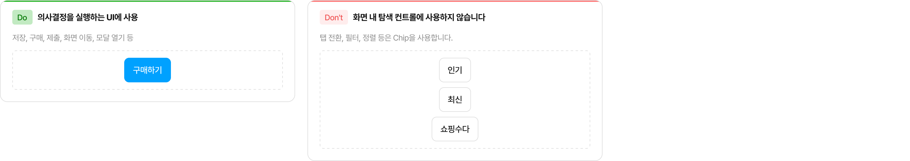
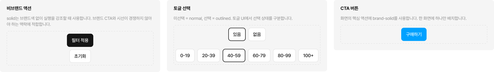
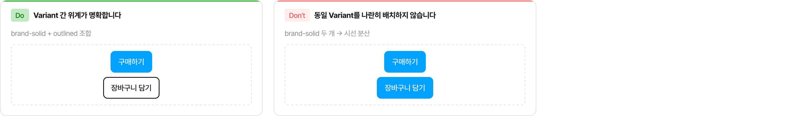
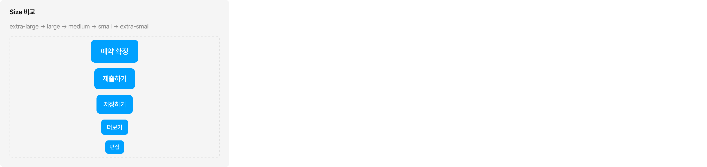
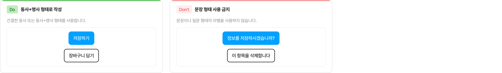
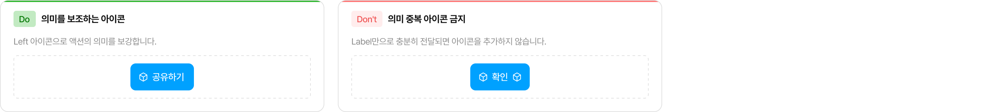
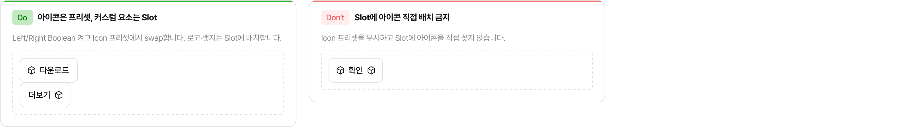
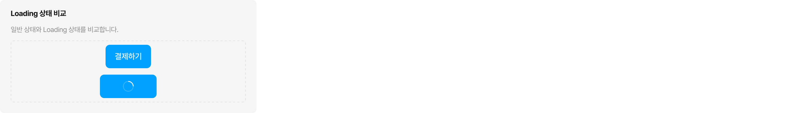
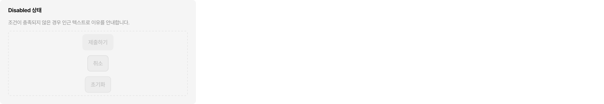

# Box Button

유저가 탭/클릭으로 액션을 실행할 때 사용합니다.

> **어떤 컴포넌트를 써야 할까?**
> - 명확한 액션 실행 (저장, 삭제, 구매, 이동 등) → **Box Button**
> - 화면 맥락 전환, 조건 필터링, 키워드 선택 → Chip
> - 텍스트 인라인 링크 스타일 → Text Button (준비 중)
> - 아이콘만 단독으로 사용 → Icon Button (준비 중)

## Usage Guidelines

### Box Button vs Chip

Box Button과 Chip은 모양이 비슷하지만 역할이 다릅니다.

| | Box Button | Chip |
|---|---|---|
| 역할 | 의사결정 **실행** | 맥락 전환 · 조건 좁히기 |
| 예시 | 저장, 구매, 제출, 화면 이동, 모달 열기 | 탭 전환, 필터, 정렬, 키워드 추천 |
| 화면 밀도 | 정보량이 적고 시선 집중이 필요한 화면 | UI 요소가 많아 시각적 밀도가 높은 화면 |

- Box Button은 시각적 무게가 크기 때문에, 여백이 충분하고 선택의 중요도가 높은 화면에 적합합니다.
- Chip은 시각적 무게가 낮아 여러 선택지를 부담 없이 나열할 수 있습니다.
- 화면 내 **탐색 컨트롤**(탭, 필터, 정렬 등)에는 Box Button을 사용하지 않습니다.

---

### Variant 선택

Variant는 Selection Color 원칙에 따라 선택합니다. 대부분의 UI에는 중립(Gray) 계열을 사용하고, 브랜드(Blue) 계열은 페이지의 핵심 액션에만 제한합니다.

**비브랜드 액션** — `solid`는 브랜드색 없이 실행을 강조할 때 사용합니다. 브랜드 CTA와 시선이 경쟁하지 않아야 하는 맥락에 적합합니다.

| Variant | 언제 쓰나 | 예시 |
|---|---|---|
| `solid` | 브랜드색 없이 눈에 띄어야 하는 액션 | "필터 적용", "저장하기" |

**토글 선택** — `normal`은 미선택, `outlined`는 선택 상태입니다. 버튼으로 토글 UI를 구성할 때 이 조합을 사용합니다.

| Variant | 역할 | 예시 |
|---|---|---|
| `normal` | **미선택 기본 상태** | 토글 그룹의 비활성 옵션 |
| `outlined` | **선택 상태** | 토글 그룹에서 현재 선택된 옵션 |

**CTA 버튼** — `brand-solid`는 페이지의 핵심 액션에만 사용합니다. 한 화면에 하나만 배치합니다.

| Variant | 언제 쓰나 | 예시 |
|---|---|---|
| `brand-solid` | 화면 내 가장 중요한 단일 CTA | "구매하기", "예약 확정" |

---

### 우선순위 규칙

한 화면에 여러 버튼이 있을 때, Variant로 액션의 중요도 위계를 표현합니다.

| | 예시 |
|---|---|
| ✅ | `brand-solid` "구매하기" + `outlined` "장바구니 담기" — 위계가 명확 |
| ✅ | `solid` "적용" + `normal` "초기화" — 주/보조 구분 |
| ❌ | `brand-solid` "구매하기" + `brand-solid` "장바구니 담기" — 동일 강조, 시선 분산 |

- `brand-solid`는 한 화면에 하나만 배치합니다. 두 개 이상이면 사용자의 시선이 분산됩니다.
- 나란히 배치할 때는 Variant 간 위계가 명확해야 합니다.

---

### Size 선택

컨텍스트에 따라 적절한 Size를 선택합니다. 같은 영역 내 버튼은 동일한 Size를 사용합니다.

| Size | 사용 맥락 | Variant 참고 |
|---|---|---|
| `xl` | 페이지 하단 고정 CTA | 일반적으로 브랜드 계열과 함께 사용 |
| `lg` | 폼 하단 제출 버튼, 카드 단독 액션, 섹션 단위 액션 | |
| `md` | 일반 컨텐츠 영역 기본 버튼 | |
| `sm` | 사이드바, 칩 옆 보조 버튼, 좁은 행 내 액션 | |
| `xs` | 테이블 행 내 인라인 액션, 배지 옆 버튼 | |

- `xl`은 페이지에서 가장 중요한 단일 액션에 사용하므로, 대부분 `brand-solid`와 함께 쓰입니다.
- Size가 클수록 정보 위계에서 높은 위치를 차지합니다. 보조 액션에 큰 Size를 쓰지 않습니다.

---

### Label 작성

동사 또는 동사+명사 형태로 짧게 작성합니다. 한 줄을 넘지 않습니다.

| | 예시 |
|---|---|
| ✅ | "저장하기", "삭제", "다음 단계로", "장바구니 담기" |
| ❌ | "정보를 저장하시겠습니까?" — 문장 형태 금지 |
| ❌ | "이 항목을 삭제합니다" — 설명형 금지 |
| ❌ | "🛒 담기" — 이모지, 특수기호 금지 |

---

### 아이콘 (Left / Right)

아이콘은 Label의 의미를 보조할 때만 사용합니다. 장식 목적으로 추가하지 않습니다.

| | 예시 |
|---|---|
| ✅ Left 아이콘 | "다운로드" 버튼에 download 아이콘 — 의미 보조 |
| ✅ Right 아이콘 | "더보기" 버튼에 chevron-right 아이콘 — 이동 방향 암시 |
| ❌ | Label "확인"에 check 아이콘 — 의미 중복 |
| ❌ | Left + Right 동시 사용 — 시각적 복잡도 증가, 꼭 필요한 경우에만 허용 |

Label만으로 충분히 전달된다면 아이콘을 추가하지 않습니다.

---

### Slot (Left / Center / Right)

Left, Center, Right 영역에 커스텀 요소를 넣을 수 있는 Slot입니다.

**기본 원칙: 아이콘은 Icon 프리셋, 그 외는 Slot**

| | 방법 |
|---|---|
| ✅ 아이콘 넣기 | Left/Right Boolean 켜고 → Icon 프리셋에서 swap |
| ✅ 로고 넣기 | Left Slot에 로고 이미지 배치 |
| ✅ 뱃지 넣기 | Right Slot에 뱃지 컴포넌트 배치 |
| ❌ | Icon 프리셋을 무시하고 Slot에 아이콘을 직접 꽂기 |

---

### Loading 상태

서버 요청 등 처리 중임을 나타낼 때 사용합니다.

- Loading 중에는 버튼의 너비가 고정됩니다. 레이아웃이 흔들리지 않으므로 별도 크기 고정 처리가 필요 없습니다.
- Loading 중에는 추가 클릭이 차단됩니다. `disabled`를 중복으로 적용하지 않습니다.
- Loading 상태의 Spinner 크기와 색상은 Box Button의 Size, Variant, Disabled 상태에 따라 결정됩니다.

---

### Disabled vs ReadOnly

| | Disabled | ReadOnly |
|---|---|---|
| 인터랙션 | 모두 차단 | 변경만 차단 |
| 폼 전송 | 미전송 | 전송됨 |
| 시각적 표현 | 흐리게 표시 | 일반 표시 |

**Disabled를 쓰는 경우**: 조건이 충족되지 않아 액션을 실행할 수 없을 때. 비활성화 이유를 인근 텍스트나 인풋 validation 메시지로 반드시 안내합니다.

**ReadOnly를 쓰는 경우**: 읽기 전용 컨텍스트(제출 완료된 폼, 뷰 모드)에서 버튼을 시각적으로 유지해야 할 때. 클릭 이벤트가 발생하지 않습니다.

## Figma

### 프로퍼티

| 프로퍼티 | 타입 | 설명 |
|---|---|---|
| Variant | Variant | `normal` / `outlined` / `solid` / `brand-solid` / `brand-outlined` |
| Size | Variant | `extra-large` / `large` / `medium` / `small` / `extra-small` |
| Loading | Variant | `false` / `true` |
| Disabled | Variant | `false` / `true` |
| Left | Boolean | 왼쪽 아이콘 표시 여부 |
| Right | Boolean | 오른쪽 아이콘 표시 여부 |

### Private Sub-Components

| sub-component | 용도 |
|---|---|
| .Left | Box Button 전용 왼쪽 아이콘/슬롯 영역 |
| .Center | Box Button 전용 라벨 및 중앙 슬롯 영역 |
| .Right | Box Button 전용 오른쪽 아이콘/슬롯 영역 |
| .State | Box Button 전용 상태 오버레이 레이어 |

---

> 치수, 색상, 상태 조합 등 상세 스펙은 [스펙 문서](spec.md)를 참고하세요.
