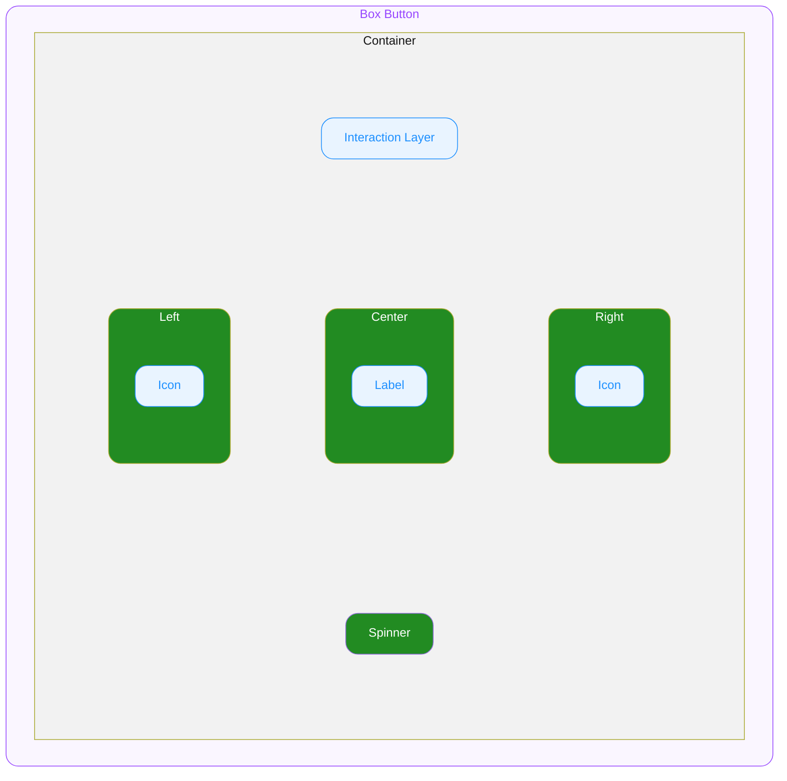

# Box Button — Spec

---

# 0. Overview

ODS Box Button은 유저가 클릭/탭의 행동을 통해 액션을 실행할 수 있도록 제공하는 컴포넌트입니다.

---

# 1. Structure

- **`Box Button`**
  외부로 노출되는 컴포넌트의 루트(엔트리)입니다. props/상태/이벤트의 진입점이며 내부 요소에 전달됩니다.
  - **`Container`**
    Center, Left, Right, Spinner와 Interaction Layer를 감싸는 영역이며, 콘텐츠 간의 관계, 정렬, 크기(너비와 높이)를 기준으로 전체 UI의 레이아웃을 결정합니다.
    - **`Interaction Layer`**
      Hovered, Pressed 등 User Interaction State에서 Container 위에 반투명으로 오버레이되는 레이어입니다.
      Container의 배경 위, 콘텐츠(Left, Center, Right) 최상단에 위치합니다.
    - **`Left`**
      버튼 왼쪽에 위치하며, 아이콘 또는 보조 요소를 Icon 또는 Custom 형식으로 배치할 수 있는 영역입니다.
      - **`Icon`**
        IconName이 지정되었을 때 렌더링되는 요소입니다.
    - **`Center`**
      버튼의 중앙에 위치하며, Label 또는 Custom 요소를 표시하는 영역입니다.
      - **`Label`**
        문자열이 지정되었을 때 렌더링되는 요소입니다.
    - **`Right`**
      버튼 오른쪽에 위치하며, 아이콘 또는 보조 요소를 Icon 또는 Custom 형식으로 배치할 수 있는 영역입니다.
      - **`Icon`**
        IconName이 지정되었을 때 렌더링되는 요소입니다.
    - **`Spinner`**
      Loading 상태에서 Center, Left, Right Slot을 숨기고 버튼 중앙에 오버레이되어 표시되는 ODS Spinner 인스턴스입니다.

---

# 2. States

| State Composition   | idle | hovered | focused | pressed |
|---------------------|------|---------|---------|---------|
| — (Default)         | ✔️   | ✔️      | ✔️      | ✔️      |
| disabled            | ✔️   | ➖      | ➖      | ➖      |
| loading             | ✔️   | ➖      | ➖      | ➖      |
| disabled + loading  | ✔️   | ➖      | ➖      | ➖      |
| readOnly            | ✔️   | ➖      | ✔️      | ➖      |

#### User Interaction States

사용자의 상호작용(클릭, 터치, 포커스 등)에 따라 컴포넌트가 변화하는 상태를 의미합니다.

- **`idle`**
  유저가 인터렉션 하지 않는 기본 상태를 의미합니다.
- **`hovered`**
  **`🌐 Web Only`** ◌ 사용자가 마우스를 버튼 위에 올렸을 때 진입하는 상태입니다.
- **`focused`**
  **`🌐 Web Only`** ◌ 유저가 키보드로 Tab을 눌러 버튼에 포커스했을 때 진입하는 상태입니다.
- **`pressed`**
  유저가 버튼을 클릭하거나 터치하고 있는 상태입니다.

#### Control States

시스템 또는 개발자의 제어에 따라 추가로 컴포넌트가 가질 수 있는 상태를 의미합니다.

- **`disabled`**
  컴포넌트가 비활성화된 상태입니다.
- **`loading`**
  데이터를 처리 중인 상태입니다.
- **`readOnly`**
  컴포넌트가 읽기 전용 상태입니다.
  시각적으로 idle과 동일하며, focus 상태에는 진입할 수 있으나, hover와 pressed 상태에는 진입하지 않습니다.

---

# 3. Type Definition

#### IconName

Left, Right 에서 사용되는 아이콘 식별자 타입입니다.
ODS Icon 시스템에 등록된 아이콘의 이름을 지정하면, 각 플랫폼에서 지정된 스타일(Size, Color, Weight)로 렌더링됩니다.

- **`string`**
  ODS Icon 이름을 지정합니다. (e.g. `"arrow_right"`, `"check"`)

---

# 4. Props

## 4.1. Variation Props

#### Variant

**`"normal" | "outlined" | "solid" | "brand-outlined" | "brand-solid"`** ◌ `Optional` ◌ Default Value: **`"normal"`** ◌ 버튼의 색상 스타일을 지정합니다.

- **`"normal"`**
  기본 스타일입니다.
- **`"solid"`**
  Solid 스타일입니다.
- **`"outlined"`**
  기본 색상의 Outlined 스타일입니다.
- **`"brand-solid"`**
  브랜드 색상으로 채워진 Solid 스타일입니다.
- **`"brand-outlined"`**
  브랜드 색상의 Outlined 스타일입니다.

#### Size

**`"extra-large" | "large" | "medium" | "small" | "extra-small"`** ◌ `Optional` ◌ Default Value: **`"medium"`** ◌ 버튼의 크기를 지정합니다.

- **`"extra-large"`**
  가장 큰 크기입니다.
- **`"large"`**
  큰 크기입니다.
- **`"medium"`**
  기본 크기입니다.
- **`"small"`**
  작은 크기입니다.
- **`"extra-small"`**
  가장 작은 크기입니다.

## 4.2. Slot Props

#### Center

**`string | Custom`** ◌ 버튼의 중앙에 표시할 요소를 지정합니다.

- **`string`**
  텍스트 문자열을 지정해 Label로써 렌더링할 수 있습니다.
- **`Custom`**
  임의의 요소를 지정할 수 있습니다.

#### Left

**`IconName | Custom`** ◌ `Optional` ◌ 버튼 왼쪽에 표시할 요소를 지정합니다.

- **`IconName`**
  아이콘을 지정하여 정해진 스타일로 아이콘을 렌더합니다.
- **`Custom`**
  임의의 요소를 지정할 수 있습니다.

#### Right

**`IconName | Custom`** ◌ `Optional` ◌ 버튼 오른쪽에 표시할 요소를 지정합니다.

- **`IconName`**
  아이콘을 지정하여 정해진 스타일로 아이콘을 렌더합니다.
- **`Custom`**
  임의의 요소를 지정할 수 있습니다.

## 4.3. State Props

#### Disabled

**`boolean`** ◌ `Optional` ◌ Default Value: `false` ◌ 컴포넌트의 비활성화 상태를 지정합니다.

- `true`
  컴포넌트를 disabled 상태로 전환합니다. Idle 외의 User Interaction State로 전환되지 않습니다.
- `false`
  컴포넌트의 disabled 상태를 해제합니다.

#### Loading

**`boolean`** ◌ `Optional` ◌ Default Value: `false` ◌ 컴포넌트의 Loading 상태를 지정합니다.

- `true`
  Spinner 인스턴스가 표시되고 Left/Center/Right Slot은 숨겨집니다. Idle 외의 User Interaction State로 전환되지 않습니다.
- `false`
  Loading 상태를 해제합니다.

## 4.4. Layout Props

#### FullWidth

**`🌐 Web Only`** ◌ **`boolean`** ◌ `Optional` ◌ Default Value: `false` ◌ 버튼이 부모 컨테이너의 전체 너비를 차지하도록 지정합니다.

- `true`
  버튼의 너비가 부모 컨테이너의 `100%`로 설정됩니다.
- `false`
  버튼의 너비는 내부 콘텐츠 크기를 따릅니다.

---

# 5. Behaviors

#### Pressed Scale Animation

유저가 버튼을 클릭/터치하면 **레이아웃을 흔들지 않으면서** 전체 UI의 크기가 `0.97`로 축소됩니다.

#### Loading Behavior

컴포넌트가 Loading 상태일 때:
- Left/Center/Right Slot의 opacity가 0%로 설정됩니다.
- Spinner 인스턴스는 중앙에 absolute position으로 오버레이됩니다.
- Spinner의 size와 color는 Box Button의 Size, Variant, Disabled 상태에 따라 결정됩니다.
- 버튼의 원래 너비는 유지됩니다.
- Idle 외의 User Interaction State로 전환되지 않습니다.

#### Disabled + Loading

Disabled 상태와 Loading 상태는 함께 사용할 수 있습니다.
두 상태 모두 활성화된 경우 Idle 외의 User Interaction State로 전환되지 않습니다.

#### Sizing

Box Button은 기본적으로 내부 콘텐츠 크기를 따르며, 내부에서 크기를 강제하지 않습니다.
너비, 높이 등 크기 관련 속성을 외부에서 주입하여 Box Button 및 Container의 크기를 제어할 수 있습니다.

#### Keyboard Interaction

**`🌐 Web Only`**

- `Enter` / `Space`
  버튼을 클릭합니다.

---

# 6. Constants

### 6.1. General

| Element | Property | Value |
|---------|----------|-------|
| Box Button | Width | 기본적으로 컨텐츠의 너비만큼 지정됩니다. 필요할 경우 너비 관련 속성(고정 너비, 전체 너비, 최대 너비 등)을 오버라이드할 수 있습니다. |
| | Alignment | 가로 방향 가운데로 정렬됩니다. |
| | Box Sizing | Container의 크기는 Border를 포함해 계산됩니다. |
| Container | Width | 컨텐츠의 크기만큼 지정됩니다. |
| | Height | 컨텐츠의 크기만큼 지정됩니다. |
| Center | Width | 컨텐츠의 크기만큼 지정됩니다. |
| | Height | 컨텐츠의 크기만큼 지정됩니다. |
| Left / Right | Width | 컨텐츠의 크기만큼 지정됩니다. |
| | Height | 컨텐츠의 크기만큼 지정됩니다. |
| Spinner | Position | Container 중앙에 absolute position으로 배치됩니다. |
| | Size | §6.2 Size 표의 Spinner Size 값을 따릅니다. |

### 6.2. Variation

#### Variant - State

Hovered, Pressed 행의 Container BG 값은 Container의 배경색을 대체하는 것이 아니라, **Interaction Layer**(Section 1. Structure 참조)에 적용되는 오버레이 색상입니다. Container의 기본 배경색은 유지된 채 그 위에 반투명으로 깔립니다.

> 토큰 테이블은 Notion 원본 참고

Spinner 컬럼은 Box Button이 ODS Spinner의 `color` prop에 주입하는 토큰을 의미합니다.

| Variant | Disabled | Interaction | Container Background Color | Container Border Color | Interaction Layer Background Color | Label | Icon | Spinner |
|---------|----------|-------------|---------------------------|------------------------|-------------------------------------|-------|------|---------|
| **`normal`** | — | — | 토큰 참고 | 토큰 참고 | — | 토큰 참고 | 토큰 참고 | 토큰 참고 |
| | — | Hovered | — | — | 토큰 참고 | — | — | — |
| | — | Pressed | — | — | 토큰 참고 | — | — | — |
| | disabled | — | 토큰 참고 | 토큰 참고 | — | 토큰 참고 | 토큰 참고 | 토큰 참고 |
| **`solid`** | — | — | 토큰 참고 | 토큰 참고 | — | 토큰 참고 | 토큰 참고 | 토큰 참고 |
| | — | Hovered | — | — | 토큰 참고 | — | — | — |
| | — | Pressed | — | — | 토큰 참고 | — | — | — |
| | disabled | — | 토큰 참고 | 토큰 참고 | — | 토큰 참고 | 토큰 참고 | 토큰 참고 |
| **`outlined`** | — | — | 토큰 참고 | 토큰 참고 | — | 토큰 참고 | 토큰 참고 | 토큰 참고 |
| | — | Hovered | — | — | 토큰 참고 | — | — | — |
| | — | Pressed | — | — | 토큰 참고 | — | — | — |
| | disabled | — | 토큰 참고 | 토큰 참고 | — | 토큰 참고 | 토큰 참고 | 토큰 참고 |
| **`brand-solid`** | — | — | 토큰 참고 | 토큰 참고 | — | 토큰 참고 | 토큰 참고 | 토큰 참고 |
| | — | Hovered | — | — | 토큰 참고 | — | — | — |
| | — | Pressed | — | — | 토큰 참고 | — | — | — |
| | disabled | — | 토큰 참고 | 토큰 참고 | — | 토큰 참고 | 토큰 참고 | 토큰 참고 |
| **`brand-outlined`** | — | — | 토큰 참고 | 토큰 참고 | — | 토큰 참고 | 토큰 참고 | 토큰 참고 |
| | — | Hovered | — | — | 토큰 참고 | — | — | — |
| | — | Pressed | — | — | 토큰 참고 | — | — | — |
| | disabled | — | 토큰 참고 | 토큰 참고 | — | 토큰 참고 | 토큰 참고 | 토큰 참고 |

#### Size

| Size | Container Height | Container Gap | Container Corner Radius | Label Typography | Icon Size | Left Icon Padding Left | Right Icon Padding Right | Spinner Size |
|------|-----------------|---------------|------------------------|-----------------|-----------|------------------------|--------------------------|--------------|
| **`extra-large`** | `48` | `-14` | `8` | Body 16 20 Medium | `18` | `16` | `16` | `24` |
| **`large`** | `44` | `-11` | `8` | Body 15 24 Medium | `18` | `13` | `13` | `22` |
| **`medium`** | `40` | `-8` | `8` | Body 14 18 Medium | `16` | `10` | `10` | `20` |
| **`small`** | `32` | `-6` | `6` | Body 13 18 Medium | `16` | `8` | `8` | `18` |
| **`extra-small`** | `28` | `-4` | `6` | Body 12 16 Medium | `12` | `6` | `6` | `16` |

#### Outlined Size Variation

| Variant | Container Border Width | Center Padding X |
|---------|----------------------|-----------------|
| **`solid`**, **`brand-solid`**, **`normal`**, **`brand-outlined`** (extra-large) | `1` | `19` |
| (large) | `1` | `16` |
| (medium) | `1` | `13` |
| (small) | `1` | `10` |
| (extra-small) | `1` | `8` |
| **`outlined`** (extra-large) | `1.5` | `18.5` |
| (large) | `1.5` | `15.5` |
| (medium) | `1.5` | `12.5` |
| (small) | `1.5` | `9.5` |
| (extra-small) | `1.5` | `7.5` |

#### User Interaction - Keyboard Tab Focused

| Element | Property | Keyboard Tab Focused **`🌐 Web Only`** |
|---------|----------|---------------------------------------|
| Container | Focus Ring Style **`🌐 Web Only`** | `2px` `Solid` |
| | Focus Ring Color **`🌐 Web Only`** | 토큰 참고 |
| | Focus Ring Offset **`🌐 Web Only`** | `2` |

### 6.3. Animation

Pressed 상태로 전환될 때 다음 애니메이션이 적용됩니다.

| Property | Value | Note |
|----------|-------|------|
| Scale | `0.97` | Scale이 레이아웃 크기에 영향을 미치지 않아야 합니다. |
| Animation Type | `spring` | — |
| Mass | `1` | — |
| Stiffness | `1754.59` | — |
| Damping | `72.05` | — |

### 6.4. Tokens

> 토큰 테이블은 Notion 원본 참고: Component Style Tokens
