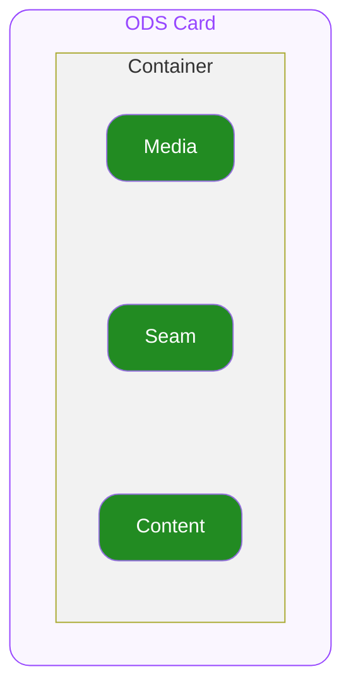

# Card — Spec
## 0. Overview

ODS Card은 오늘의집 제품 전반에서 상품, 컨텐츠 등의 정보를 위해 사용하는 UI 컴포넌트입니다.

---

## 1. Structure

- **`Container`**
  최상위 영역으로 하위 요소들의 관계, 정렬, 크기(너비와 높이)를 기준으로 전체 UI의 레이아웃을 결정합니다.

  - **`media`**
    상품의 썸네일 UI를 지정하기 위한 슬롯입니다. 주로 Image 컴포넌트를 배치하는 것이 의도되었습니다.
  - **`seam`**
    media와 content 사이의 보조적인 UI를 지정하기 위한 슬롯입니다.
  - **`content`**
    상품의 정보를 제공하는 UI를 지정하기 위한 슬롯입니다.

---

## 2. States

#### User Interaction States

사용자의 상호작용(클릭, 터치, 포커스 등)에 따라 컴포넌트가 변화하는 상태를 의미합니다.

- **`idle`**
  유저가 인터렉션 하지 않는 기본 상태를 의미합니다.
- **`hovered`**
  `🌐 Web Only` 사용자가 마우스를 버튼 위에 올렸을 때 진입하는 상태입니다.
- **`focused`**
  `🌐 Web Only` 유저가 키보드로 Tab을 눌러 버튼에 포커스했을 때 진입하는 상태입니다.
- **`pressed`**
  유저가 컴포넌트를 클릭하거나 터치하고 있는 상태입니다.

---

## 3. Props

### 3.1. Layout Prop

#### Type

**`"vertical" | "horizontal"`** ◌ `Optional` ◌ `Default Value`: **`"vertical"`** ◌ Container의 ODS Product Card의 정렬 방향을 지정합니다.

- **`"vertical"`**
  Container가 세로로 정렬됩니다.
- **`"horizontal"`**
  Container가 가로로 정렬됩니다.

#### Gap

**`number`** ◌ `Optional` ◌ `Default Value`: **`8`** ◌ Container의 간격을 지정합니다.

### 3.2. Slot Prop

#### Media

**`Custom`** ◌ media 위치에 렌더할 임의의 요소를 지정합니다. 주로 Image 컴포넌트를 통해 구성하도록 의도되었습니다.

#### Seam

**`Custom`** ◌ `Optional` ◌ seam 위치에 렌더할 임의의 요소를 지정합니다.

#### Content

**`Custom`** ◌ content 위치에 렌더할 임의의 요소를 지정합니다.

### 3.3. Event Props

#### On Blur

`🌐 Web Only` ◌ **`func`** ◌ `Optional` ◌ 키보드 포커스가 적용 되는 등 컴포넌트가 focused 상태에서 벗어나 idle 상태로 전환될 때 실행할 동작을 전달합니다.

#### On Focus

`🌐 Web Only` ◌ **`func`** ◌ `Optional` ◌ 키보드 포커스가 적용 되는 등 컴포넌트가 focused 상태로 전환될 때 실행할 콜백을 전달합니다.

#### On Mouse Enter

`🌐 Web Only` ◌ **`func`** ◌ `Optional` ◌ 마우스 포인터가 Container를 진입하였을 때 실행할 콜백을 전달합니다.

#### On Mouse Leave

`🌐 Web Only` ◌ **`func`** ◌ `Optional` ◌ 마우스 포인터가 Container를 벗어날 때 실행할 콜백을 전달합니다.

#### On Press

**`func`** ◌ `Optional` ◌ Container가 클릭되거나 터치되었을 때 실행할 콜백을 전달합니다.

---

## 4. Constants

#### Interaction Animation

| 상태 | 값 |
|---|---|
| pressed | Scale = 0.97 Transition = cubic-bezier(0.33, 1, 0.68, 1) Duration = 100ms |

#### General

| 요소 | 속성 | 값 |
|---|---|---|
| Container | Alignment | 좌측 상단으로 세로 정렬됩니다. |
| | Width | 상위 컨테이너의 가용 너비를 전부 차지합니다. 필요한 경우 별도로 고정 너비, 변동 너비 등을 지정할 수 있습니다. |
| | Height | 컨텐츠의 높이만큼 차지합니다. |
| media | Alignment | 좌측 상단으로 세로 정렬됩니다. |
| | Width | 상위 컨테이너의 가용 너비를 전부 차지합니다. |
| | Height | 컨텐츠의 높이만큼 차지합니다. |
| seam | Alignment | 좌측 상단으로 세로 정렬됩니다. |
| | Width | 상위 컨테이너의 가용 너비를 전부 차지합니다. |
| | Height | 컨텐츠의 높이만큼 차지합니다. |
| content | Alignment | 좌측 상단으로 세로 정렬됩니다. |
| | Width | 상위 컨테이너의 가용 너비를 전부 차지합니다. |
| | Height | 컨텐츠의 높이만큼 차지합니다. |
