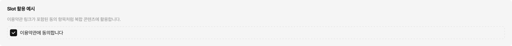
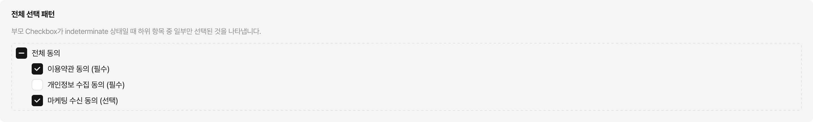
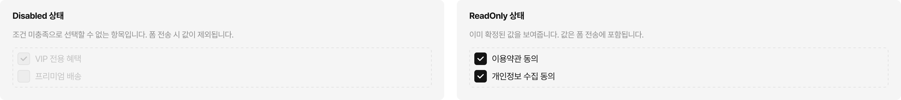
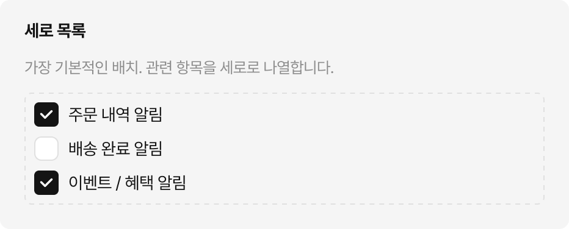
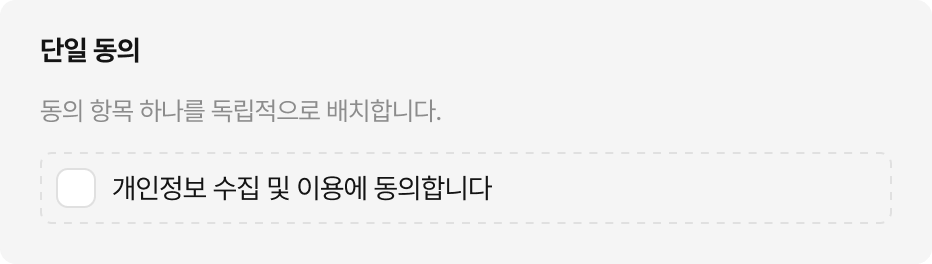
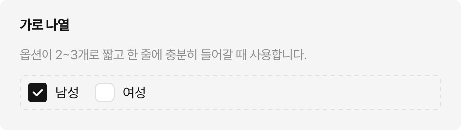

# Checkbox

사용자가 하나 이상의 옵션을 선택하거나 해제할 수 있는 폼 컨트롤입니다.

> **어떤 컴포넌트를 써야 할까?**
> - 복수 선택이 가능한 경우 → **Checkbox**
> - 단일 선택만 가능한 경우 → [Radio](../radio/guide.md)
> - 즉시 반영되는 On/Off 토글 → [Switch](../switch/guide.md)

## Usage Guidelines

### 언제 Checkbox를 쓰는가

- 여러 항목 중 **복수 선택**이 허용될 때
- **동의 여부**를 묻는 단일 항목 (이용약관, 마케팅 수신 동의 등)
- 선택 결과가 **폼 제출 시 반영**되는 경우

선택과 동시에 즉각적인 효과가 발생한다면 Switch를 사용합니다. 예를 들어 알림 On/Off, 다크모드 전환처럼 탭 즉시 적용되는 상황은 Switch가 적합합니다.

---

### 레이블 작성

레이블은 **명사 또는 명사구**로 짧게 작성합니다. 선택 여부에 따라 의미가 달라지는 문장형은 사용하지 않습니다.

| | 예시 |
|---|---|
| ✅ | 마케팅 수신 동의 |
| ✅ | 오늘 하루 보지 않기 |
| ✅ | 만 14세 이상입니다 |
| ❌ | 마케팅 수신에 동의하시겠습니까? |
| ❌ | 이 항목을 선택하면 알림을 받습니다 |

레이블 없이 Indicator만 단독으로 사용하는 경우(예: 테이블 행 선택)에는 반드시 접근성 레이블을 별도 제공합니다.

---

### Content Slot

Content 영역에 단순 텍스트가 아닌 복합 콘텐츠를 넣을 수 있습니다.

**기본 원칙: 단순 텍스트는 Label 프로퍼티, 복합 콘텐츠는 Slot**

| | 방법 |
|---|---|
| ✅ "마케팅 수신 동의" | Label 프로퍼티에 텍스트 입력 |
| ✅ "이용약관에 동의합니다" (이용약관 = 링크) | Content Slot에 텍스트 + 링크 조합 배치 |
| ✅ 약관 전문 + 동의 체크 | Content Slot에 커스텀 레이아웃 배치 |
| ❌ | Label로 충분한 단순 텍스트를 Slot에 직접 넣기 |

[](https://www.figma.com/design/F6L3NF3Ts9nbxQt7etAiq2?node-id=64338-192)

---

### Align 선택 기준

Align은 Indicator(체크박스 사각형)와 Content(레이블 영역)의 세로 정렬 방식을 결정합니다.

- **center** — 레이블이 한 줄일 때 사용합니다. Indicator가 텍스트 중앙에 위치합니다.
- **top** — 레이블이 두 줄 이상으로 길어질 때 사용합니다. Indicator가 첫 번째 줄 상단에 고정됩니다.

`top`을 쓰면 긴 안내문 앞에 Indicator가 어색하게 아래에 떠 있는 문제를 방지할 수 있습니다.

[](https://www.figma.com/design/F6L3NF3Ts9nbxQt7etAiq2?node-id=64338-192)

---

### Size 선택

| Size | 사용 맥락 |
|---|---|
| medium | 기본 크기. 특별한 이유가 없으면 medium을 사용합니다. |
| small | 공간이 제한된 밀집 레이아웃에서 사용합니다. 같은 CheckboxGroup 안에서는 동일한 Size를 사용합니다. |

---

### Indeterminate 사용 규칙

`indeterminate`는 **"전체 선택" 패턴에서만** 사용합니다. 하위 Checkbox 중 일부만 선택된 상태를 부모 Checkbox에 시각적으로 표현할 때 사용됩니다.

[](https://www.figma.com/design/F6L3NF3Ts9nbxQt7etAiq2?node-id=64338-192)

- `indeterminate`는 프로그래밍 방식으로만 설정합니다. 사용자가 직접 indeterminate 상태로 전환할 수 없습니다.
- `indeterminate` 상태를 클릭하면 `checked`로 전환됩니다.
- 전체 선택 패턴 외의 용도로 indeterminate를 사용하지 않습니다. 의미가 불명확해집니다.

---

### Disabled vs ReadOnly

| | Disabled | ReadOnly |
|---|---|---|
| 인터랙션 | 모두 차단 | 변경만 차단 |
| 폼 전송 | 미전송 | 전송됨 |
| 시각적 표현 | 흐리게 표시 | 일반 표시 |

**Disabled를 쓰는 경우**: 조건이 충족되지 않아 해당 항목을 선택할 수 없을 때. 예를 들어 멤버십 등급 조건 미충족으로 특정 혜택 선택이 막힌 경우. 폼 전송 시 해당 값은 제외됩니다.

**ReadOnly를 쓰는 경우**: 이미 확정된 값을 사용자에게 보여주기만 해야 할 때. 예를 들어 계약 체결 후 동의 내역 확인 화면, 관리자가 고정한 설정 항목. 값은 폼 전송에 포함됩니다.

흐리게 보이면 사용자가 "왜 선택할 수 없지?" 하고 의문을 가집니다. Disabled는 이유를 함께 안내하거나 Tooltip을 제공하는 것이 좋습니다.

[](https://www.figma.com/design/F6L3NF3Ts9nbxQt7etAiq2?node-id=64338-192)

---

### 레이아웃 조합

Checkbox를 화면에 배치할 때 자주 사용되는 패턴입니다.

> **권장 간격:** 세로 목록은 항목 사이 **8px**, 가로 나열은 **16px**이 표준입니다. 맥락에 따라 조정할 수 있지만, 특별한 이유가 없다면 이 간격을 기본으로 사용합니다.

**세로 목록** — 가장 기본적인 배치. 관련 항목을 세로로 나열합니다.

[](https://www.figma.com/design/F6L3NF3Ts9nbxQt7etAiq2?node-id=64338-192)

**단일 동의** — 동의 항목 하나를 독립적으로 배치합니다.

[](https://www.figma.com/design/F6L3NF3Ts9nbxQt7etAiq2?node-id=64338-192)

**전체 선택 + 하위 항목** — 부모 Checkbox로 일괄 제어합니다. 부모에 indeterminate를 활용합니다.

```
☑ 전체 동의
  ☑ 이용약관 동의 (필수)
  ☐ 개인정보 수집 동의 (필수)
  ☑ 마케팅 수신 동의 (선택)
```

하위 항목은 들여쓰기로 계층을 표현합니다. 부모와 하위 사이 간격은 동일하게 유지합니다.

**테이블 행 선택** — Indicator만 단독으로 사용합니다. 레이블 없이 배치하되, 행 전체가 클릭 영역이 됩니다.

```
☑ | 주문번호 | 상품명      | 금액
☐ | 20240301 | 소파 커버   | 29,000
☑ | 20240302 | 쿠션 세트   | 15,000
```

**가로 나열** — 옵션이 2~3개로 짧고 한 줄에 충분히 들어갈 때 사용합니다. 4개 이상이면 세로 목록으로 전환합니다.

[](https://www.figma.com/design/F6L3NF3Ts9nbxQt7etAiq2?node-id=64338-192)

---

## Figma

### 프로퍼티

| 프로퍼티 | 타입 | 설명 |
|---|---|---|
| Size | Variant | medium / small |
| Checked | Variant | unchecked / checked / indeterminate |
| Disabled | Boolean | 비활성화 여부 |
| ReadOnly | Boolean | 읽기 전용 여부 |
| Content | Boolean | 레이블 영역 표시 여부 |
| Label | Text | 레이블 텍스트 |
| Align | Variant | top / center — Indicator와 Content의 세로 정렬 |

### Private Sub-Components

| sub-component | 용도 |
|---|---|
| .Checkbox Indicator | Checkbox 전용 선택 상태 표시 영역 |

---

> 치수, 색상, 상태별 토큰 등 상세 스펙은 [스펙 문서](spec.md)를 참고하세요.
