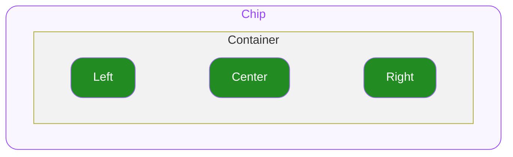

# Chip — Spec

# 0. Overview

본 문서는 ODS Chip이 제공하는 스펙을 명세합니다.

# 1. States

## User Interaction States

사용자의 상호작용(클릭, 터치, 포커스 등)에 따라 컴포넌트가 변화하는 상태를 의미합니다.

- **`idle`**
  유저가 인터렉션 하지 않는 기본 상태를 의미합니다.
- **`hovered`**
  `🌐 Web Only` 사용자가 마우스를 버튼 위에 올렸을 때 진입하는 상태입니다.
- **`focused`**
  `🌐 Web Only` 유저가 키보드로 Tab을 눌러 버튼에 포커스했을 때 진입하는 상태입니다.
- **`pressed`**
  유저가 컴포넌트를 클릭하거나 터치하고 있는 상태입니다.

## Control States

시스템 또는 개발자의 제어에 따라 컴포넌트가 가질 수 있는 상태를 의미합니다.

- **`default`**
  컴포넌트의 기본 상태입니다. 유저는 컴포넌트와 자유롭게 상호작용할 수 있습니다.
- **`disabled`**
  컴포넌트가 사용 불가능한 상태입니다. 유저는 컴포넌트와 어떠한 상호작용도 할 수 없습니다.

# 2. Props

## 2.1. Style Props

### Variant

`Optional` Chip의 색상 스타일을 지정합니다.

- **`normal`**
  `Default Value`
- **`outlined`**
- **`solid`**
- **`subtle`**

### Size

`Optional` Chip의 크기 스타일을 지정합니다.

- **`sm`**
  `Default Value`
- **`md`**

## 2.2. State Props

### Disabled

`Optional` disabled 상태 여부를 결정합니다.

- **`true`**
  컴포넌트가 disabled 상태로 전환됩니다.
- **`false`**
  `Default Value` 컴포넌트가 default 상태로 전환됩니다.

## 2.3. Slot Props

### Left

`Optional` Left 위치에 렌더할 요소를 지정합니다.

- **`icon`**
  아이콘 이름을 지정하여 지정된 스타일로 ODS 아이콘을 렌더합니다.
- **`custom`**
  임의의 요소를 자유롭게 조합하여 지정할 수 있습니다.

### Right

`Optional` Right 위치에 렌더할 요소를 지정합니다.

- **`icon`**
  아이콘 이름을 지정하여 지정된 스타일로 ODS 아이콘을 렌더합니다.
- **`custom`**
  임의의 요소를 자유롭게 조합하여 지정할 수 있습니다.

### Center

`Optional` Center 위치에 렌더할 요소를 지정합니다.

- **`label`**
  문자열을 지정하여 지정된 스타일로 렌더합니다.
- **`icon`**
  아이콘 이름을 지정하여 지정된 스타일로 ODS 아이콘을 렌더합니다.
- **`custom`**
  임의의 요소를 자유롭게 조합하여 지정할 수 있습니다.

## 2.4. Event Props

### On Blur

`🌐 Web Only` 컴포넌트가 focused 상태에서 벗어나 idle 상태로 전환될 때 실행할 콜백을 전달합니다.

### On Focus

`🌐 Web Only` 키보드 포커스가 적용 되는 등 컴포넌트가 focused 상태로 전환될 때 실행할 콜백을 전달합니다.

### On Mouse Enter

`🌐 Web Only` 마우스 포인터가 컴포넌트에 진입하였을 때 실행할 콜백을 전달합니다.

### On Mouse Leave

`🌐 Web Only` 마우스 포인터가 컴포넌트를 벗어날 때 실행할 콜백을 전달합니다.

### On Press

컴포넌트가 클릭되거나 터치되어 pressed 상태로 전환되었을 때 실행할 콜백을 전달합니다.

# 3. Structure

### Container

최상위 영역으로 하위 요소들의 관계, 정렬, 크기(너비와 높이)를 기준으로 전체 UI의 레이아웃을 결정합니다.

### Left

Container 왼쪽에 위치하며 Icon 또는 Custom 요소를 배치할 수 있는 영역입니다.

### Right

Container 오른쪽에 위치하며 Icon 또는 Custom 요소를 배치할 수 있는 영역입니다.

### Center

Container 가운데에 위치하며 Label, Icon 또는 Custom 요소를 배치할 수 있는 영역입니다.

# 4. Constant

### General

| 영역 | 속성 | 값 |
|---|---|---|
| Container | Alignment | 가로 방향 가운데로 정렬됩니다. |
| | Gap | -2 |
| | Width | 컨텐츠의 너비만큼 지정됩니다. |
| | Box Sizing | Border 두께를 포함해서 계산됩니다. |
| | Border Radius | 9999 |
| Center | Padding X | 6 |
| | Label Typography | Body 14 L18 |
| | Icon Size | 18 |
| Left | Icon Size | 12 |
| | Icon Padding Left | 4 (Icon일 경우에만 적용됩니다.) |
| Right | Icon Size | 12 |
| | Icon Padding Right | 4 (Icon일 경우에만 적용됩니다.) |

### Size

| 영역 | 속성 | `sm` | `md` |
|---|---|---|---|
| Container | Height | 32 | 38 |
| | Padding X | 4 | 8 |

### Variants

| 영역 | 상태 | 속성 | `normal` | `solid` | `outlined` | `subtle` |
|---|---|---|---|---|---|---|
| Container | default | Background Color | 토큰 테이블은 Notion 원본 참고 | 토큰 테이블은 Notion 원본 참고 | 토큰 테이블은 Notion 원본 참고 | 토큰 테이블은 Notion 원본 참고 |
| | | Border Color | 토큰 테이블은 Notion 원본 참고 | 토큰 테이블은 Notion 원본 참고 | 토큰 테이블은 Notion 원본 참고 | 토큰 테이블은 Notion 원본 참고 |
| | disabled | Background Color | 토큰 테이블은 Notion 원본 참고 | 토큰 테이블은 Notion 원본 참고 | 토큰 테이블은 Notion 원본 참고 | 토큰 테이블은 Notion 원본 참고 |
| | | Border Color | 토큰 테이블은 Notion 원본 참고 | 토큰 테이블은 Notion 원본 참고 | 토큰 테이블은 Notion 원본 참고 | 토큰 테이블은 Notion 원본 참고 |
| Left | All States | Icon Weight | regular | regular | semibold | regular |
| | default | Icon Color | 토큰 테이블은 Notion 원본 참고 | 토큰 테이블은 Notion 원본 참고 | 토큰 테이블은 Notion 원본 참고 | 토큰 테이블은 Notion 원본 참고 |
| | disabled | Icon Color | 토큰 테이블은 Notion 원본 참고 | 토큰 테이블은 Notion 원본 참고 | 토큰 테이블은 Notion 원본 참고 | 토큰 테이블은 Notion 원본 참고 |
| Right | All States | Icon Weight | regular | regular | semibold | regular |
| | default | Icon Color | 토큰 테이블은 Notion 원본 참고 | 토큰 테이블은 Notion 원본 참고 | 토큰 테이블은 Notion 원본 참고 | 토큰 테이블은 Notion 원본 참고 |
| | disabled | Icon Color | 토큰 테이블은 Notion 원본 참고 | 토큰 테이블은 Notion 원본 참고 | 토큰 테이블은 Notion 원본 참고 | 토큰 테이블은 Notion 원본 참고 |
| Center | All States | Label Font Weight | regular | regular | semibold | regular |
| | | Icon Weight | regular | regular | semibold | regular |
| | default | Label Color | 토큰 테이블은 Notion 원본 참고 | 토큰 테이블은 Notion 원본 참고 | 토큰 테이블은 Notion 원본 참고 | 토큰 테이블은 Notion 원본 참고 |
| | | Icon Color | 토큰 테이블은 Notion 원본 참고 | 토큰 테이블은 Notion 원본 참고 | 토큰 테이블은 Notion 원본 참고 | 토큰 테이블은 Notion 원본 참고 |
| | disabled | Label Color | 토큰 테이블은 Notion 원본 참고 | 토큰 테이블은 Notion 원본 참고 | 토큰 테이블은 Notion 원본 참고 | 토큰 테이블은 Notion 원본 참고 |
| | | Icon Color | 토큰 테이블은 Notion 원본 참고 | 토큰 테이블은 Notion 원본 참고 | 토큰 테이블은 Notion 원본 참고 | 토큰 테이블은 Notion 원본 참고 |

> 토큰 테이블은 Notion 원본을 참고하세요. (이관 예정)
