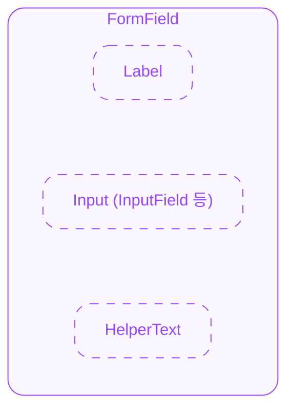

# FormField — Spec

---

# 0. Overview

ODS FormField는 Label, 입력 컴포넌트, HelperText 등을 감싸는 래퍼 컴포넌트입니다. error/disabled/readonly 상태를 플랫폼 컨텍스트 메커니즘(Web: Context, iOS: Environment, Android: CompositionLocal)을 통해 하위 요소에 전파합니다.

Label, HelperText는 독립 컴포넌트로 FormField 밖에서도 단독 사용이 가능하며, FormField 안에서 사용하면 상태 동기화 혜택을 받습니다.

---

# 1. Structure

- **`FormField`**
  외부로 노출되는 컴포넌트의 루트(엔트리)입니다. children을 **전달된 순서 그대로** vertical 렌더링합니다. 타입 인식이나 자동 재배치를 하지 않습니다.
  - **`children`**
    Label, HelperText, 입력 컴포넌트 등을 자유롭게 전달합니다.

> 커스텀 레이아웃이 필요한 경우, children에 커스텀 뷰를 감싸서 자유롭게 구성합니다. 상태 전파는 nesting 깊이와 무관하게 동작합니다.

---

# 2. States

FormField 자체의 시각적 상태는 없습니다. 하위 요소에 상태를 전파하는 역할만 합니다.

> readonly는 disabled와 달리 정상 시각 스타일을 유지하며, 값 변경만 불가합니다.

#### 전파 대상 상태

- **`error`**
- **`disabled`**
- **`readonly`**

#### 전파 방식

FormField는 플랫폼 컨텍스트 메커니즘을 통해 상태를 제공합니다. 하위 컴포넌트가 스스로 해당 상태를 읽을지 결정합니다.

|          | Label      | Input | HelperText |
|----------|------------|-------|------------|
| error    | 읽지 않음  | 읽음  | 읽음       |
| disabled | 읽지 않음  | 읽음  | 읽지 않음  |
| readonly | 읽지 않음  | 읽음  | 읽지 않음  |

> SDUI에서는 클라이언트 적용을 기본 방식으로 합니다: 서버는 FormField 레벨에만 상태를 보내고, 클라이언트가 플랫폼 컨텍스트 메커니즘을 통해 children에 전파합니다.

---

# 3. Behaviors

#### 상태 우선순위

children에 직접 전달한 상태가 FormField의 상태보다 우선합니다.

예: FormField에 `error=false`이지만 InputField에 `error=true`를 직접 전달하면, InputField는 error 상태입니다. 이를 통해 FormField의 상태 동기화를 사용하면서도 개별 오버라이드가 가능합니다.

#### Count 표시

Count는 **HelperText 컴포넌트의 `count` prop**으로 제공합니다 (FormField의 prop이 아님).

- 카운팅 기준: Unicode Extended Grapheme Cluster (UAX #29)
- `countGraphemes(string): number` 유틸 함수는 디자인 시스템에서 공용으로 제공합니다. (iOS: `String.count`가 동일 기준이므로 별도 유틸 불필요)
- count는 순수 표시 용도입니다. current > max일 때 자동 error 스타일을 적용하지 않습니다.

---

# 4. Props

## 4.1. State Props

#### Error

`boolean` ◌ `Optional` ◌ **Default Value**: `false` ◌ error 상태를 children에 전파합니다.

- `true` → 에러 상태를 활성화합니다.
- `false` → 에러 상태를 해제합니다.

#### Disabled

`boolean` ◌ `Optional` ◌ **Default Value**: `false` ◌ disabled 상태를 Input에 전파합니다. (Label/HelperText에는 전파하지 않음)

- `true` → 컴포넌트를 disabled 상태로 전환합니다. Idle 외의 User Interaction State로 전환되지 않습니다.
- `false` → 컴포넌트의 disabled 상태를 해제합니다.

#### Readonly

`boolean` ◌ `Optional` ◌ **Default Value**: `false` ◌ readonly 상태를 Input에 전파합니다. (Label/HelperText에는 전파하지 않음)

- `true` → 읽기 전용 상태로 전환합니다. idle과 동일한 시각 스타일을 유지합니다.
- `false` → readonly 상태를 해제합니다.

## 4.2. Children

#### Children

Label, HelperText, 입력 컴포넌트 등을 자유롭게 전달합니다. 전달된 순서 그대로 vertical 렌더링합니다 (타입 인식 없음). Label, HelperText의 props(necessity 등)는 각 컴포넌트가 자체 관리합니다.

---

# 5. Constants

> 모든 수치의 단위는 logical unit 기준입니다. 1 logical unit = 1px(Web) = 1pt(iOS) = 1dp(Android).

(디자인 확정 후 정의)

| 컴포넌트  | 속성          | 값  |
|-----------|---------------|-----|
| FormField | Children Gap  | TBD |

> gap 구조: 균일 gap 또는 요소 쌍별 gap 중 하나를 디자인 확정 시 결정합니다.
