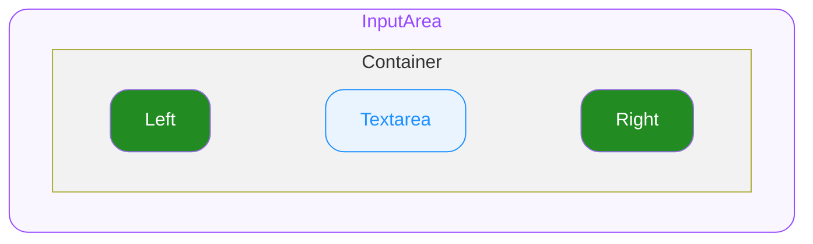

# InputArea — Spec

---

# 0. Overview

ODS InputArea는 여러 줄 텍스트를 입력받는 컴포넌트입니다. InputField와 유사하지만 여러 줄 입력을 지원하며, 세 가지 높이 모드(Fixed / Auto Grow / Manual)를 제공하며, height prop 조합에 따라 모드가 결정됩니다.

---

# 1. Structure

- **`InputArea`**
  외부로 노출되는 컴포넌트의 루트(엔트리)입니다.
  - **`Container`**
    최상위 영역으로 하위 요소들의 레이아웃을 결정합니다.
    - **`Left`**
      Custom 요소를 배치할 수 있는 영역입니다.
    - **`Textarea`**
      유저가 값을 입력하고 편집할 수 있는 영역입니다.
    - **`Right`**
      Custom 요소를 배치할 수 있는 영역입니다.

---

# 2. States

| State Composition | idle | hovered | focused |
|---|---|---|---|
| — (Default) | ✔️ | ✔️ | ✔️ |
| error | ✔️ | ✔️ | ✔️ |
| disabled | ✔️ | ➖ | ➖ |
| readonly | ✔️ | ➖ | ✔️ |
| disabled + error | ✔️ | ➖ | ➖ |

#### User Interaction States

사용자의 상호작용에 따라 컴포넌트가 변화하는 상태를 의미합니다. 한 번에 하나만 시각적으로 표현됩니다.

- **`idle`**
  유저가 인터랙션 하지 않는 기본 상태입니다.
- **`hovered`**
  `🌐 Web Only` ◌ 마우스를 위에 올렸을 때 진입하는 상태입니다.
- **`focused`**
  클릭/터치로 textarea가 포커스된 상태입니다.

#### Control States

시스템 또는 개발자의 제어에 따라 컴포넌트가 가질 수 있는 상태입니다. 동시에 올 수 있습니다.

- **`disabled`**
  컴포넌트가 사용 불가능한 상태입니다.
- **`error`**
  에러 상태입니다.
- **`readonly`**
  idle과 동일한 시각 스타일을 유지합니다.

---

# 3. Behaviors

#### Height Behavior

Size Props의 조합에 따라 높이 동작 방식이 결정됩니다.

- **Fixed**
  - `rows`로 고정 높이를 지정합니다.
  - 내용이 지정된 줄 수를 초과하면 내부 스크롤이 발생합니다.
  - e.g. `rows: 5` → 항상 5줄 높이
- **Auto Grow**
  - 내용에 따라 높이가 자동으로 늘어납니다.
  - `minRows`(default: 1)와 `maxRows`(optional)로 범위를 지정합니다.
  - `maxRows`에 도달하면 내부 스크롤이 발생합니다.
  - `maxRows`를 지정하지 않으면 무제한으로 늘어납니다. ScrollView 내부 사용 시 레이아웃 충돌에 주의하세요.
  - e.g. `minRows: 1, maxRows: 5` → 1줄에서 시작, 최대 5줄까지 자동 확장
- **Manual**
  - height prop을 지정하지 않으면 높이를 외부 스타일에 위임합니다.
  - 부모 컨테이너나 외부 스타일이 높이를 결정합니다.
  - 내용이 높이를 초과하면 내부 스크롤이 발생합니다.

#### Focus

- **일반 Focus** (플랫폼 공통)
  클릭/터치로 textarea가 focused됩니다.
- **Keyboard Tab Focus Traversal** `🌐 Web Only`
  left(내부 요소가 focusable할 경우) → textarea → right(내부 요소가 focusable할 경우)

#### Readonly

- readonly 상태에서 커서는 진입하지 않으며 데이터를 조작할 수 없습니다.
- 가상 키보드는 표시하지 않습니다.
- 텍스트 선택 및 복사는 플랫폼별 방식으로 지원합니다.

#### 줄바꿈

- Enter/Return 키 입력 시 줄바꿈이 발생합니다.
- InputField의 returnKeyType과 달리, Enter는 기본적으로 줄바꿈 동작입니다.

---

# 4. Props

## 4.1. Slot Props

#### Left

**`Custom`** ◌ `Optional` ◌ left 자리에 요소를 지정합니다.

#### Right

**`Custom`** ◌ `Optional` ◌ right 자리에 요소를 지정합니다.

---

## 4.2. Size Props

#### Rows

**`number`** ◌ `Optional` ◌ 고정 높이를 지정합니다. 내용 초과 시 내부 스크롤이 발생합니다.

#### MinRows

**`number`** ◌ `Optional` ◌ `Default Value`: **`1`** ◌ 자동 확장 최소 줄 수를 지정합니다.

#### MaxRows

**`number`** ◌ `Optional` ◌ 자동 확장 최대 줄 수를 지정합니다. 미지정 시 무제한 확장됩니다.

> `rows`와 `minRows`/`maxRows`는 동시에 사용할 수 없음. 모두 지정하지 않으면 외부 스타일에 위임합니다 (Manual).

---

## 4.3. Field Props

#### Placeholder

**`string`** ◌ `Optional` ◌ 플레이스홀더 텍스트를 지정합니다.

#### Value

**`string`** ◌ 입력 값을 지정합니다.

#### MaxLength

**`number`** ◌ `Optional` ◌ 최대 입력 가능 문자 수를 제한합니다.

- 카운팅 기준: Unicode Extended Grapheme Cluster (UAX #29)
- 보다 자세한 내용은 InputField의 maxLength 스펙과 동일

---

## 4.4. State Props

#### Disabled

**`boolean`** ◌ `Optional` ◌ `Default Value`: `false` ◌ disabled 상태를 지정합니다.

- `true`
  컴포넌트를 disabled 상태로 전환합니다. Idle 외의 User Interaction State로 전환되지 않습니다.
- `false`
  컴포넌트의 disabled 상태를 해제합니다.

#### Error

**`boolean`** ◌ `Optional` ◌ `Default Value`: `false` ◌ error 상태를 지정합니다.

- `true`
  에러 상태를 활성화합니다.
- `false`
  에러 상태를 해제합니다.

#### Readonly

**`boolean`** ◌ `Optional` ◌ `Default Value`: `false` ◌ readonly 상태를 지정합니다.

- `true`
  읽기 전용 상태로 전환합니다. idle과 동일한 시각 스타일을 유지합니다.
- `false`
  readonly 상태를 해제합니다.

---

# 5. Constants

> 모든 수치의 단위는 logical unit 기준입니다. 1 logical unit = 1px(Web) = 1pt(iOS) = 1dp(Android).

(디자인 확정 후 정의)

- rows 기반 높이 계산에 필요한 Typography 토큰 (font size, line height)을 함께 정의
