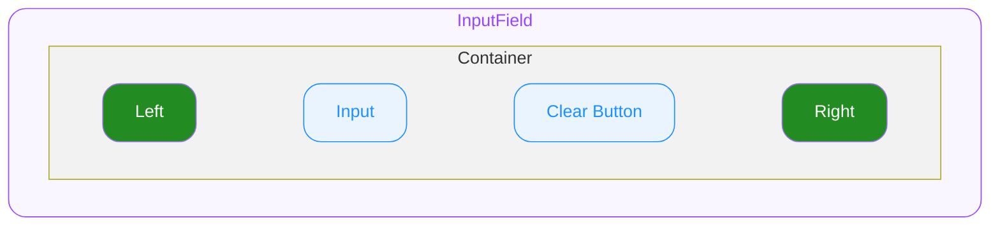

# InputField — Spec

## 0. Overview

ODS InputField는 단일 줄 텍스트를 입력받는 컴포넌트입니다. 좌우 슬롯, 클리어 버튼, 다양한 키보드/입력 타입 설정을 지원합니다.

## 1. Structure

- **`InputField`**
  외부로 노출되는 컴포넌트의 루트(엔트리)입니다.
  - **`Container`**
    최상위 영역으로 하위 요소들의 레이아웃을 결정합니다.
    - **`Left`**
      Container 내에서 Input 왼쪽에 위치하는 슬롯입니다.
    - **`Input`**
      유저가 값을 입력하고 편집할 수 있는 영역입니다.
    - **`Clear Button`**
      Value를 지울 수 있는 버튼 UI입니다.
    - **`Right`**
      Container 내에서 Input 오른쪽에 위치하는 슬롯입니다.

## 2. States

| State Composition | idle | hovered | focused |
|---|---|---|---|
| — (Default) | ✔️ | ✔️ | ✔️ |
| error | ✔️ | ✔️ | ✔️ |
| disabled | ✔️ | ➖ | ➖ |
| readonly | ✔️ | ➖ | ✔️ |
| disabled + error | ✔️ | ➖ | ➖ |

### User Interaction States

사용자의 상호작용에 따라 컴포넌트가 변화하는 상태를 의미합니다. 한 번에 하나만 시각적으로 표현됩니다.

- **`idle`**
  유저가 인터랙션 하지 않는 기본 상태입니다.
- **`hovered`**
  **`🌐 Web Only`** ◌ 사용자가 마우스를 위에 올렸을 때 진입하는 상태입니다.
- **`focused`**
  클릭/터치로 input이 포커스된 상태입니다.

### Control States

시스템 또는 개발자의 제어에 따라 컴포넌트가 가질 수 있는 상태입니다. 동시에 올 수 있습니다.

- **`disabled`**
  컴포넌트가 사용 불가능한 상태입니다.
- **`error`**
  에러 상태입니다.
- **`readonly`**
  idle과 동일한 시각 스타일을 유지합니다 (별도 시각 변화 없음).

## 3. Behaviors

### Focus

- **일반 Focus** (플랫폼 공통)
  클릭/터치로 input이 focused됩니다.
- **Keyboard Tab Focus Traversal** **`🌐 Web Only`**
  Tab 이동 순서: left(내부 요소가 focusable할 경우) → input → clear button(렌더 시) → right(내부 요소가 focusable할 경우)

### Clear Button

- 렌더 조건
  - `clearable=true`이고 value가 빈 문자열이 아니고 readonly/disabled가 아닐 때
- 유저가 clear button을 작동하면 기존 value는 지워지고 InputField가 focused 상태가 됩니다.

### Readonly

- readonly 상태에서 커서는 진입하지 않으며 데이터를 조작할 수 없습니다.
- 가상 키보드는 표시하지 않습니다.
- 텍스트 선택 및 복사는 플랫폼별 방식으로 지원합니다 (모바일: long press 등).
- clear button은 렌더되지 않습니다.

### Format

- InputField는 자체적인 포맷팅 기능을 내장하지 않습니다.
- 외부에서 value를 가공하여 전달하는 방식으로 포맷을 적용할 수 있습니다.

## 4. Props

### 4.1. Slot Props

#### Left

`IconName | string | Custom` ◌ `Optional` ◌ left 자리에 요소를 지정합니다.

- **`IconName`**
  아이콘을 지정하여 정해진 스타일로 아이콘을 렌더합니다.
- **`string`**
  텍스트를 지정하여 정해진 스타일로 텍스트를 렌더합니다.
- **`Custom`**
  임의의 요소를 지정할 수 있습니다.

#### Right

`IconName | string | Custom` ◌ `Optional` ◌ right 자리에 요소를 지정합니다.

- **`IconName`**
  아이콘을 지정하여 정해진 스타일로 아이콘을 렌더합니다.
- **`string`**
  텍스트를 지정하여 정해진 스타일로 텍스트를 렌더합니다.
- **`Custom`**
  임의의 요소를 지정할 수 있습니다.

### 4.2. Field Props

#### Placeholder

`string` ◌ `Optional` ◌ 플레이스홀더 텍스트를 지정합니다.

#### Value

`string` ◌ 입력 값을 지정합니다.

#### Clearable

`boolean` ◌ `Optional` ◌ Default Value: `false` ◌ Clear Button 렌더 여부를 지정합니다.

- `true`
  Clear Button을 렌더합니다.
- `false`
  Clear Button을 렌더하지 않습니다.

#### TextContentType

`Optional` ◌ Default Value: `text` ◌ 입력 데이터의 의미론적 유형을 지정합니다.

**TextContentType Platform Mapping**

| 용도 | TextContentType | **`🌐 Web`** [type / autocomplete](https://developer.mozilla.org/en-US/docs/Web/HTML/Element/input#input_types) | **`🤖 Android`** [autofillHints](https://developer.android.com/reference/android/view/View#setAutofillHints(java.lang.String...)) | **`🍏 iOS`** [UITextContentType](https://developer.apple.com/documentation/uikit/uitextcontenttype) |
|---|---|---|---|---|
| 일반 텍스트 입력 | `text` | `text` | 지정 안 함 | 지정 안 함 |
| 이메일 주소 입력 | `email` | `email` | [`AUTOFILL_HINT_EMAIL_ADDRESS`](https://developer.android.com/reference/android/view/View#AUTOFILL_HINT_EMAIL_ADDRESS) | [`.emailAddress`](https://developer.apple.com/documentation/uikit/uitextcontenttype/emailaddress) |
| URL 입력 | `url` | `url` | 지정 안 함 | [`.URL`](https://developer.apple.com/documentation/uikit/uitextcontenttype/url) |
| 전화번호 입력 | `phone` | `tel` | [`AUTOFILL_HINT_PHONE`](https://developer.android.com/reference/android/view/View#AUTOFILL_HINT_PHONE) | [`.telephoneNumber`](https://developer.apple.com/documentation/uikit/uitextcontenttype/telephonenumber) |
| 일회용 인증 코드 입력 | `oneTimeCode` | `inputMode="numeric"` • `autocomplete="one-time-code"` | [`AUTOFILL_HINT_SMS_OTP`](https://developer.android.com/reference/android/view/View#AUTOFILL_HINT_SMS_OTP) | [`.oneTimeCode`](https://developer.apple.com/documentation/uikit/uitextcontenttype/onetimecode) |

#### KeyboardType

`Optional` ◌ OS별 키보드 타입을 설정합니다.

**KeyboardType Platform Mapping**

| 용도 | KeyboardType | **`🌐 Web`** [inputmode](https://developer.mozilla.org/ko/docs/Web/HTML/Reference/Global_attributes/inputmode) | **`🤖 Android`** [KeyboardType](https://developer.android.com/reference/kotlin/androidx/compose/ui/text/input/KeyboardType) | **`🍏 iOS`** [UIKeyboardType](https://developer.apple.com/documentation/uikit/uikeyboardtype) |
|---|---|---|---|---|
| 기본 텍스트 키보드 | `default` | `text` | `Text` | `.default` |
| 숫자 전용 키보드 | `number` | `numeric` | `Number` | `.numberPad` |
| 소수점 포함 숫자 키보드 | `decimal` | `decimal` | `Decimal` | `.decimalPad` |
| 전화번호 입력 키보드 | `phone` | `tel` | `Phone` | `.phonePad` |
| 이메일 입력 키보드 | `email` | `email` | `Email` | `.emailAddress` |
| URL 입력 키보드 | `url` | `url` | `Uri` | `.URL` |

#### ReturnKeyType

`Optional` ◌ OS별 가상 키보드 리턴 키 타입을 설정합니다.

**ReturnKeyType Platform Mapping**

| 용도 | **`🌐 Web`** [enterkeyhint](https://developer.mozilla.org/en-US/docs/Web/HTML/Reference/Global_attributes/enterkeyhint) | **`🤖 Android`** [imeOptions](https://developer.android.com/reference/android/widget/TextView#attr_android:imeOptions) | **`🍏 iOS`** [UIReturnKeyType](https://developer.apple.com/documentation/uikit/uireturnkeytype) |
|---|---|---|---|
| 기본 리턴 키 | `enter` | `IME_ACTION_UNSPECIFIED` | `.default` |
| 입력 완료 | `done` | `IME_ACTION_DONE` | `.done` |
| 이동 | `go` | `IME_ACTION_GO` | `.go` |
| 다음 필드로 이동 | `next` | `IME_ACTION_NEXT` | `.next` |
| 검색 실행 | `search` | `IME_ACTION_SEARCH` | `.search` |
| 전송 | `send` | `IME_ACTION_SEND` | `.send` |

#### AutoCorrect

`boolean` ◌ `Optional` ◌ OS별 키보드 자동완성 활성화 여부를 지정합니다.

**AutoCorrect Platform Mapping**

| 용도 | **`🌐 Web`** [autocorrect](https://developer.mozilla.org/en-US/docs/Web/HTML/Reference/Global_attributes/autocorrect) | **`🤖 Android`** [autoCorrect](https://developer.android.com/reference/kotlin/androidx/compose/ui/text/input/ImeOptions?hl=en#autoCorrect()) | **`🍏 iOS`** [UITextAutocorrectionType](https://developer.apple.com/documentation/uikit/uitextautocorrectiontype) |
|---|---|---|---|
| 자동 교정 활성화 | `on` | `true` | `.yes` |
| 자동 교정 비활성화 | `off` | `false` | `.no` |

### 4.3. State Props

#### Disabled

`boolean` ◌ `Optional` ◌ Default Value: `false` ◌ disabled 상태를 지정합니다.

- `true`
  컴포넌트를 disabled 상태로 전환합니다. Idle 외의 User Interaction State로 전환되지 않습니다.
- `false`
  컴포넌트의 disabled 상태를 해제합니다.

#### Error

`boolean` ◌ `Optional` ◌ Default Value: `false` ◌ error 상태를 지정합니다.

- `true`
  에러 상태를 활성화합니다.
- `false`
  에러 상태를 해제합니다.

#### Readonly

`boolean` ◌ `Optional` ◌ Default Value: `false` ◌ readonly 상태를 지정합니다.

- `true`
  읽기 전용 상태로 전환합니다. idle과 동일한 시각 스타일을 유지합니다.
- `false`
  readonly 상태를 해제합니다.

## 5. Constants

> 모든 수치의 단위는 logical unit 기준입니다. 1 logical unit = 1px(Web) = 1pt(iOS) = 1dp(Android).

(디자인 확정 후 정의)
