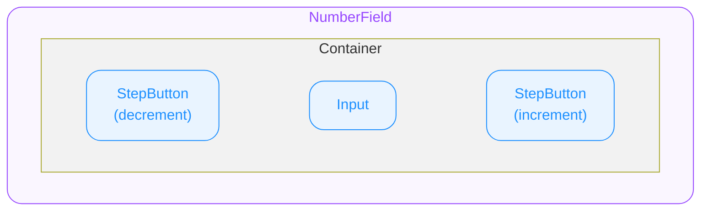

# NumberField — Spec

## 0. Overview

ODS NumberField는 숫자 입력 전용 컴포넌트입니다. 좌우 StepButton으로 값을 증감할 수 있으며, 키보드 직접 입력도 지원합니다. min/max, step, precision 등으로 입력 범위와 단위를 제어합니다.

## 1. NumberField

숫자 입력을 담당하는 루트 컴포넌트입니다.

### 1.1. Structure

- **`NumberField`**
  외부로 노출되는 컴포넌트의 루트(엔트리)입니다.
  - **`Container`**
    최상위 영역입니다.
    - **`StepButton (decrement)`**
      값을 감소시키는 버튼입니다.
    - **`Input`**
      숫자 입력 필드입니다.
    - **`StepButton (increment)`**
      값을 증가시키는 버튼입니다.

### 1.2. States

| State Composition | idle | hovered | focused |
|---|---|---|---|
| — (Default) | ✔️ | ✔️ | ✔️ |
| error | ✔️ | ✔️ | ✔️ |
| disabled | ✔️ | ➖ | ➖ |
| readonly | ✔️ | ➖ | ✔️ |
| disabled + error | ✔️ | ➖ | ➖ |

#### User Interaction States

사용자의 상호작용에 따라 컴포넌트가 변화하는 상태를 의미합니다. 한 번에 하나만 시각적으로 표현됩니다. NumberField Container의 User Interaction 상태와 StepButton의 User Interaction 상태는 독립적으로 동작합니다.

- **`idle`**
  유저가 인터랙션 하지 않는 기본 상태입니다.
- **`hovered`**
  `🌐 Web Only` — 사용자가 마우스를 위에 올렸을 때 진입하는 상태입니다.
- **`focused`**
  클릭/터치로 input이 포커스된 상태입니다.

#### Control States

시스템 또는 개발자의 제어에 따라 컴포넌트가 가질 수 있는 상태입니다. 동시에 올 수 있습니다.

- **`disabled`**
  컴포넌트가 사용 불가능한 상태입니다.
- **`error`**
  에러 상태입니다.
- **`readonly`**
  idle과 동일한 시각 스타일을 유지합니다 (별도 시각 변화 없음).

### 1.3. Behaviors

#### Focus

- 클릭/터치로 NumberField가 포커스되면 내부 input만 focused 상태가 됩니다.
- StepButton은 탭 포커스 대상이 아닙니다 (마우스/터치 전용).
- NumberField 전체가 하나의 탭 스톱으로 동작합니다 `🌐 Web Only`

#### StepButton 터치 시 포커스 동작

- **Web**
  - StepButton 클릭 시 input에 포커스 이동
- **iOS/Android**
  - StepButton 터치 시 input에 포커스를 주지 않음 (가상 키보드 미표시)

#### Keyboard Interaction `🌐 Web Only`

input이 focused된 상태에서만 동작합니다.

> 참고: [WAI-ARIA Spinbutton Pattern](https://www.w3.org/WAI/ARIA/apg/patterns/spinbutton/)

- **ArrowUp**: step만큼 증가
- **ArrowDown**: step만큼 감소
- **Page Up / Shift + ArrowUp**: largeStep만큼 증가
- **Page Down / Shift + ArrowDown**: largeStep만큼 감소
- **Home**: min으로 이동 (min 미지정 시 동작 없음)
- **End**: max로 이동 (max 미지정 시 동작 없음)

#### Blur 시 값 보정

- blur 시 **clamp(min/max)만 적용** — step 배수로의 snap은 하지 않음
- step은 StepButton / ArrowUp/Down 증감 전용이며, 직접 입력 값을 제한하지 않음
- **빈 값 허용**: blur 시 빈 값(`""`)은 유지. 복구 정책은 사용처에서 제어
- **소수점 정규화** (precision > 0일 때)
  - `"."` 단독 입력 → 빈 값 처리
  - `"3."` → `"3"` (불완전 소수점 제거)
  - `"3.10"` → `"3.1"` (후행 0 제거)
  - precision은 입력 허용 자릿수만 제한, blur 시 패딩하지 않음

#### Direct Input

- 숫자, 음수 부호(`"-"`)만 기본 허용. 소수점(`"."`) precision > 0일 때만 허용. `"e"`/`"E"` 차단
- 소수점 이하 자릿수는 precision까지만 허용 (초과 입력 무시)
- 입력 중(focused)에는 clamp를 적용하지 않고, blur 시 일괄 보정
- **음수 부호 입력 규칙**: `"-"`는 맨 앞에서만 허용. 이미 부호가 있으면 추가 `"-"` 입력 무시. `"-"`만 입력 후 blur → 빈 값 처리

#### Keyboard Type (네이티브)

prop 조합에 따라 키보드 타입을 자동 결정합니다.

| 용도 | `🍏 iOS` | `🤖 Android` |
|---|---|---|
| 정수 & min >= 0 | `.numberPad` | `inputType="number"` |
| 소수 & min >= 0 | `.decimalPad` | `inputType="numberDecimal"` |
| 정수 & 음수 허용 | 구현 재량 | `inputType="numberSigned"` |
| 소수 & 음수 허용 | 구현 재량 | `numberSigned\|numberDecimal` |

#### Readonly

- 커서는 진입하지 않으며 데이터를 조작할 수 없습니다.
- StepButton은 비활성화됩니다.
- 키보드 ArrowUp/Down도 동작하지 않습니다.

#### 빈 값 (Empty)

- value가 빈 문자열(`""`)일 때 StepButton 클릭 시 `clamp(0, min, max)` 값부터 시작합니다.
  - min=5이면 5부터, max=-1이면 -1부터, min/max 미지정이면 0부터

### 1.4. Props

#### 1.4.1. Value Props

##### Value

**`string`** — 사용자에게 표시되는 입력 텍스트를 나타냅니다. 빈 상태는 `""` (빈 문자열).

> 입력 중 중간 상태(`"-"`, `"1."`, `""` 등)를 표현하기 위해 string 타입을 사용. 최종 number 변환은 사용처에서 수행.

##### Min

**`number`** — `Optional` — 허용 최솟값. 미지정 시 감소 방향 제한 없음.

##### Max

**`number`** — `Optional` — 허용 최댓값. 미지정 시 증가 방향 제한 없음.

##### Step

**`number`** — `Optional` — `Default Value`: **`1`** — increment/decrement 및 ArrowUp/Down 시 변화 단위. 양수만 허용 (step > 0).

##### Precision

**`number`** — `Optional` — `Default Value`: **`0`** — 소수점 이하 허용 자릿수. 소수점 입력이 필요하면 명시적으로 지정합니다.

> **precision-step 정합성**
> precision은 step의 소수점 자릿수 이상이어야 합니다. 미달 시 precision을 step의 소수점 자릿수로 자동 확장합니다. (e.g. step=0.5, precision=0 → precision이 1로 자동 확장)

##### LargeStep `🌐 Web Only`

**`number`** — `Optional` — `Default Value`: **`step * 10`** — Page Up/Down 및 Shift + ArrowUp/Down 시 변화 단위.

#### 1.4.2. Field Props

##### Placeholder

**`string`** — `Optional` — value가 없을 때 표시할 텍스트.

#### 1.4.3. State Props

##### Disabled

**`boolean`** — `Optional` — `Default Value`: `false` — disabled 상태를 지정합니다.

- `true`: 컴포넌트를 disabled 상태로 전환합니다. Idle 외의 User Interaction State로 전환되지 않습니다.
- `false`: 컴포넌트의 disabled 상태를 해제합니다.

##### Error

**`boolean`** — `Optional` — `Default Value`: `false` — error 상태를 지정합니다.

- `true`: 에러 상태를 활성화합니다.
- `false`: 에러 상태를 해제합니다.

##### Readonly

**`boolean`** — `Optional` — `Default Value`: `false` — readonly 상태를 지정합니다.

- `true`: 읽기 전용 상태로 전환합니다. idle과 동일한 시각 스타일을 유지합니다.
- `false`: readonly 상태를 해제합니다.

### 1.5. Constants

> 모든 수치의 단위는 logical unit 기준입니다. 1 logical unit = 1px(Web) = 1pt(iOS) = 1dp(Android).

(디자인 토큰 확정 후 정의)

| 항목 | 속성 | 값 |
|---|---|---|
| decrementButton | Icon | TBD |
| incrementButton | Icon | TBD |

## 2. StepButton

NumberField 내부에서 값의 증감을 담당하는 버튼 컴포넌트입니다.

### 2.1. Structure

- StepButton > Container > Icon (type에 따라 Constants에서 정의된 아이콘 자동 렌더)

### 2.2. States

| State Composition | idle | hovered | pressed |
|---|---|---|---|
| — (Default) | ✔️ | ✔️ | ✔️ |
| disabled | ✔️ | ➖ | ➖ |

#### User Interaction States

사용자의 상호작용에 따라 컴포넌트가 변화하는 상태를 의미합니다. 한 번에 하나만 시각적으로 표현됩니다.

- **`idle`**
  유저가 인터랙션 하지 않는 기본 상태입니다.
- **`hovered`**
  `🌐 Web Only` — 사용자가 마우스를 위에 올렸을 때 진입하는 상태입니다.
- **`pressed`**
  유저가 컴포넌트를 클릭하거나 터치하고 있는 상태입니다.

#### Control States

시스템 또는 개발자의 제어에 따라 컴포넌트가 가질 수 있는 상태입니다.

- **`disabled`**
  컴포넌트가 사용 불가능한 상태입니다.

**disabled 조건**

- NumberField가 disabled/readonly인 경우: 양쪽 모두 disabled
- decrementButton: value ≤ min일 때 disabled
- incrementButton: value ≥ max일 때 disabled

### 2.3. Behaviors

#### Long Press 반복 증감

StepButton을 길게 누르면 연속으로 값이 변하며, 시간이 지남에 따라 반복 간격이 단축됩니다 (가속). 전 플랫폼(Web, iOS, Android) 지원.

### 2.4. Props

#### Type

**`"decrement" | "increment"`** — 버튼의 방향을 지정합니다. type에 따라 Constants에서 정의된 아이콘을 자동 렌더합니다.

### 2.5. Constants

#### Long Press 반복 증감 파라미터

| 파라미터 | 설명 | 값 |
|---|---|---|
| 반복 시작 딜레이 | 길게 누르기 시작 후 반복이 시작되기까지의 대기 시간 | TBD |
| 초기 반복 간격 | 반복 시작 직후의 증감 간격 | TBD |
| 최소 반복 간격 | 가속 후 도달하는 최소 간격 | TBD |
| 가속 비율 | 반복 간격이 줄어드는 비율 | TBD |
