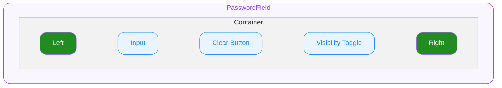

# PasswordField — Spec

# 0. Overview

ODS PasswordField는 비밀번호 입력 전용 컴포넌트입니다. 마스킹/마스킹 해제 전환을 위한 visibilityToggle을 내장하며, 플랫폼 네이티브 비밀번호 자동완성을 지원합니다. 값의 유효성 검증은 외부에서 담당하고, PasswordField는 시각적 피드백만 제공합니다.

# 1. Structure

- **`PasswordField`**
  외부로 노출되는 컴포넌트의 루트(엔트리)입니다.
  - **`Container`**
    최상위 영역으로 하위 요소들의 레이아웃을 결정합니다.
    - **`Left`**
      Input 왼쪽 슬롯입니다.
    - **`Input`**
      비밀번호 입력 영역입니다.
    - **`Clear Button`**
      Value를 지울 수 있는 버튼입니다.
    - **`Visibility Toggle`**
      마스킹/마스킹 해제를 전환하는 토글 버튼입니다.
    - **`Right`**
      Input 오른쪽 슬롯입니다.

# 2. States

| State Composition | idle | hovered | focused |
|---|---|---|---|
| — (Default) | ✔️ | ✔️ | ✔️ |
| error | ✔️ | ✔️ | ✔️ |
| disabled | ✔️ | ➖ | ➖ |
| readonly | ✔️ | ➖ | ✔️ |
| disabled + error | ✔️ | ➖ | ➖ |

#### User Interaction States

사용자의 상호작용에 따라 컴포넌트가 변화하는 상태를 의미합니다. 한 번에 하나만 시각적으로 표현됩니다.

- **`idle`**
  유저가 인터랙션 하지 않는 기본 상태입니다.
- **`hovered`**
  `🌐 Web Only` ◌ 사용자가 마우스를 위에 올렸을 때 진입하는 상태입니다.
- **`focused`**
  클릭/터치로 input이 포커스된 상태입니다.

#### Control States

시스템 또는 개발자의 제어에 따라 컴포넌트가 가질 수 있는 상태입니다. 동시에 올 수 있습니다.

- **`disabled`**
  컴포넌트가 사용 불가능한 상태입니다.
- **`error`**
  에러 상태입니다.
- **`readonly`**
  idle과 동일한 시각 스타일을 유지합니다 (별도 시각 변화 없음).

# 3. Behaviors

#### Focus

- **일반 Focus** (플랫폼 공통)
  클릭/터치로 input이 focused됩니다.
- **Keyboard Tab Focus Traversal** `🌐 Web Only`
  left → input → clearButton(렌더 시) → visibilityToggle → right

#### Clear Button

- 렌더 조건
  - `clearable=true`이고 value가 빈 문자열이 아니고 readonly/disabled가 아닐 때
- 유저가 clearButton을 작동하면 value는 지워지고 PasswordField가 focused 상태가 됩니다.

#### Visibility Toggle

- 비밀번호의 마스킹/마스킹 해제를 전환하는 토글 버튼입니다.
- 아이콘
  - 마스킹 상태일 때 "eye-off", 마스킹 해제 상태일 때 "eye-on"
- `masked`는 외부 controlled 상태입니다. visibilityToggle 클릭 시 외부에서 masked 값을 토글하여 전달합니다.
- 마스킹 전환 시 input의 포커스와 커서 위치(캐럿)를 보존합니다.
- disabled/readonly 상태에서도 토글은 작동합니다. (값 조작이 아닌 표시 방식 전환이므로)

> **마스킹 문자:** 각 플랫폼의 네이티브 password input 마스킹 방식을 그대로 따릅니다. (Web: `<input type="password">`, iOS: `SecureField`, Android: `inputType="textPassword"`)

#### Readonly

- 커서는 진입하지 않으며 데이터를 조작할 수 없습니다.
- 가상 키보드는 표시하지 않습니다.
- 텍스트 선택 및 복사는 마스킹 상태에 따라 다릅니다
  - masked
    - 복사 차단 (플랫폼 네이티브 password input 정책에 따름)
  - unmasked
    - 텍스트 선택 및 복사 허용
- clearButton은 렌더되지 않습니다.

> 보안이 민감한 경우, readonly 상태에서 masked를 고정(true)하는 것을 권장합니다.

# 4. Props

## 4.1. Slot Props

#### Left

**`IconName | Custom`** ◌ `Optional` ◌ left 자리에 요소를 지정합니다.

- **`IconName`**
  아이콘을 지정하여 정해진 스타일로 아이콘을 렌더합니다.
- **`Custom`**
  임의의 요소를 지정할 수 있습니다.

#### Right

**`IconName | Custom`** ◌ `Optional` ◌ right 자리에 요소를 지정합니다.

- **`IconName`**
  아이콘을 지정하여 정해진 스타일로 아이콘을 렌더합니다.
- **`Custom`**
  임의의 요소를 지정할 수 있습니다.

## 4.2. Field Props

#### Placeholder

**`string`** ◌ `Optional` ◌ 플레이스홀더 텍스트를 지정합니다.

#### Value

**`string`** ◌ 입력 값을 지정합니다.

#### Clearable

**`boolean`** ◌ `Optional` ◌ `Default Value`: `false` ◌ Clear Button 렌더 여부를 지정합니다.

- `true`
  Clear Button을 렌더합니다.
- `false`
  Clear Button을 렌더하지 않습니다.

#### Masked

**`boolean`** ◌ 비밀번호 마스킹 상태를 외부에서 제어합니다 (controlled).

- `true`
  마스킹 상태입니다. 비밀번호가 숨겨집니다.
- `false`
  마스킹 해제 상태입니다. 평문으로 표시됩니다.

visibilityToggle 클릭 시 외부에서 masked 상태를 변경하여 전달합니다.

#### TextContentType

`Optional` ◌ `Default Value`: **`password`** ◌ 입력 데이터의 의미론적 유형을 지정합니다.

**TextContentType Platform Mapping**

| 용도 | `🌐 Web` [autocomplete](https://developer.mozilla.org/en-US/docs/Web/HTML/Attributes/autocomplete) | `🤖 Android` [autofillHints](https://developer.android.com/reference/android/view/View#setAutofillHints(java.lang.String...)) | `🍏 iOS` [textContentType](https://developer.apple.com/documentation/uikit/uitextcontenttype) |
|---|---|---|---|
| 기존 비밀번호 입력 (로그인 등) | `current-password` | `AUTOFILL_HINT_PASSWORD` | `.password` |
| 새 비밀번호 입력 (회원가입, 비밀번호 변경 등) | `new-password` | `AUTOFILL_HINT_NEW_PASSWORD` | `.newPassword` |

## 4.3. State Props

#### Disabled

**`boolean`** ◌ `Optional` ◌ `Default Value`: `false` ◌ disabled 상태를 지정합니다.

- `true`
  컴포넌트를 disabled 상태로 전환합니다. Idle 외의 User Interaction State로 전환되지 않습니다.
- `false`
  컴포넌트의 disabled 상태를 해제합니다.

#### Error

**`boolean`** ◌ `Optional` ◌ `Default Value`: `false` ◌ error 상태를 지정합니다.

- `true`
  에러 상태를 활성화합니다.
- `false`
  에러 상태를 해제합니다.

#### Readonly

**`boolean`** ◌ `Optional` ◌ `Default Value`: `false` ◌ readonly 상태를 지정합니다.

- `true`
  읽기 전용 상태로 전환합니다. idle과 동일한 시각 스타일을 유지합니다.
- `false`
  readonly 상태를 해제합니다.

# 5. Constants

> 모든 수치의 단위는 logical unit 기준입니다. 1 logical unit = 1px(Web) = 1pt(iOS) = 1dp(Android).

(InputField Constants 기반으로 정의 예정)

| | | |
|---|---|---|
| clearButton ↔ visibilityToggle | Gap | TBD |

> maxLength는 보안 관점에서 비밀번호 길이 제한을 두지 않는 것이 권장되어 제외했습니다 (NIST SP 800-63B).
