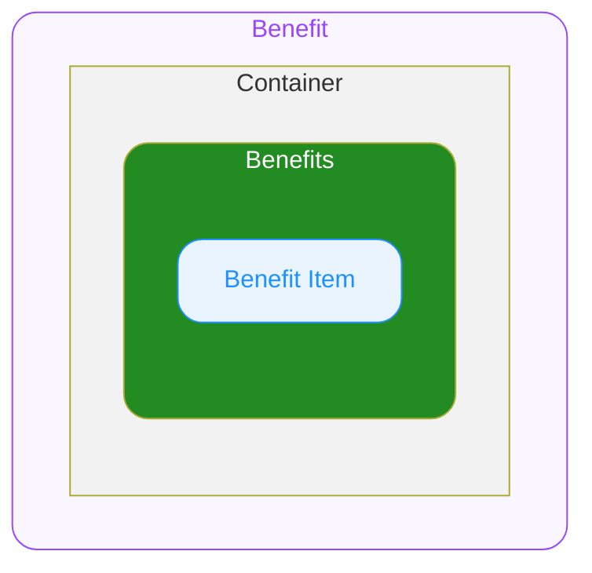
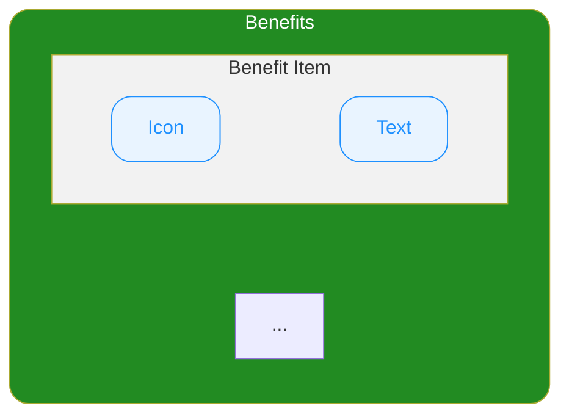

# Product Card Benefit — Spec
## 0. Overview

ODS Product Card 하위에서 상품의 쿠폰 및 결제 할인율 혹은 할인금액을 표시하기 위해서 사용하는 컴포넌트입니다.
자세한 사용구조는 Product Card 스펙을 참고하세요.

---

## 1. Structure

- **`Container`**
  최상위 영역으로 하위 요소들의 관계, 정렬, 크기(너비와 높이)를 기준으로 전체 UI의 레이아웃을 결정합니다.

  - **`Benefits`**
    쿠폰, 결제 관련 할인을 나타내는 내용이 나열되는 공간입니다.
    - **`Benefit Item`**
      쿠폰, 결제 관련 할인을 나타내는 개별 Item입니다.

---

## 2. Type Definitions

### BenefitIconName

각 플랫폼에서 지정하는 ODS Icon의 **이름**입니다.

### BenefitIconColor

Benefit Item 아이콘의 색상을 지정하는 열거형입니다.

- **`"default"`**
  기본 색상을 적용합니다.
- **`"red"`**
  빨간색을 적용합니다.

---

## 3. Props

## 3.1. Variant Props

### Soldout

`boolean` ◌ `Optional` ◌ `Default Value`: `false` ◌ 품절 상태를 지정합니다.

- `true`
  품절 상태를 의미합니다. UI의 Opacity가 변동됩니다.
- `false`
  기본 상태입니다.

## 3.2. Slot Props

### Benefits

`{ icon: BenefitIconName, iconColor: BenefitIconColor, text: string }[]` ◌ `Optional` ◌ Benefits 영역에 렌더될 혜택 항목의 목록을 지정합니다. 배열의 각 아이템이 하나의 Benefit Item으로 렌더됩니다.

- **`icon: BenefitIconName`**
  Benefit Item에 표시할 아이콘을 지정합니다.
- **`iconColor: BenefitIconColor`**
  Benefit Item에 표시할 아이콘의 색상을 지정합니다.
- **`text: string`**
  혜택 항목에 표시할 문자열을 지정합니다.
  **포맷팅이 완료된 전체 문자열**(full string)을 전달받으며, 컴포넌트는 별도의 가공 없이 그대로 렌더합니다.
  > e.g. `"최대 15% 쿠폰"`
  > e.g. `"최대 3,000원 결제할인"`

## 3.3. Layout Props

### Top Space

`number` ◌ `Optional` ◌ `Default Value`: `0` ◌ 컴포넌트의 상단 간격을 지정합니다.

---

## 4. Constant

### General

| | Property | Value |
|---|---|---|
| Container | Width | 상단 컨테이너의 가용 너비를 전체 차지합니다. |
| | Height | 콘텐츠의 높이만큼 지정됩니다. |
| | Align Direction | 좌측 세로 상단으로 정렬됩니다. |
| | Gap | `4` |
| Benefits | Container Width | 콘텐츠의 너비만큼 차지합니다. |
| | Container Height | `20` |
| | Container Align Direction | 좌측 가운데 중앙으로 정렬됩니다. |
| | Container Corner Radius | `4` |
| | Container Background Color | (토큰 참조) |
| | Container Border Color | (토큰 참조) |
| | Container Border Width | `1` — Container의 크기가 border 두께를 포함합니다. |
| | Icon Name | Icon Ticket Filled |
| | Icon Size | `12` |
| | Typography Style | Detail 10 L14 Semibold |
| | Text Color | (토큰 참조) |

### Soldout Variation

| | Property | Soldout = `false` | Soldout = `true` |
|---|---|---|---|
| Container | Opacity | 100% | 24% |

---

## 5. Reference

- https://ohou-se.slack.com/archives/C01CL4Y8TD5/p1747981292577769?thread_ts=1747967606.401879&cid=C01CL4Y8TD5
