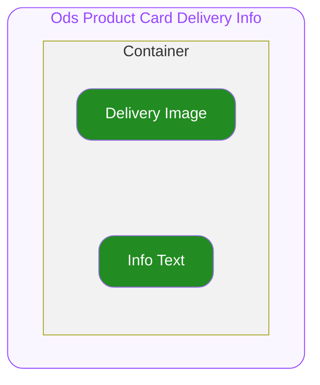

# Product Card Delivery Info — Spec
## 0. Overview

ODS Product Card 하위에서 상품의 배송타입 및 정보 등을 표시하기 위해서 사용하는 컴포넌트입니다.
자세한 사용 구조는 ODS Product Card Spec을 참고하세요.

---

## 1. Structure

- **`Container`**
  최상위 영역으로 하위 요소들의 관계, 정렬, 크기(너비와 높이)를 기준으로 전체 UI의 레이아웃을 결정합니다.

  - **`Delivery Image`**
    배송 타입을 나타내는 이미지 영역입니다.
  - **`Info Text`**
    배송 타입 관련 정보를 나타내는 슬롯입니다.

---

## 2. Props

### 2.1. Variant Props

#### Soldout

**`boolean`** ◌ `Optional` ◌ `Default Value`: `false` ◌ 품절 상태를 지정합니다.

- `true`
  품절 상태를 의미합니다. UI의 Opacity가 변동됩니다.
- `false`
  기본 상태입니다.

### 2.2. Option Props

#### Delivery Type

**`"DEPARTURE_TODAY" | "OHOUSE" | "THIRD_PARTY_APPLIANCE" | "THIRD_PARTY_FURNITURE"`** ◌ 배송 타입을 지정합니다.

- **`"DEPARTURE_TODAY"`**
  
  오늘출발 이미지([**AssetDepartureToday**](https://fe.co-workerhou.se/catalog/?path=/docs/assets-svg-assetdeparturetoday--docs))를 Delivery Image에 렌더합니다.

- **`"OHOUSE"`**
  
  원하는날 도착 이미지([**AssetDeliveryOhouse**](https://fe.co-workerhou.se/catalog/?path=/docs/assets-svg-assetdeliveryohouse--docs))를 Delivery Image에 노출합니다.

- **`"THIRD_PARTY_APPLIANCE"`**
  
  빠른가전배송 이미지([**AssetDeliveryThirdPartyAppliance**](https://fe.co-workerhou.se/catalog/?path=/docs/assets-svg-assetdeliverythirdpartyappliance--docs))를 Delivery Image에 노출합니다.

- **`"THIRD_PARTY_FURNITURE"`**
  
  빠른가구배송 이미지([**AssetDeliveryThirdPartyFurniture**](https://fe.co-workerhou.se/catalog/?path=/docs/assets-svg-assetdeliverythirdpartyfurniture--docs))를 Delivery Image에 노출합니다.

### 2.3. Slot Props

#### Info Text

**`string`** ◌ `Optional` ◌ Info Text에 렌더될 배송에 관련된 조건을 지정합니다.

### 2.4. Layout Props

#### Top Space

**`number`** ◌ `Optional` ◌ `Default Value`: `0` ◌ 컴포넌트의 상단 간격을 지정합니다.

---

## 3. Constant

#### General

| 요소 | 속성 | 값 |
|---|---|---|
| Container | Width | 상단 컨테이너의 가용 너비를 전체 차지합니다. |
| | Height | 콘텐츠의 높이만큼 지정됩니다. |
| | Align Direction | 좌측 세로로 정렬됩니다. |
| | Gap | 4 |
| Delivery Image | Width | 이미지의 원본 비율에 맞춰 지정됩니다. |
| | Height | `15` |
| | Image | `"DEPARTURE_TODAY"` → [AssetDepartureToday](https://fe.co-workerhou.se/catalog/?path=/docs/assets-svg-assetdeparturetoday--docs)  `"OHOUSE"` → [AssetDeliveryOhouse](https://fe.co-workerhou.se/catalog/?path=/docs/assets-svg-assetdeliveryohouse--docs)  `"THIRD_PARTY_APPLIANCE"` → [AssetDeliveryThirdPartyAppliance](https://fe.co-workerhou.se/catalog/?path=/docs/assets-svg-assetdeliverythirdpartyappliance--docs)  `"THIRD_PARTY_FURNITURE"` → [AssetDeliveryThirdPartyFurniture](https://fe.co-workerhou.se/catalog/?path=/docs/assets-svg-assetdeliverythirdpartyfurniture--docs) |
| Info Text | Width | 상위 컨테이너의 가용 너비 전체를 차지합니다. |
| | Height | 콘텐츠의 높이만큼 지정됩니다. |
| | Text Color | FG/Secondary |
| | Typography Style | Detail12L16 Regular |
| | Text Wrapping | 글자 단위로 soft wrapping 됩니다. |

#### Soldout Variation

| 요소 | 속성 | Soldout = `false` | Soldout = `true` |
|---|---|---|---|
| Container | Opacity | 100% | 24% |
