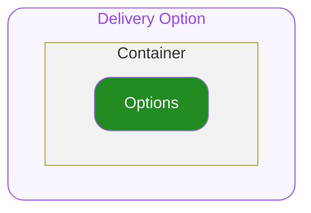
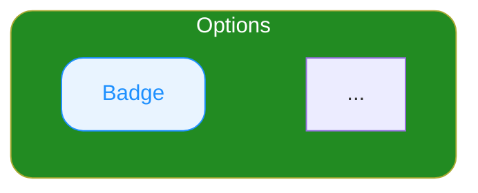

# Product Card Delivery Option — Spec

---

## 0. Overview

ODS Product Card 하위에서 상품의 배송비, 설치비, 해외배송 등을 표시하기 위해서 사용하는 컴포넌트 입니다.
자세한 사용구조는 ODS Product Card 를 참고하세요.

---

## 1. Structure

- **`Container`**
  최상위 영역으로 하위 요소들의 관계, 정렬, 크기(너비와 높이)를 기준으로 전체 UI의 레이아웃을 결정합니다.

  - **`Delivery Fee`**
    배송비 타입을 나타내는 영역입니다.
  - **`Assembling Fee`**
    설치비 타입을 나타내는 영역입니다.
  - **`Overseas Purchase`**
    해외배송 여부를 나타내는 영역입니다.

---

## 2. Props

### 2.1. Variant Props

#### Soldout

**`boolean`** ◌ `Optional` ◌ `Default Value`: `false` ◌ 품절 상태를 지정합니다.

- `true`
  품절 상태를 의미합니다. UI의 Opacity가 변동됩니다.
- `false`
  기본 상태입니다.

---

### 2.2. Slot Props

#### Options

**`string[]`** ◌ `Optional` ◌ 배송 관련 옵션 뱃지에 표시할 문자열 목록을 지정합니다.

- **`string[]`**
  배열의 각 항목이 개별 뱃지로 렌더링되며, 전달된 문자열이 그대로 뱃지 텍스트로 사용됩니다.
  빈 배열이거나 전달하지 않으면 Delivery Option 영역이 노출되지 않습니다.

**사용 예시**

| Example | Result |
|---|---|
| `["무료배송"]` | `무료배송` |
| `["무료배송", "설치비 별도"]` | `무료배송` `설치비 별도` |
| `["무료배송", "설치비 별도", "해외직구"]` | `무료배송` `설치비 별도` `해외직구` |
| `[]` 또는 미전달 | 미노출 |

---

### 2.3. Layout Props

#### Top Space

**`number`** ◌ `Optional` ◌ `Default Value`: `0` ◌ 컴포넌트의 상단 간격을 지정합니다.

---

## 3. Constant

### General

| 요소 | 속성 | 값 |
|---|---|---|
| Container | Width | 상단 컨테이너의 가용 너비를 전체 차지합니다. |
| | Height | 콘텐츠의 높이만큼 지정됩니다. |
| | Align Direction | 가로 상단으로 정렬됩니다. 콘텐츠를 나열할 공간이 부족할 경우 아래로 wrapping 됩니다. |
| | Gap | `4` |
| Badge | Container Width | 컨텐츠의 너비만큼 지정됩니다. |
| | Container Height | `20` |
| | Padding (x, y) | `6` `3` |
| | Corner Radius | `4` |
| | Container Background Color | 토큰 테이블은 Notion 원본 참고 |
| | Typography Style | Detail 10 L14 Semibold |
| | Text Color | 토큰 테이블은 Notion 원본 참고 |

### Soldout Variation

| 요소 | 속성 | Soldout = `false` | Soldout = `true` |
|---|---|---|---|
| Container | Opacity | 100% | 24% |
