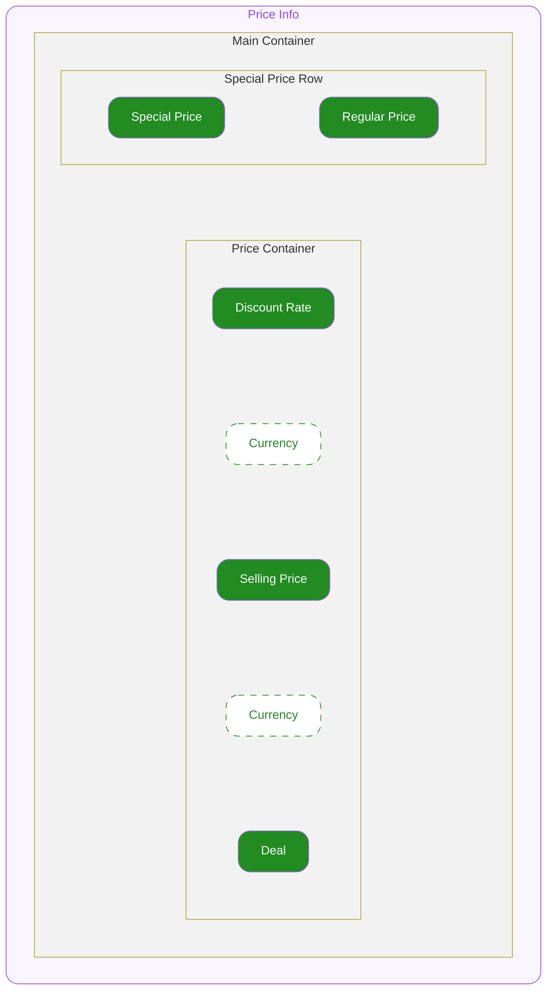

# Product Card Price — Spec
ODS Product Card 하위에서 상품의 가격 및 할인율 등을 표시하기 위해서 사용하는 컴포넌트입니다.
자세한 사용 구조는 Product Card 문서를 참고하세요.

---

## 1. Structure

- **`Main Container`**
  최상위 영역으로 하위 요소들의 관계, 정렬, 크기(너비와 높이)를 기준으로 전체 UI의 레이아웃을 결정합니다.

  - **`Special Price Row`**
    특별인증가와 Regular Price가 가로로 배치되는 컨테이너입니다.
    - **`Special Price`**
      특별인증가 정보를 나타내는 슬롯입니다.
    - **`Regular Price`**
      할인 전 원가를 취소선으로 표시하는 슬롯입니다.

  - **`Price Container`**
    가격 관련 정보들이 담기는 컨테이너입니다.
    - **`Discount Rate`**
      상품의 할인율입니다.
    - **`Currency`**
      통화 정보를 표시합니다.
      통화의 국가에 따라 Price의 앞 또는 뒤에 조건부 렌더됩니다.
    - **`Price`**
      상품의 가격입니다.
    - **`Deal`**
      묶음 상품 여부를 표시하는 슬롯입니다.

---

## 2. Type Definition

#### CurrencyCodeTypes

[ISO 4217](https://en.wikipedia.org/wiki/ISO_4217) 표준 중 통화를 지정하는 일부 타입입니다. (오늘의집에서 사용하는 통화 코드만 사용합니다)

- **`"KRW"`**
  원화를 지정합니다.
- **`"USD"`**
  미화를 지정합니다.
- **`"JPY"`**
  엔화를 지정합니다.

---

## 3. Property

## 3.1. Variant Props

#### Size

**`"small" | "medium"`** ◌ `Optional` ◌ Default Value: **`"medium"`** ◌ 컴포넌트의 스타일을 지정합니다.

#### Soldout

**`boolean`** ◌ `Optional` ◌ Default Value: `false` ◌ 품절 상태를 지정합니다.

- `true`
  품절 상태를 의미합니다. UI의 Opacity가 변동됩니다.
- `false`
  기본 상태입니다.

---

## 3.2. Slot Props

#### Discount Rate

**`number`** ◌ `Optional` ◌ Discount Rate에 렌더될 할인율을 지정합니다.

- **`number`**
  지정받은 할인율은 아래 포맷의 형태로 변환되어 문자열로 렌더됩니다.
  - `"{Discount Rate}%"`

#### Selling Price

**`number`** ◌ Price에 렌더될 판매 가격을 지정합니다. (서버 API 필드명 `sellingPrice`와 통일)

#### Regular Price

**`number`** ◌ `Optional` ◌ Price에 렌더될 할인 전 원가를 지정합니다. 취소선으로 표시됩니다. (서버 API 필드명 `regularPrice`와 통일)

- Currency Format은 Selling Price와 동일 규칙 적용 (Currency, Currency Display, Use Grouping, Fraction Digits)
- Size(small/medium)에 관계없이 동일 스타일 (Detail12L16 Regular, foregroundWeak)

#### Special Price Text

**`string`** ◌ `Optional` ◌ Default Value: `"특별인증가"` ◌ Special Price Row에 렌더될 광고 표시 문구를 지정합니다.

#### Deal Text

**`string`** ◌ `Optional` ◌ Default Value: `"외"` ◌ Deal에 렌더될 광고 표시 문구를 지정합니다.

---

## 3.3. Currency Format Props

#### Currency

**`CurrencyCodeTypes`** ◌ ISO 4217 코드로 통화를 지정합니다.

#### Currency Display

**`"none" | "symbol" | "narrowSymbol" | "code" | "name" | "narrowName"`** ◌ `Optional` ◌ Default Value: **`"none"`** ◌ 통화 표기 방법을 지정합니다.

- **`"none"`**
  어떤 Currency Display도 없이 가격만 표시합니다.

- **`"symbol"`**
  [CLDR root.xml](https://github.com/unicode-org/cldr/blob/410fa03400aab2c32e90278af9310a93bed2b3ce/common/main/root.xml#L4545) 스펙에 따라 통화 기호를 표시합니다.

  | Currency | Format | Example |
  |---|---|---|
  | "KRW" | `₩{Selling Price}` | ₩1,000 |
  | "USD" | `US${Selling Price}` | US$1,000 |
  | "JPY" | `￥{Selling Price}` | ￥1,000 |

- **`"narrowSymbol"`**
  [CLDR root.xml](https://github.com/unicode-org/cldr/blob/410fa03400aab2c32e90278af9310a93bed2b3ce/common/main/root.xml#L4545) 스펙에 따라 압축된 통화 기호를 표시합니다.

  | Currency | Format | Example |
  |---|---|---|
  | "KRW" | `₩{Selling Price}` | ₩1,000 |
  | "USD" | `${Selling Price}` | $1,000 |
  | "JPY" | `￥{Selling Price}` | ￥1,000 |

- **`"code"`**
  Currency에 입력받은 값을 반환합니다.

  | Currency | Format | Example |
  |---|---|---|
  | "KRW" | `KRW {Selling Price}` | KRW 1,000 |
  | "USD" | `USD {Selling Price}` | USD 1,000 |
  | "JPY" | `JPY {Selling Price}` | JPY 1,000 |

- **`"name"`**
  [cldr/common/main](https://github.com/unicode-org/cldr/tree/main/common/main) 스펙의 각 언어별 파일의 currency - displayName을 참고하여 언어별로 통화 이름을 표시합니다.

  | Currency | Format | Example |
  |---|---|---|
  | "KRW" | `{Selling Price} 대한민국 원` | 1,000 대한민국 원 |
  | "USD" | `{Selling Price} US Dollars` | 1,000 US Dollars |
  | "JPY" | `{Selling Price} 日本円` | 1,000 日本円 |

- **`"narrowName"`**
  `"narrowSymbol"` 스펙에 따른 각 국가의 통화 기호(e.g. $)를 각각 언어별 이름으로 매핑한 값을 표시합니다.
  `"name"`과 띄어쓰기 차이에 유의합니다.

  | Currency | Format | Example |
  |---|---|---|
  | "KRW" | `{Selling Price}원` | 1,000원 |
  | "USD" | `{Selling Price} Dollars` | 1,000 Dollars |
  | "JPY" | `{Selling Price}円` | 1,000円 |

#### Use Grouping

**`boolean`** ◌ `Optional` ◌ Default Value: **`true`** ◌ 자릿수 구분 기호 사용 여부를 지정합니다.

- **`true`**
  Currency 코드의 기본 지역 포맷에 따른 자릿수 구분 기호를 표시합니다.

  | Currency | Format | Example |
  |---|---|---|
  | "KRW" | `,` | 1,000 |
  | "USD" | `,` | 1,000 |
  | "JPY" | `,` | 1,000 |

- **`false`**
  자릿수 구분 기호를 표시하지 않습니다.
  > e.g. `1000` → `"1000"`

#### Minimum Fraction Digits

**`number`** ◌ `Optional` ◌ Default Value: `0` ◌ 소수점 이하 **최소** 자릿수를 지정합니다. 소수점 자릿수가 지정값보다 적으면 `0`으로 채웁니다.

> e.g.
> - `0`
>   - e.g. `1000.0` → `"1,000"`
>   - e.g. `99` → `"99"`
> - `2`
>   - e.g. `99.5` → `"99.50"`
>   - e.g. `99` → `"99.00"`

> **주의:** 설정된 값이 Maximum Fraction Digits보다 클 경우, Maximum Fraction Digits 값으로 자동 조정됩니다.
> - Minimum Fraction Digits = `3`, Maximum Fraction Digits = `1`
>   → Minimum Fraction Digits = `1`, Maximum Fraction Digits = `1`로 처리

#### Maximum Fraction Digits

**`number`** ◌ `Optional` ◌ Default Value: `0` ◌ 소수점 이하 **최대** 자릿수를 지정합니다.

> e.g.
> - **`0`**
>   - e.g. `1000.789` → `"1,000"`
>   - e.g. `99.5` → `"99"`
> - **`2`**
>   - e.g. `99.500` → `"99.50"`
>   - e.g. `99.6789` → `"99.67"`

---

## 3.4. Layout Props

#### Top Space

**`number`** ◌ `Optional` ◌ Default Value: `0` ◌ 컴포넌트의 상단 간격을 지정합니다.

#### Is Special Price

**`boolean`** ◌ `Optional` ◌ Default Value: `false` ◌ Special Price Row 내 특별인증가 텍스트 표시 여부를 지정합니다.

- `true`
  특별인증가 텍스트를 표시합니다.
- `false`
  특별인증가 텍스트를 표시하지 않습니다.

#### Is Deal

**`boolean`** ◌ `Optional` ◌ Default Value: `false` ◌ Deal 표시 여부를 지정합니다.

- `true`
  Deal을 표시합니다.
- `false`
  Deal을 표시하지 않습니다.

---

## 4. Constants

#### General

| | | |
|---|---|---|
| Main Container | Width | 상단 컨테이너의 가용 너비를 전체 차지합니다. |
| | Height | 콘텐츠의 높이만큼 지정됩니다. |
| | Align Direction | 좌측상단 세로로 정렬됩니다. |
| | Gap | `0` |
| Special Price Row | Direction | Horizontal (Wrap) |
| | Gap | `4` |
| | Vertical Align | Center |
| | Align | 좌측 정렬 |
| | Width | 상단 컨테이너의 가용 너비를 전체 차지합니다. |
| | Padding Top | `2` |
| Special Price | Width | 콘텐츠의 너비만큼 지정됩니다. |
| | Color | foregroundBrand (또는 해당 토큰) |
| | Typography | Detail12L16 Medium |
| Regular Price | Width | 콘텐츠의 너비만큼 지정됩니다. |
| | Color | foregroundWeak |
| | Typography | Detail12L16 Regular |
| | Text Decoration | Strikethrough |
| Price Container | Width | 상단 컨테이너의 가용 너비를 전체 차지합니다. |
| | Height | 콘텐츠의 높이만큼 지정됩니다. |
| | Align Direction | 가로 중앙으로 정렬됩니다. 콘텐츠의 너비가 Container의 너비보다 긴 경우 아래로 wrapping됩니다. |
| | Gap | `4` |
| Discount Rate | Width | 콘텐츠의 너비만큼 지정됩니다. |
| | Color | foregroundError (또는 해당 토큰) |
| Currency | Width | 콘텐츠의 너비만큼 지정됩니다. |
| | Color | foreground (또는 해당 토큰) |
| Price | Width | 콘텐츠의 너비만큼 지정됩니다. |
| | Color | foreground (또는 해당 토큰) |
| | Text Wrapping | 글자 단위로 soft wrapping됩니다. |
| Deal | Width | 콘텐츠의 너비만큼 지정됩니다. |
| | Color | foreground (또는 해당 토큰) |
| | Text Wrapping | 글자 단위로 soft wrapping됩니다. |

#### Size Variation

| | | Size = `"small"` | Size = `"medium"` |
|---|---|---|---|
| Discount Rate | Typography Style | Body 16L20 Bold | Heading 18 |
| Currency | Typography | Body 16L20 Bold | Heading 18 |
| Price | Typography | Body 16L20 Bold | Heading 18 |
| Deal | Typography | Body 16L20 Bold | Heading 18 |

#### Soldout Variation

| | | Soldout = `false` | Soldout = `true` |
|---|---|---|---|
| Main Container | Opacity | 100% | 24% |
