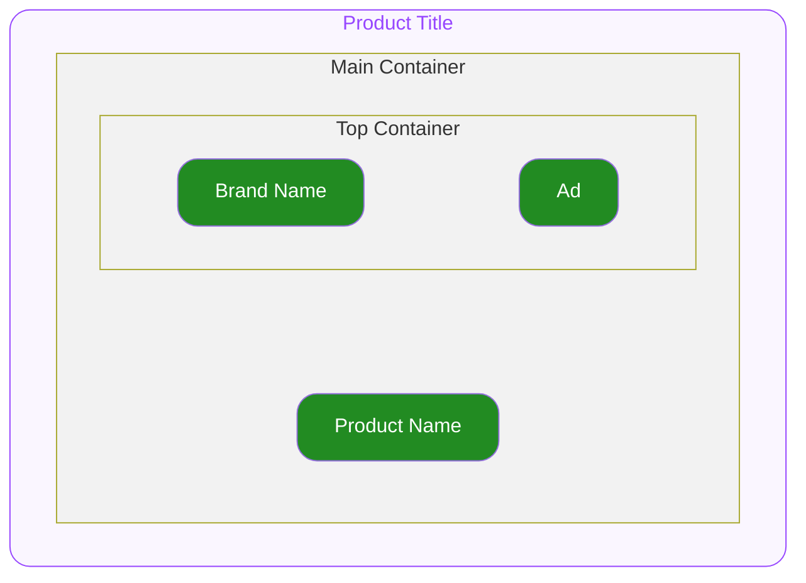

# Product Card Product Title — Spec
## 0. Overview

ODS Product Card 하위에서 상품의 이름을 표시하기 위해서 사용하는 컴포넌트입니다.
자세한 사용구조는 [Product Card](../../../patterns/product-card/pattern.md) 를 참고하세요.

---

## 1. Structure

- **`Main Container`**
  최상위 영역으로 하위 요소들의 관계, 정렬, 크기(너비와 높이)를 기준으로 전체 UI의 레이아웃을 결정합니다.

  - **`Top Container`**
    브랜드명과 광고 표시가 담기는 컨테이너입니다.
    - **`Brand Name`**
      브랜드명이 지정되기 위한 슬롯입니다.
    - **`Ad`**
      광고 여부를 표시하기위한 뱃지입니다.
  - **`Product Name`**
    상품의 정보를 제공하는 UI를 지정하기 위한 슬롯입니다.

---

## 2. Property

### 2.1. Slot Props

#### Brand Name
**`string`** ◌ `Optional` ◌ Brand Name 에 렌더될 브랜드명을 지정합니다.

#### Product Name
**`string`** ◌ Product Name 에 렌더될 상품 이름을 지정합니다.

#### Is Ad
**`boolean`** ◌ `Optional` ◌ `Default Value`: **`false`** ◌ Ad 표시 여부를 지정합니다.

- **`true`**
  Ad를 노출합니다.
- **`false`**
  Ad를 노출하지 않습니다.

#### Ad Text
**`string`** ◌ `Optional` ◌ `Default Value`: `"AD"` ◌ Ad 에 렌더될 광고 표시 문구를 지정합니다.

### 2.2. Layout Props

#### Brand Name Max Lines
**`number`** ◌ `Optional` ◌ `Default Value`: `1` ◌ 브랜드명의 최대 줄 수를 지정합니다. 최대 줄 수를 넘어간 문자열은 Ellipsis(…) 처리됩니다.

#### Product Name Max Line
**`number`** ◌ `Optional` ◌ `Default Value`: `2` ◌ 제품명의 최대 줄 수를 지정합니다. 최대 줄 수를 넘어간 문자열은 Ellipsis(…) 처리됩니다.

#### Top Space
**`number`** ◌ `Optional` ◌ `Default Value`: `0` ◌ 컴포넌트의 상단 간격을 지정합니다.

---

## 3. Constants

#### General

| Element | Property | Value |
|---|---|---|
| Main Container | Width | 상위 컨테이너의 가용 너비 전체를 차지합니다. |
| | Height | 콘텐츠의 높이만큼 지정됩니다. |
| | Align Direction | 세로로 정렬됩니다. |
| | Gap | `2` |
| Top Container | Width | 상위 컨테이너의 가용 너비 전체를 차지합니다. |
| | Height | 콘텐츠의 높이만큼 지정됩니다. |
| | Align Direction | 가로 상단으로 정렬됩니다. |
| | Gap | `10` |
| Brand Name | Width | 상위 컨테이너의 가용 너비 전체를 차지합니다. |
| | Typography Style | Detail12L16 Regular |
| | Color | foreground weak |
| Ad | Width | 콘텐츠의 너비만큼 차지합니다. |
| | Height | `16` |
| | Padding X | `4` |
| | Corner Radius | `4` |
| | Border Color | border |
| | Border Width | `1` Container의 크기가 border 두께를 포함합니다. |
| | Text Typography Style | Detail12L16 Regular |
| | Text Color | foreground weak |
| Product Name | Width | 상위 컨테이너의 가용 너비 전체를 차지합니다. |
| | Typography Style | Detail 13 L18 Regular |
| | Color | foreground |
