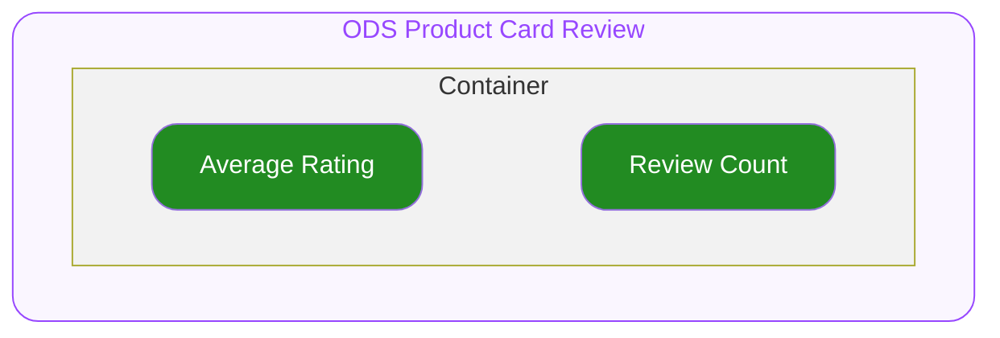
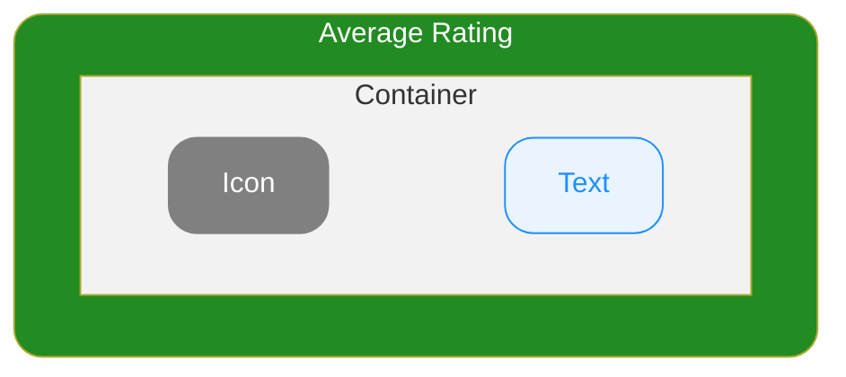

# Product Card Review — Spec
## 0. Overview

ODS Product Card 하위에서 상품의 리뷰 갯수 및 평점을 표시하기 위해서 사용하는 컴포넌트입니다.
자세한 사용 구조는 Product Card 문서를 참고하세요.

---

## 1. Structure

- **`Container`**
  최상위 영역으로 하위 요소들의 관계, 정렬, 크기(너비와 높이)를 기준으로 전체 UI의 레이아웃을 결정합니다.

  - **`Average Rating`**
    리뷰 평균 점수가 지정되기 위한 슬롯입니다.
  - **`Review Count`**
    리뷰 갯수가 지정되기 위한 슬롯입니다.

---

## 2. Property

### 2.1. Variant Props

#### Soldout

**`boolean`** ◌ `Optional` ◌ `Default Value`: `false` ◌ 품절 상태를 지정합니다.

- `true`
  품절 상태를 의미합니다. UI의 Opacity가 변동됩니다.
- `false`
  기본 상태입니다.

---

### 2.2. Slot Props

#### Average Rating

**`number`** ◌ 리뷰의 평균 점수를 지정합니다.

- **`number`**
  지정받은 리뷰 평균 점수는 Text 영역에 렌더됩니다.

#### Review Count

**`number`** ◌ 리뷰 수를 지정합니다. 지정받은 리뷰 수는 아래 포맷의 형태로 변환되어 렌더됩니다.

- **`number`**
  지정받은 리뷰 수는 아래 포맷의 형태로 변환되어 문자열로 렌더됩니다.
  - `"리뷰 {Review Count}"`
  이 때 전달받은 값은 자릿수마다 구분하여 표기합니다.
  - e.g. `8049` → `"8,049"`
  - e.g. `102821` → `"102,821"`

---

### 2.3. Layout Props

#### Top Space

**`number`** ◌ `Optional` ◌ `Default Value`: `0` ◌ 컴포넌트의 상단 간격을 지정합니다.

---

## 3. Constant

### General

| 요소 | 속성 | 값 |
|---|---|---|
| Container | Width | 상위 컨테이너의 가용 너비 전체를 차지합니다. |
| | Height | 콘텐츠의 높이만큼 지정됩니다. |
| | Align Direction | 가로 중앙으로 정렬됩니다. |
| | Gap | `4` |
| Average Rating | Container Width | 컨텐츠의 너비만큼 지정됩니다. |
| | Container Height | 콘텐츠의 높이만큼 지정됩니다. |
| | Container Align Direction | 가로 중앙으로 정렬됩니다. |
| | Container Gap | `1` |
| | Icon Name | IconStar |
| | Icon Size | `12` |
| | Icon Color | Brand/Star |
| | Text Width | 컨텐츠 너비만큼 지정됩니다. 콘텐츠의 너비가 Container의 너비보다 긴 경우 아래로 wrapping되지 **않습니다.** |
| | Typography Style | Detail 12 L16 Semibold |
| | Text Color | FG/Secondary |
| Review Count | Width | 콘텐츠의 너비만큼 지정됩니다. |
| | Text Color | FG/Secondary |
| | Typography Style | Detail12L16 Regular |

### Soldout Variation

| 요소 | 속성 | Soldout = `false` | Soldout = `true` |
|---|---|---|---|
| Container | Opacity | 100% | 24% |
