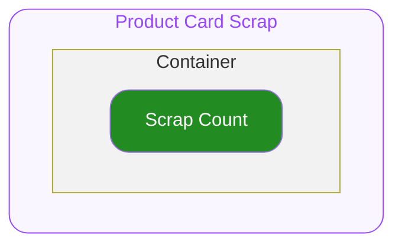

# Product Card Scrap — Spec
## 0. Overview

ODS Product Card 하위에서 상품의 스크랩 수를 표시하기 위해서 사용하는 컴포넌트 입니다.
자세한 사용구조는 ODS Product Card 를 참고하세요.

---

## 1. Structure

- **`Container`**
  최상위 영역으로 하위 요소들의 관계, 정렬, 크기(너비와 높이)를 기준으로 전체 UI의 레이아웃을 결정합니다.

  - **`Scrap Count`**
    스크랩 갯수가 지정되기 위한 슬롯입니다.

---

## 2. Property

### 2.1. Variant Props

#### Soldout

**`boolean`** ◌ `Optional` ◌ `Default Value`: `false` ◌ 품절 상태를 지정합니다.

- `true`
  품절 상태를 의미합니다. UI의 Opacity가 변동됩니다.
- `false`
  기본 상태입니다.

### 2.2. Slot Props

#### Scrap Count

**`number`** ◌ 스크랩 수를 지정합니다.

- **`number`**
  지정받은 스크랩 수는 아래 포맷의 형태로 변환되어 문자열로 렌더됩니다.
  - `"스크랩 {Scrap Count}"`
  이 때 전달받은 값은 자릿수 마다 구분하여 표기합니다.
  - e.g. `8049` → `"8,049"`
  - e.g. `102821` → `"102,821"`

### 2.3. Layout Props

#### Top Space

**`number`** ◌ `Optional` ◌ `Default Value`: `0` ◌ 컴포넌트의 상단 간격을 지정합니다.

---

## 3. Constants

#### General

| 요소 | 속성 | 값 |
|---|---|---|
| Container | Width | 상위 컨테이너의 가용 너비 전체를 차지합니다. |
| Container | Height | 콘텐츠의 높이만큼 지정됩니다. |
| Scrap Count | Width | 콘텐츠의 너비만큼 지정됩니다. |
| Scrap Count | Text Color | FG/Tertiary |
| Scrap Count | Typography Style | Detail12L16 Regular |

#### Soldout Variation

| 요소 | 속성 | Soldout = `false` | Soldout = `true` |
|---|---|---|---|
| Container | Opacity | 100% | 24% |
