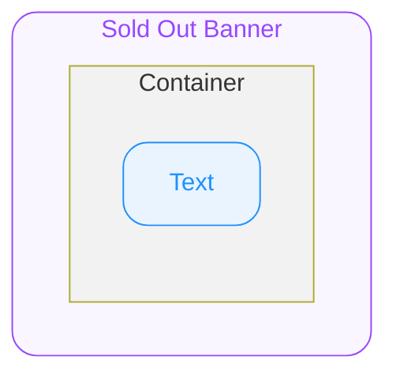

# Product Card Sold Out Banner — Spec
## 0. Overview

ODS Product Card가 품절 상태일 경우 ODS Product Card Thumbnail의 bottom slot에 지정되는 UI 입니다.

---

## 1. Structure & Appearance

### Container

하위 요소들을 담는 최상위 컨테이너 입니다.

| 속성 | 값 |
|---|---|
| Width | 상위 컨테이너의 가용 너비를 전부 차지합니다. |
| Height | 컨텐츠 높이만큼 지정됩니다. |
| Padding X | 2px |
| Padding Y | 8px |
| Background Color | BG/Overlay/Solid/Normal |

### Text

품절 정보를 보여주는 텍스트 요소 입니다.

| 속성 | 값 |
|---|---|
| Width | 상위 컨테이너의 가용 너비를 전부 차지합니다. |
| Typography Style | Detail 12 L16 Semibold |
| Color | FG/Static/White |
