# Radio

여러 옵션 중 하나만 선택할 수 있는 폼 컨트롤입니다. 한 번 선택한 Radio는 다른 Radio를 선택해야만 해제됩니다.

> **어떤 컴포넌트를 써야 할까?**
>
> | 상황 | 컴포넌트 |
> |---|---|
> | 여러 개를 동시에 선택할 수 있다 | [Checkbox](../checkbox/guide.md) |
> | 하나만 선택할 수 있다 | **Radio** |
> | 즉시 반영되는 On/Off 토글 (저장 버튼 없음) | [Switch](../switch/guide.md) |

## Usage Guidelines

### 대표 사용 시나리오

| 시나리오 | 옵션 예시 |
|---|---|
| 배송 방법 선택 | 일반 배송 / 빠른 배송 / 새벽 배송 |
| 결제 수단 선택 | 신용카드 / 무통장 입금 / 카카오페이 |
| 목록 정렬 기준 | 최신순 / 인기순 / 낮은 가격순 |
| 성별 선택 | 남성 / 여성 |

[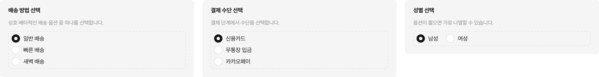](https://www.figma.com/design/F6L3NF3Ts9nbxQt7etAiq2?node-id=64257-114)

## 선택 해제 동작

Radio는 이미 선택된 항목을 다시 탭해도 해제되지 않습니다. **"선택 안 함" 상태가 필요하면 별도 옵션으로 제공합니다.**

**Do** — "없음" 또는 "선택 안 함"을 명시적인 옵션으로 추가합니다.

[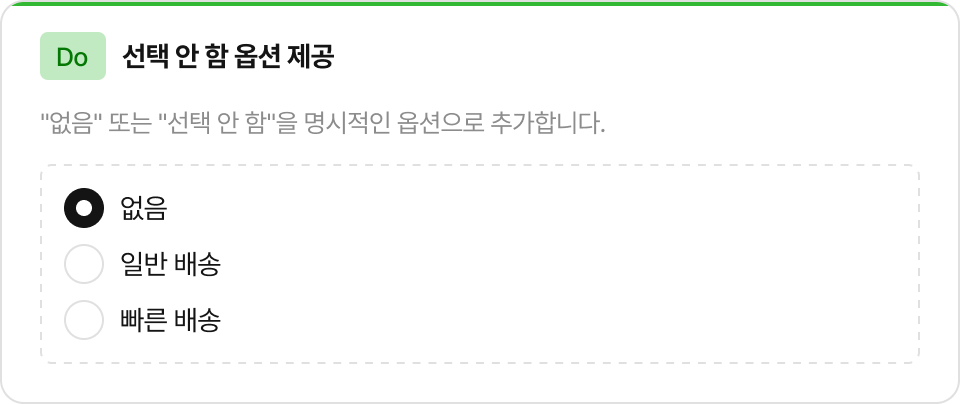](https://www.figma.com/design/F6L3NF3Ts9nbxQt7etAiq2?node-id=64257-114)

**Don't** — 한 번 선택하면 해제할 수 없어, 빈 상태로 돌아갈 방법이 없습니다.

[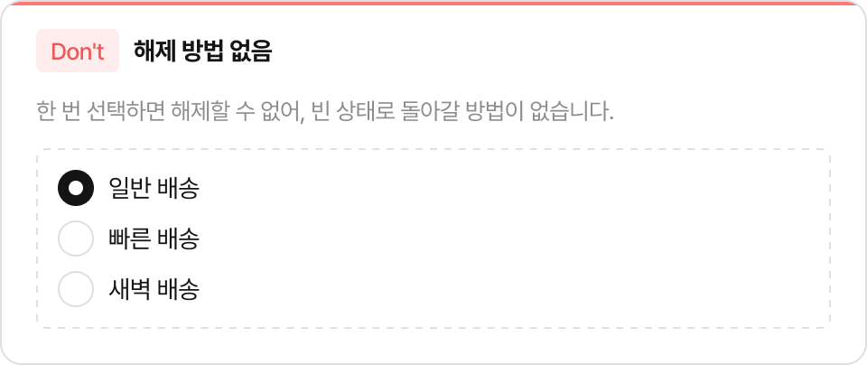](https://www.figma.com/design/F6L3NF3Ts9nbxQt7etAiq2?node-id=64257-114)

## 옵션 개수 가이드

Radio는 옵션이 **2~5개**일 때 가장 적합합니다.

- **6개 이상**이면 [Dropdown](../dropdown/guide.md)으로 전환을 검토합니다. 옵션이 많을수록 스크롤 없이 비교하기 어렵습니다.
- **2개** 옵션이고 즉시 반영(저장 버튼 없음)이라면 [Switch](../switch/guide.md)를 검토합니다.

## Label 작성 규칙

레이블은 선택 항목을 명확히 나타내는 짧은 명사나 구문으로 작성합니다.

**Do**
- 일반 배송
- 신용카드
- 낮은 가격순

[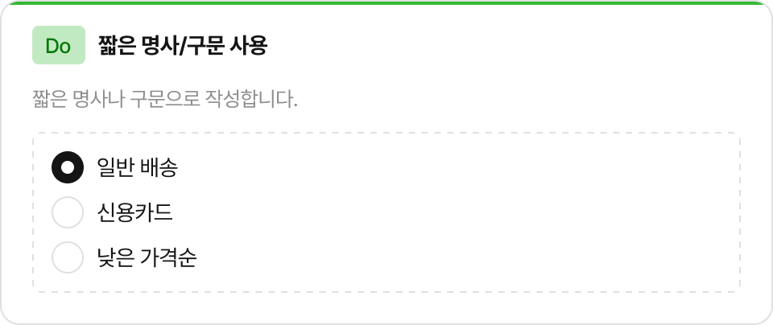](https://www.figma.com/design/F6L3NF3Ts9nbxQt7etAiq2?node-id=64257-114)

**Don't**
- 일반 배송을 원하시면 선택하세요 ← 문장 형태 금지
- 배송1 ← 의미 없는 번호
- 옵션A ← 내용 없는 라벨

[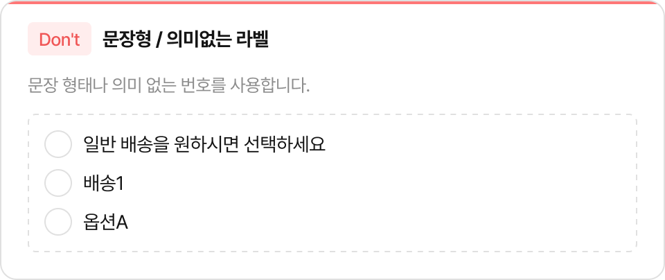](https://www.figma.com/design/F6L3NF3Ts9nbxQt7etAiq2?node-id=64257-114)

레이블 없이 Indicator만 표시할 경우, 인접 요소에서 선택 의미를 명확히 전달해야 합니다.

## Content Slot

Content 영역에 단순 텍스트가 아닌 복합 콘텐츠를 넣을 수 있습니다.

**기본 원칙: 단순 텍스트는 Label 프로퍼티, 복합 콘텐츠는 Slot**

| | 방법 |
|---|---|
| ✅ "일반 배송" | Label 프로퍼티에 텍스트 입력 |
| ✅ 배송 옵션 + 가격 + 예상 도착일 | Content Slot에 커스텀 레이아웃 배치 |
| ✅ 결제 수단 + 카드사 로고 | Content Slot에 이미지 + 텍스트 조합 배치 |
| ❌ | Label로 충분한 단순 텍스트를 Slot에 직접 넣기 |

[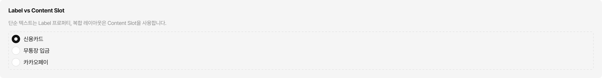](https://www.figma.com/design/F6L3NF3Ts9nbxQt7etAiq2?node-id=64257-114)

## Align 선택 기준

| 상황 | Align |
|---|---|
| 레이블이 한 줄로 끝나는 경우 (대부분) | `center` (기본값) |
| 레이블이 두 줄 이상으로 길어지는 경우 | `top` |

`top`을 사용하면 Indicator가 텍스트 첫 줄에 고정됩니다. 긴 설명이 붙는 약관 동의 항목이나 상세 옵션 설명에 적합합니다.

[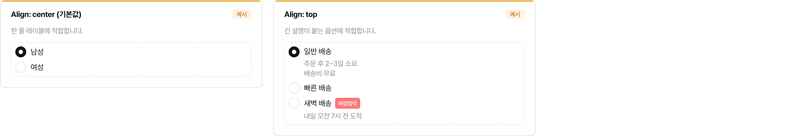](https://www.figma.com/design/F6L3NF3Ts9nbxQt7etAiq2?node-id=64257-114)

## Size 선택

| Size | 사용 맥락 |
|---|---|
| medium | 기본 크기. 특별한 이유가 없으면 medium을 사용합니다. |
| small | 공간이 제한된 밀집 레이아웃에서 사용합니다. 같은 RadioGroup 안에서는 동일한 Size를 사용합니다. |

## Disabled 사용 시나리오

Disabled는 현재 선택할 수 없는 옵션임을 시각적으로 나타냅니다.

**사용 시나리오 예시**

- 재고 없음으로 인해 선택 불가한 배송 옵션
- 사용자 등급이 맞지 않아 이용 불가한 결제 수단
- 특정 조건을 충족해야만 활성화되는 옵션

Disabled 이유를 사용자가 인지할 수 있도록 인접 텍스트나 툴팁으로 안내합니다.

[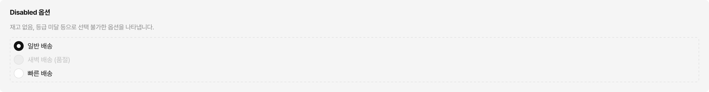](https://www.figma.com/design/F6L3NF3Ts9nbxQt7etAiq2?node-id=64257-114)

상위 조건에 의해 전체 옵션이 선택 불가한 경우, 그룹 전체를 Disabled 처리할 수 있습니다.

## 레이아웃 조합

Radio를 화면에 배치할 때 자주 사용되는 패턴입니다.

> **권장 간격:** 세로 목록은 항목 사이 **8px**, 가로 나열은 **16px**이 표준입니다. 맥락에 따라 조정할 수 있지만, 특별한 이유가 없다면 이 간격을 기본으로 사용합니다.

**세로 목록** — 가장 기본적인 배치. 상호 배타적인 옵션을 세로로 나열합니다.

[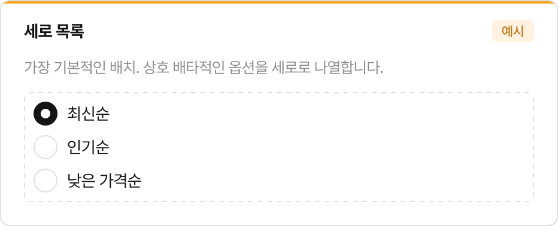](https://www.figma.com/design/F6L3NF3Ts9nbxQt7etAiq2?node-id=64257-114)

**세로 목록 + 보조 설명** — 각 옵션에 추가 설명이 필요할 때. Align `top`과 함께 사용합니다.

[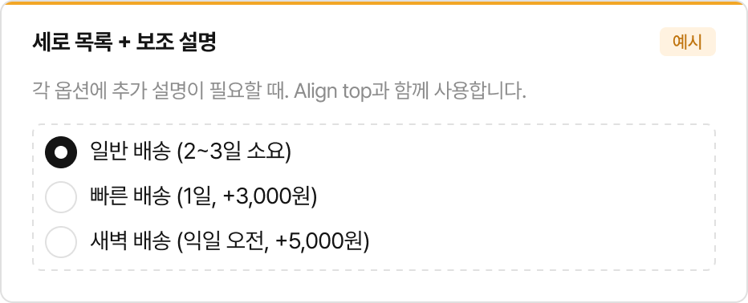](https://www.figma.com/design/F6L3NF3Ts9nbxQt7etAiq2?node-id=64257-114)

**가로 나열** — 옵션이 2~3개로 짧고 한 줄에 충분히 들어갈 때 사용합니다. 4개 이상이면 세로 목록으로 전환합니다.

[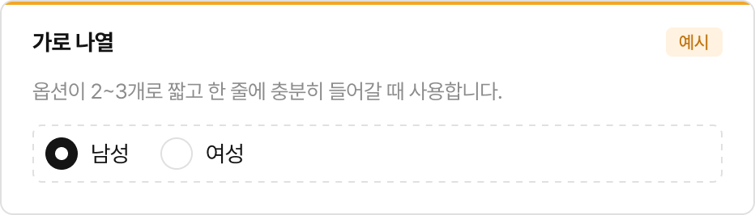](https://www.figma.com/design/F6L3NF3Ts9nbxQt7etAiq2?node-id=64257-114)

## Figma 프로퍼티

### Radio

| 프로퍼티 | 타입 | 설명 |
|---|---|---|
| Size | Variant | medium / small |
| Checked | Boolean | 선택 상태 |
| Disabled | Boolean | 비활성화 |
| Content | Boolean | 레이블 표시 여부 |
| Label | Text | 레이블 텍스트 |
| Align | Variant | Indicator 세로 정렬 (`center` / `top`) |

---

> 치수, 색상, 상태 조합 등 상세 스펙은 [스펙 문서](spec.md)를 참고하세요.
