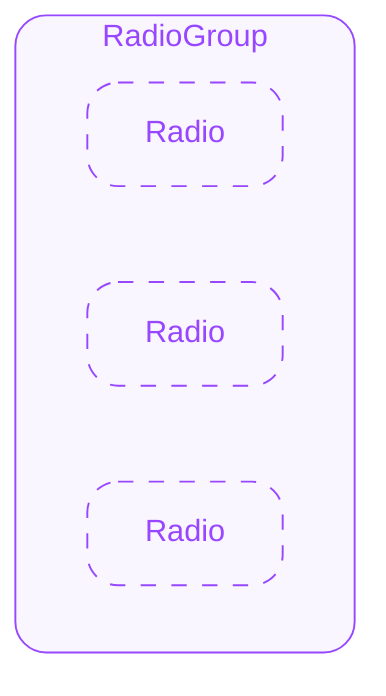
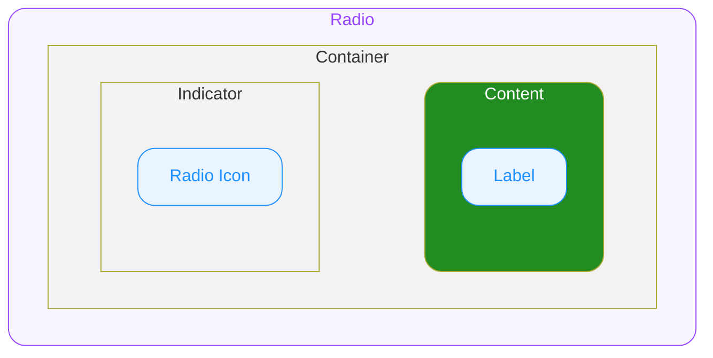

# Radio — Spec

# 0. Overview

Radio는 여러 옵션 중 하나만 선택할 수 있는 폼 컨트롤입니다.
한 번 선택한 Radio는 다른 Radio를 선택해야만 해제됩니다.

> **Checkbox vs Radio vs Switch 사용 기준**
> - 복수 선택이 가능한 경우 → Checkbox
> - 단일 선택만 가능한 경우 → Radio
> - 즉시 반영되는 On/Off 토글 → Switch

---

# 1. Radio Group

## 1.1. Structure

- **`RadioGroup`**
  RadioGroup은 그룹 내에서 하나의 Radio만 선택 가능하도록 선택 상태와 키보드 내비게이션을 관리하는 논리적 컴포넌트로써, 시각적 표현(View)을 가지지 않습니다.
  Radio는 단독 사용이 불가하며, 반드시 RadioGroup 내에서 사용해야 합니다.
  단, Group 내부에 다른 Group을 중첩할 수 없습니다.
  - **`Radio`**
    개별 Radio 컴포넌트입니다. (상세: Radio 섹션 참고)

## 1.2. Props

### 1.2.1. Variant Props

#### Size
`"medium" | "small"` ◌ `Optional` ◌ `Default Value`: `"medium"` ◌ 그룹 내 Radio의 크기를 지정합니다. 개별 Radio에 Size가 지정된 경우 개별 값이 우선합니다.

- `"medium"`
  기본 크기입니다.
- `"small"`
  공간이 제한된 밀집 레이아웃에서 사용하는 작은 크기입니다.

### 1.2.2. State Props

#### Value
`string` ◌ `Optional` ◌ 현재 선택된 Radio의 value를 지정합니다.

#### Disabled
`boolean` ◌ `Optional` ◌ `Default Value`: `false` ◌ 그룹 전체를 비활성화합니다.

- `true`
  그룹 내 모든 Radio가 disabled 상태로 전환됩니다.
- `false`
  그룹의 비활성화를 해제합니다. 개별 Radio의 Disabled 상태는 유지됩니다.

### 1.2.3. Field Props

#### Name
`string` ◌ `Optional` ◌ 폼 그룹 식별자를 지정합니다. 폼 제출 시 이 이름으로 선택된 Radio의 value가 전송됩니다.

#### Required
`boolean` ◌ `Optional` ◌ `Default Value`: `false` ◌ 그룹 내 하나 이상의 Radio가 선택되어야 하는지 여부를 지정합니다.

- `true`
  하나 이상의 Radio가 반드시 선택되어야 합니다.
- `false`
  선택이 필수가 아닙니다.

---

# 2. Radio

## 2.1. Structure

- **`Radio`**
  외부로 노출되는 컴포넌트의 루트(엔트리)입니다. props/상태/이벤트의 진입점이며 내부 요소에 전달됩니다.
  - **`Container`**
    최상위 영역으로 하위 요소들의 관계, 정렬, 크기(너비와 높이)를 기준으로 전체 UI의 레이아웃을 결정합니다.
    - **`Indicator`**
      Radio의 선택 상태를 시각적으로 표시하는 원형 컨트롤 영역입니다.
      - **`Radio Icon`**
        Radio의 선택 상태를 나타내는 아이콘입니다.
    - **`Content`**
      Indicator 옆에 배치되는 콘텐츠 영역입니다. 생략 시 Indicator만 단독으로 표시됩니다.
      - **`Label`**
        Radio 옵션의 텍스트 레이블입니다.

## 2.2. States

| State Composition | idle | hovered **`🌐 Web Only`** | pressed | keyboard tab focused **`🌐 Web Only`** |
|---|---|---|---|---|
| unchecked | ✔️ | ✔️ | ✔️ | ✔️ |
| unchecked + disabled | ✔️ | ➖ | ➖ | ➖ |
| checked | ✔️ | ✔️ | ✔️ | ✔️ |
| checked + disabled | ✔️ | ➖ | ➖ | ➖ |

#### User Interaction States

사용자의 상호작용(클릭, 터치, 포커스 등)에 따라 컴포넌트가 변화하는 상태를 의미합니다.

- **`idle`**
  유저가 인터렉션 하지 않는 기본 상태를 의미합니다.
- **`hovered`**
  **`🌐 Web Only`** ◌ 사용자가 마우스를 버튼 위에 올렸을 때 진입하는 상태입니다.
- **`keyboard tab focused`**
  **`🌐 Web Only`** ◌ 유저가 키보드로 Tab을 눌러 버튼에 포커스했을 때 진입하는 상태입니다.
- **`pressed`**
  유저가 컴포넌트를 클릭하거나 터치하고 있는 상태입니다.

#### Control States

시스템 또는 개발자의 제어에 따라 추가로 컴포넌트가 가질 수 있는 상태를 의미합니다.

- **`disabled`**
  컴포넌트가 사용 불가능한 상태입니다. 유저는 컴포넌트와 어떠한 상호작용도 할 수 없습니다.
- **`unchecked`**
  컴포넌트가 선택되지 않은 상태입니다.
- **`checked`**
  컴포넌트가 선택된 상태입니다.

## 2.3. Props

### 2.3.1. Variant Props

#### Size
`"medium" | "small"` ◌ `Optional` ◌ `Default Value`: `"medium"` ◌ Radio의 크기를 지정합니다. Group 내부에서 별도로 지정하지 않으면 RadioGroup의 Size를 따릅니다.

- `"medium"`
  기본 크기입니다.
- `"small"`
  공간이 제한된 밀집 레이아웃에서 사용하는 작은 크기입니다.

### 2.3.2. State Props

#### Checked
`boolean` ◌ `Optional` ◌ `Default Value`: `false` ◌ 컴포넌트의 선택 상태를 지정합니다.

- `true`
  컴포넌트를 checked 상태로 전환합니다.
- `false`
  컴포넌트의 checked 상태를 해제합니다.

#### Disabled
`boolean` ◌ `Optional` ◌ `Default Value`: `false` ◌ 컴포넌트의 비활성화 상태를 지정합니다.

- `true`
  컴포넌트를 disabled 상태로 전환합니다.
- `false`
  컴포넌트의 disabled 상태를 해제합니다.

### 2.3.3. Field Props

#### Value
`string` ◌ `Optional` ◌ 컴포넌트에 연결되는 값을 지정합니다. 폼 제출 시 전송되는 데이터 값으로 사용됩니다.

#### Required
`boolean` ◌ `Optional` ◌ `Default Value`: `false` ◌ 컴포넌트가 필수 입력 항목인지 여부를 나타냅니다. required가 true여도 checked 상태를 강제하지 않으며, 별도의 시각적 변화는 없습니다.

- `true`
  컴포넌트가 필수 입력 항목 입니다.
- `false`
  컴포넌트가 필수 입력 항목이 아닙니다.

### 2.3.4. Layout Props

#### Align
`"top" | "center"` ◌ `Optional` ◌ `Default Value`: `"center"` ◌ Container의 세로방향 정렬을 지정합니다.

- `"center"`
  Container의 정렬 방향이 center 입니다.
- `"top"`
  Container의 정렬 방향이 top 입니다.

### 2.3.5. Slot Props

#### Content
`string | Custom` ◌ `Optional` ◌ Contents에 지정할 요소를 지정합니다.

- `string`
  문자열을 지정하여 Label에 Content의 기본 타이포그래피 스타일로 렌더합니다.
- `Custom`
  임의의 요소를 지정할 수 있습니다.
  Content의 기본 타이포그래피 스타일을 상속받으며, 인라인 요소(링크, 강조 등)에서 개별 스타일을 오버라이드할 수 있습니다.
  해당 요소는 인터랙션 측면에서 독립적으로 동작할 수 있습니다.

---

# 3. Behaviors

#### Exclusive Selection

RadioGroup 내 하나의 Radio만 선택 가능합니다. Radio 선택 시 이전 선택이 자동 해제됩니다.

#### Toggle Interaction

- **unchecked → checked**
  사용자가 Container를 클릭/터치하면 checked 상태로 전환됩니다.
- **checked → unchecked**
  checked 상태의 Radio를 다시 클릭/터치해도 unchecked로 **전환되지 않습니다.** 다른 Radio를 선택하거나 외부 컴포넌트의 동작으로만 해제됩니다.

#### Sizing

Radio는 기본적으로 내부 콘텐츠 크기를 따르며, 내부에서 크기를 강제하지 않습니다.
너비, 높이 등 크기 관련 속성을 외부에서 주입하여 Radio 및 Content의 크기를 제어할 수 있으며, 텍스트의 줄바꿈(wrapping) 동작 또한 외부에서 주입할 수 있습니다.

#### Interaction Target

Radio는 단일 포커스 단위(single focusable unit)로 동작합니다.

- **Touch/Click Target**
  Container 전체 영역(Indicator + Content)이 클릭/터치에 반응합니다.
- **Focus Target**
  **`🌐 Web Only`** ◌ 포커스 링은 **Indicator에만** 표시됩니다. Container나 Content에는 포커스 링이 표시되지 않습니다.
- **Tab Navigation**
  **`🌐 Web Only`** ◌ Radio는 하나의 포커스 단위입니다.
  Tab 키를 누르면 Content를 건너뛰고 **다음 포커서블 요소**로 포커스가 이동합니다.
  RadioGroup 내부에서는 Arrow 키로 Radio 간 이동합니다.

#### Keyboard Interaction

**`🌐 Web Only`**

- `Arrow Up` / `Arrow Left`
  이전 Radio로 포커스를 이동합니다.
- `Arrow Down` / `Arrow Right`
  다음 Radio로 포커스를 이동합니다.
- `Space`
  현재 포커스된 Radio를 선택합니다.
- `Tab` / `Shift+Tab`
  그룹 안팎으로 포커스를 이동합니다. 그룹 내부에서는 Arrow 키로 이동합니다.

---

# 4. Constants

### 4.1. General

| Element | Property | Value |
|---|---|---|
| Container | Width | 콘텐츠의 너비에 따라 지정됩니다. 필요할 경우 너비 관련 속성(고정 너비, 전체 너비, 최대 너비 등)을 오버라이드할 수 있습니다. (Sizing 참고) |
| Container | Height | 컨텐츠의 높이에 따라 지정됩니다. |
| Container | Alignment | Direction: Row / Align: Align 을 따릅니다. |
| Container | Gap | `8` |
| Indicator | Width | Size를 따릅니다. |
| Indicator | Height | Size를 따릅니다. |
| Indicator | Border Radius | `9999` |
| Indicator | Border Style | 1px Solid |
| Radio Icon | Icon Name | Radio Dot / `regular` / `monochrome` |
| Radio Icon | Icon Size | Size를 따릅니다. |
| Content | Typography Style | Size를 따릅니다. |

### 4.2. Variation

#### Size

| Size | Indicator Width | Indicator Height | Radio Icon Size | Content Typography Style |
|---|---|---|---|---|
| **`"medium"`** | `20` | `20` | `20` | Body 14 L20 **Regular** |
| **`"small"`** | `18` | `18` | `18` | Detail 13 L18 **Regular** |

#### User Interaction - Keyboard Tab Focused

keyboard tab focused 상태일 때, Indicator만 스타일이 변화됩니다.

| Element | Property | Keyboard Tab Focused **`🌐 Web Only`** |
|---|---|---|
| Indicator | Focus Ring Style **`🌐 Web Only`** | `2px` Solid |
| Indicator | Focus Ring Color **`🌐 Web Only`** | 토큰 테이블은 Notion 원본 참고 |
| Indicator | Focus Ring Offset **`🌐 Web Only`** | `2` |

#### State

| Checked | Disabled | Indicator Background Color | Indicator Border Color | Radio Icon Color | Label Text Color |
|---|---|---|---|---|---|
| unchecked | — | 토큰 테이블은 Notion 원본 참고 | 토큰 테이블은 Notion 원본 참고 | — | 토큰 테이블은 Notion 원본 참고 |
| unchecked | disabled | 토큰 테이블은 Notion 원본 참고 | 토큰 테이블은 Notion 원본 참고 | — | 토큰 테이블은 Notion 원본 참고 |
| checked | — | 토큰 테이블은 Notion 원본 참고 | 토큰 테이블은 Notion 원본 참고 | 토큰 테이블은 Notion 원본 참고 | 토큰 테이블은 Notion 원본 참고 |
| checked | disabled | 토큰 테이블은 Notion 원본 참고 | 토큰 테이블은 Notion 원본 참고 | 토큰 테이블은 Notion 원본 참고 | 토큰 테이블은 Notion 원본 참고 |

### 4.3. Tokens

토큰 테이블은 Notion 원본 참고
