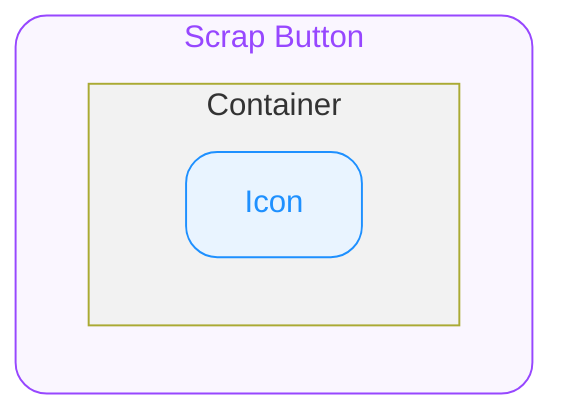

# Scrap Button — Spec

# 0. Overview

본 문서는 ODS Scrap Button이 제공하는 스펙을 명세합니다.

# 1. Structure

- **`Container`**
  최상위 영역으로 하위 요소들의 관계, 정렬, 크기(너비와 높이)를 기준으로 전체 UI의 레이아웃을 결정합니다.

  - **`Icon`**
    Container 중앙에 위치하는 Scrap Button Icon 입니다.

# 2. States

|  | idle | hovered | focused | pressed |
|---|---|---|---|---|
| — | ✔️ | ✔️ | ✔️ | ✔️ |
| disabled | ✔️ | ➖ | ➖ | ➖ |
| selected | ✔️ | ✔️ | ✔️ | ✔️ |
| selected / disabled | ✔️ | ➖ | ➖ | ➖ |

#### User Interaction States

사용자의 상호작용(클릭, 터치, 포커스 등)에 따라 컴포넌트가 변화하는 상태를 의미합니다.

- **`idle`**
  유저가 인터렉션 하지 않는 기본 상태를 의미합니다.
- **`hovered`**
  `🌐 Web Only` 사용자가 마우스를 버튼 위에 올렸을 때 진입하는 상태입니다.
- **`focused`**
  `🌐 Web Only` 유저가 키보드로 Tab을 눌러 버튼에 포커스했을 때 진입하는 상태입니다.
- **`pressed`**
  유저가 컴포넌트를 클릭하거나 터치하고 있는 상태입니다.

#### Control States

시스템 또는 개발자의 제어에 따라 추가로 컴포넌트가 가질 수 있는 상태를 의미합니다.

- **`disabled`**
  컴포넌트가 사용 불가능한 상태입니다. 유저는 컴포넌트와 어떠한 상호작용도 할 수 없습니다.
- **`selected`**
  컴포넌트가 선택된 상태입니다.

# 3. Props

---

## 3.1. Style Props

#### Variant

**`"normal" | "media"`** ◌ `Optional` ◌ `Default Value`: **`"normal"`** ◌ 컴포넌트의 스타일을 지정합니다.

- **`"normal"`**
  _(이미지: normal variant 예시)_
- **`"media"`**
  _(이미지: media variant 예시)_

## 3.2. State Props

#### Selected

**`boolean`** ◌ `Optional` ◌ `Default Value`: **`false`** ◌ selected 상태 여부를 결정합니다.

- **`true`**
  컴포넌트가 selected 상태로 전환됩니다.
- **`false`**
  컴포넌트의 selected 상태가 해제됩니다.

#### Disabled

**`boolean`** ◌ `Optional` ◌ `Default Value`: **`false`** ◌ disabled 상태 여부를 결정합니다.

- **`true`**
  컴포넌트가 disabled 상태로 전환됩니다.
- **`false`**
  컴포넌트의 disabled 상태가 해제됩니다.

## 3.3. Event Props

#### On Blur

`🌐 Web Only` ◌ **`func`** ◌ `Optional` ◌ 키보드 포커스가 적용 되는 등 컴포넌트가 focused 상태에서 벗어나 idle 상태로 전환될 때 실행할 동작을 전달합니다.

#### On Focus

`🌐 Web Only` ◌ **`func`** ◌ `Optional` ◌ 키보드 포커스가 적용 되는 등 컴포넌트가 focused 상태로 전환될 때 실행할 콜백을 전달합니다.

#### On Mouse Enter

`🌐 Web Only` ◌ **`func`** ◌ `Optional` ◌ 마우스 포인터가 Container를 진입하였을 때 실행할 콜백을 전달합니다.

#### On Mouse Leave

`🌐 Web Only` ◌ **`func`** ◌ `Optional` ◌ 마우스 포인터가 Container를 벗어날 때 실행할 콜백을 전달합니다.

#### On Press

**`func`** ◌ `Optional` ◌ Container가 클릭되거나 터치되었을 때 실행할 콜백을 전달합니다.

# 4. Constant

#### Interaction Animation

| | |
|---|---|
| pressed | Scale = 0.97 Transition = cubic-bezier(0.33, 1, 0.68, 1) Duration = 100ms |

#### General

| | | |
|---|---|---|
| Container | Alignment | 가로 방향 가운데로 정렬됩니다. |
| | Width | 24 |
| | Height | 24 |
| | Shadow | Depth 30 |
| Icon | Icon Name | |
| | Size | 24 |

#### Variant

| | | | **`"normal"`** | **`"media"`** |
|---|---|---|---|---|
| Icon | Icon Name | — | Bookmark | Bookmark |
| | | selected | Bookmark Filled | Bookmark Filled |
| | Icon Mode | — | `"monochrome"` | `"hierarchical"` |
| | Icon Color | — | 토큰 테이블은 Notion 원본 참고 | 토큰 테이블은 Notion 원본 참고 |
| | | disabled | 토큰 테이블은 Notion 원본 참고 | 토큰 테이블은 Notion 원본 참고 |
| | | selected | 토큰 테이블은 Notion 원본 참고 | 토큰 테이블은 Notion 원본 참고 |
| | | selected / disabled | 토큰 테이블은 Notion 원본 참고 | 토큰 테이블은 Notion 원본 참고 |

#### Tokens

토큰 테이블은 Notion 원본 참고
