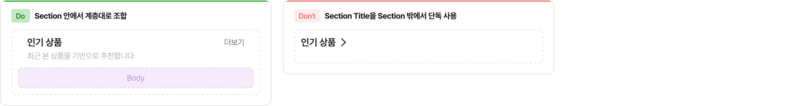
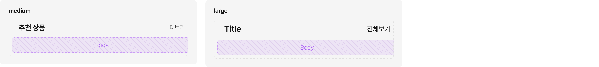
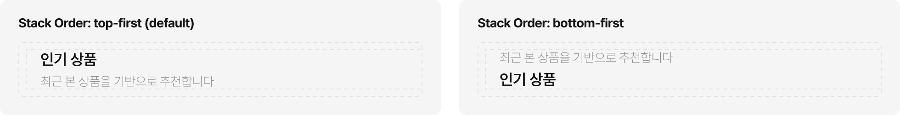
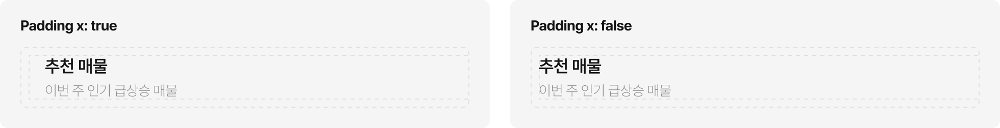
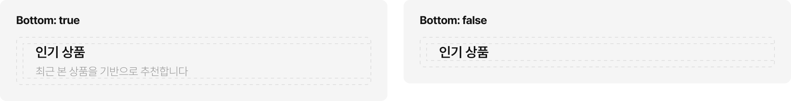
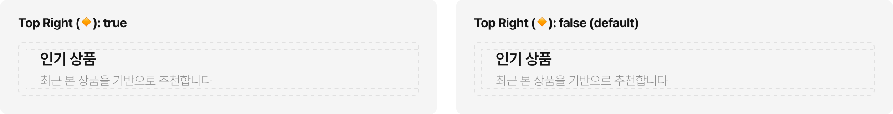
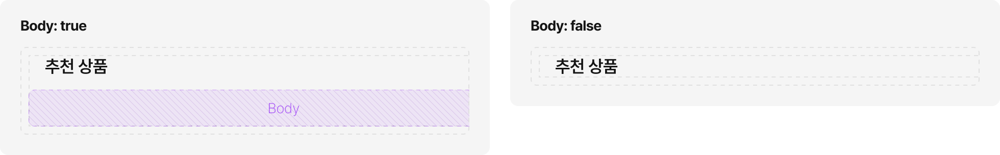
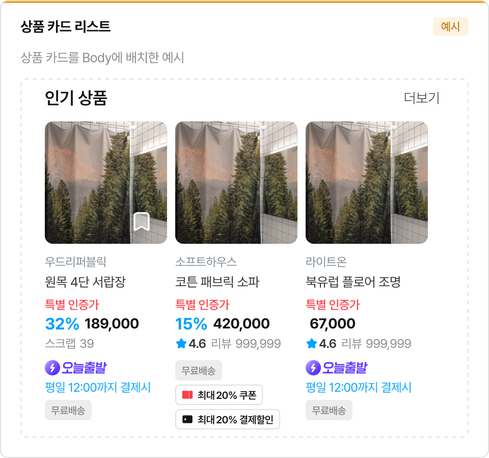
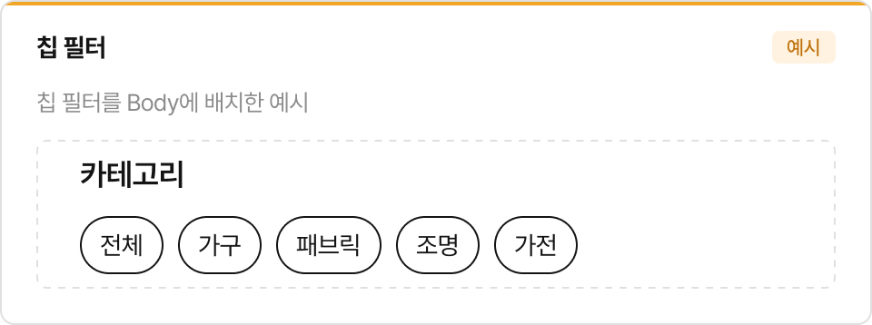
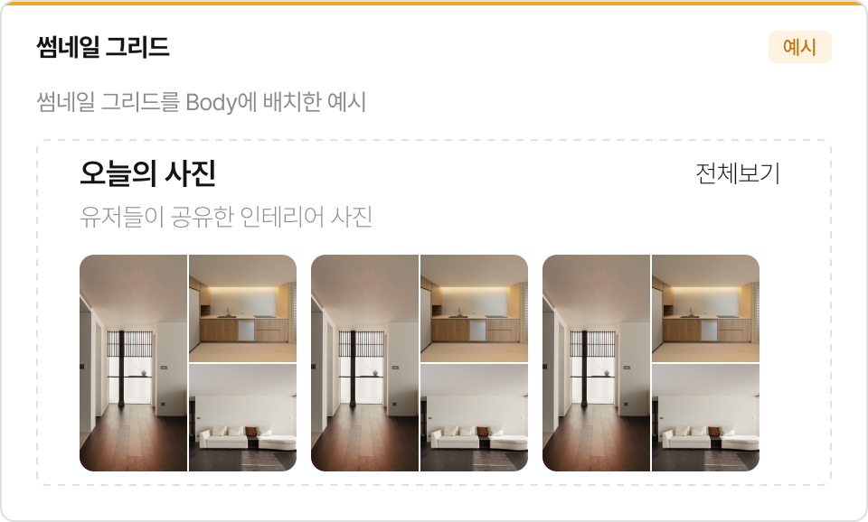

# Section

화면 내 콘텐츠를 논리적 단위로 구분하는 섹션 컴포넌트입니다. 헤더(타이틀 + 액션)와 바디 영역으로 구성됩니다.

## Usage Guidelines

### 조합 규칙

Section은 4개의 compound component가 정해진 계층으로 조합됩니다. 각 하위 컴포넌트를 Section 밖에서 독립적으로 사용하지 않습니다.

- Section Header는 Section의 Header 영역에 배치합니다.
- Section Title은 Section Header의 Top Left에 배치합니다.
- Section Action은 Section Header의 Top Right에 배치합니다.
- Size를 Section에서 설정하면 하위 컴포넌트 전체에 자동 전파됩니다.

---

### Size 선택

| Size | 사용 맥락 |
|---|---|
| medium | 기본 크기. 특별한 이유가 없으면 medium을 사용합니다. |
| large | 페이지 최상위 섹션이나 강조가 필요한 경우에 사용합니다. |

Size에 따라 Section Title의 타이포그래피, Section Action의 타이포그래피, Chevron 아이콘 크기가 함께 변경됩니다.

---

### Section Header 구성

Section Header는 타이틀, 액션, 설명을 조합하는 영역입니다.

**Stack Order** — Description(Bottom)의 위치를 결정합니다.

- `top-first (default)`: 타이틀이 위, Description이 아래
- `bottom-first`: Description이 위, 타이틀이 아래

**Padding X** — 좌우 패딩 여부를 결정합니다.

- 카드나 컨테이너 내부에 Section을 배치할 때 패딩을 적용합니다.
- 풀 블리드(full-width) 레이아웃에서는 패딩을 끕니다.

**Bottom (Description)** — 타이틀 아래 보조 설명이 필요할 때 활성화합니다.

- 섹션의 목적이나 맥락을 부가 설명할 때 사용합니다.
- 예: "최근 본 상품을 기반으로 추천합니다"

**Top Right (Action)** — 헤더 우측에 액션이 필요할 때 활성화합니다.

- "더보기", "전체보기" 등 섹션 전체에 대한 동작을 배치합니다.
- 기본값은 Section Action이 들어가며, Custom 슬롯으로 자유 요소도 가능합니다.

---

### Section Title

섹션의 타이틀 영역입니다.

**On Press** — 클릭 가능한 타이틀일 때 활성화합니다.

- Chevron(>) 아이콘이 자동으로 표시되어 "탭하면 이동"을 나타냅니다.
- 예: "인기 상품" 타이틀을 탭하면 인기 상품 전체 목록으로 이동

**Left / Right 슬롯** — 타이틀 좌우에 부가 요소를 배치합니다.

- 아이콘, 배지, 카운트 등을 넣을 수 있습니다.
- 불필요한 슬롯은 비활성화합니다.

---

### Section Action

헤더 우측에 배치되는 액션 버튼입니다.

- "더보기", "전체보기", "편집" 등의 레이블을 표시합니다.
- 조건이 충족되지 않아 액션을 수행할 수 없을 때 Disabled를 사용합니다.

---

### Body 활용

헤더 아래 콘텐츠 영역입니다. Body Boolean으로 표시 여부를 제어합니다.

- Instance Swap 또는 Slot으로 자유롭게 콘텐츠를 배치합니다.
- 가로 스크롤 리스트, 그리드, 필터 등 다양한 레이아웃을 넣을 수 있습니다.

**실사용 예시**

상품 카드 리스트, 칩 필터, 썸네일 그리드 등 다양한 콘텐츠를 Body에 배치할 수 있습니다.

---

## Figma

### 프로퍼티 (Section)

| 프로퍼티 | 타입 | 설명 |
|---|---|---|
| Size | Variant | `medium` / `large` |
| Header | Instance Swap | Section Header 인스턴스 |
| Body | Boolean | 바디 영역 표시 여부 |
| ↳ Body | Slot | 바디 콘텐츠 |

### 프로퍼티 (Section Header)

| 프로퍼티 | 타입 | 설명 |
|---|---|---|
| Stack Order | Variant | `top-first (default)` / `bottom-first` |
| Padding x | Variant | `true` / `false` — 좌우 패딩 |
| Bottom | Boolean | Description 표시 여부 |
| ↳ Bottom | Text | Description 텍스트 |
| Top Right (🔸) | Boolean | Action 영역 표시 여부 |
| Left | Boolean | 좌측 슬롯 표시 여부 |
| ↳ Left | Instance Swap | 좌측 슬롯 콘텐츠 |

### 프로퍼티 (Section Title)

| 프로퍼티 | 타입 | 설명 |
|---|---|---|
| On Press | Boolean | 클릭 가능 여부 (Chevron 표시) |
| Left | Boolean | 좌측 슬롯 |
| Right | Boolean | 우측 슬롯 |
| ↳ Left | Slot | 좌측 슬롯 콘텐츠 |
| ↳ Right | Slot | 우측 슬롯 콘텐츠 |

### 프로퍼티 (Section Action)

| 프로퍼티 | 타입 | 설명 |
|---|---|---|
| Label | Text | 액션 레이블 텍스트 |
| Disabled | Variant | `false` / `true` |

### Private Sub-Components

| sub-component | 용도 |
|---|---|
| _Section Header | Section 전용 헤더 (타이틀 + 액션 + 설명 조합) |
| _Section Title | Section Header 전용 타이틀 영역 |
| _Section Action | Section Header 전용 액션 버튼 |

---

> 치수, 토큰 등 상세 스펙은 [스펙 문서](spec.md)를 참고하세요.
