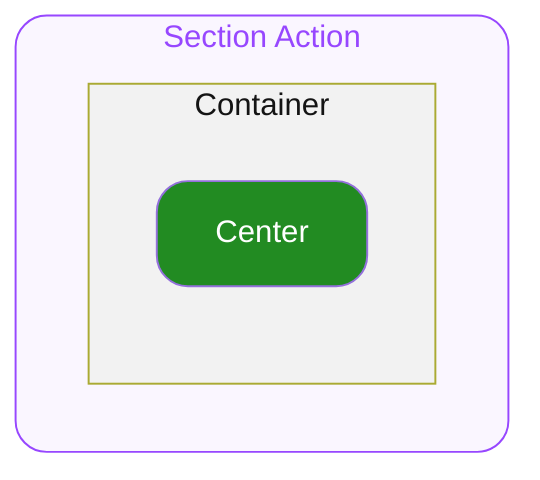

# 1. Section Action

Section Header 아래에서 우측의 액션 영역을 담당하는 컴포넌트 입니다.

## 1.1. Structure

- **`Container`**
  최상위 영역으로 하위 요소들의 관계, 정렬, 크기(너비와 높이)를 기준으로 전체 UI의 레이아웃을 결정합니다.

  - **`Center`**
    Container의 중앙에 위치하여 문자열, 혹은 Custom 요소를 배치할 수 있는 영역입니다.

## 1.2. States

#### User Interaction States

사용자의 상호작용(클릭, 터치, 포커스 등)에 따라 컴포넌트가 변화하는 상태를 의미합니다.

- **`idle`**
  유저가 인터렉션 하지 않는 기본 상태를 의미합니다.
- **`hovered`**
  `🌐 Web Only` ◌ 사용자가 마우스를 버튼 위에 올렸을 때 진입하는 상태입니다.
- **`focused`**
  `🌐 Web Only` ◌ 유저가 키보드로 Tab을 눌러 버튼에 포커스했을 때 진입하는 상태입니다.
- **`pressed`**
  유저가 컴포넌트를 클릭하거나 터치하고 있는 상태입니다.

#### Control States

시스템 또는 개발자의 제어에 따라 컴포넌트가 가질 수 있는 상태를 의미합니다.

- **`default`**
  컴포넌트의 기본 상태입니다. 유저는 컴포넌트와 자유롭게 상호작용할 수 있습니다.
- **`disabled`**
  컴포넌트가 사용 불가능한 상태입니다. 유저는 컴포넌트와 어떠한 상호작용도 할 수 없습니다.

## 1.3. Props

### 1.3.1. State Props

#### Disabled

**`boolean`** ◌ `Optional` ◌ `Default Value`: **`false`**

disabled 상태 여부를 결정합니다.

- **`true`**
  컴포넌트가 disabled 상태로 전환됩니다.
- **`false`**
  컴포넌트가 default 상태로 전환됩니다.

### 1.3.2. Slot Props

#### Center

**`string`**

Center 위치에 렌더할 Label용 문자열을 지정합니다.

### 1.3.3. Event Props

#### On Press

**`func`** ◌ `Optional`

Container 가 클릭되거나 터치되었을 때 실행할 콜백을 전달합니다.

## 1.4. Constants

#### General

| | | |
|---|---|---|
| Container | Width | 컨텐츠의 너비만큼 지정됩니다. |
| | Height | 컨텐츠의 높이만큼 지정됩니다. |

#### Variant - State

| Control State | Label Color |
|---|---|
| **`default`** | `ODS Section Action Label Default Color` |
| **`disabled`** | `ODS Section Action Label Disabled Color` |

#### Section Size Variation

| | | Section Size = **`"medium"`** | Section Size = **`"large"`** |
|---|---|---|---|
| Center | Typography Style | Body14L18 Medium | Body16L20 Medium |

#### Tokens

토큰 값 정의(alias · hex per theme)는 `tokens.md` 참조.
