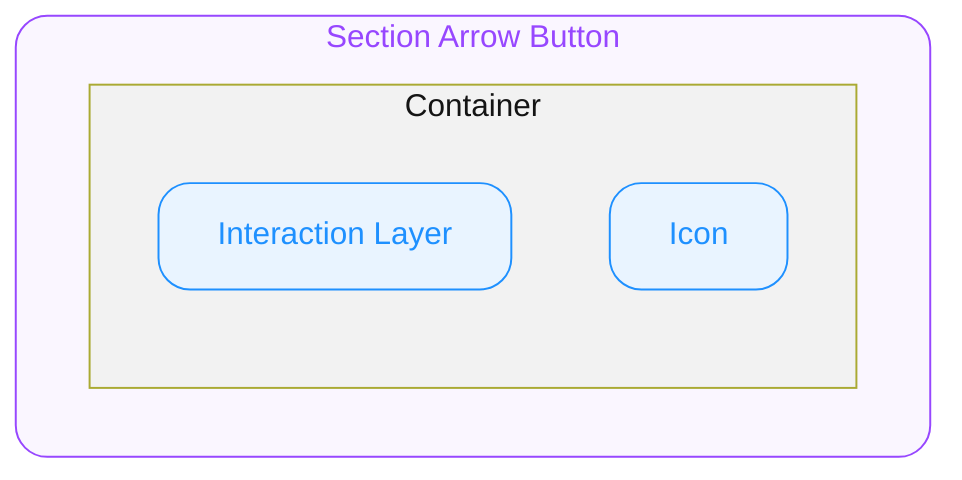

# 1. Section Arrow Button

Section Header의 `On Press`가 지정되었을 때 자동으로 렌더되는 trailing 어포던스 버튼입니다. 소비자 직접 사용이 금지되며 Section Header가 관리합니다.

## 1.1. Structure

- **`Container`**
  최상위 영역으로 버튼 역할을 담당합니다.

  - **`Interaction Layer`**
    Hovered, Pressed 상태에서 Container 위에 반투명으로 오버레이되는 레이어입니다.
    Container의 배경 위, Icon 아래에 위치합니다.

  - **`Icon`**
    Container 내부에 위치하는 Arrow Right Semibold 아이콘입니다.

## 1.2. States

#### User Interaction States

사용자의 상호작용(클릭, 터치, 포커스 등)에 따라 컴포넌트가 변화하는 상태를 의미합니다.

- **`idle`**
  유저가 인터렉션 하지 않는 기본 상태입니다.
- **`hovered`**
  `🌐 Web Only` ◌ 사용자가 마우스를 버튼 위에 올렸을 때 진입하는 상태입니다.
- **`focused`**
  `🌐 Web Only` ◌ 유저가 키보드로 Tab을 눌러 버튼에 포커스했을 때 진입하는 상태입니다. Focus는 Arrow Button만 소유합니다.
- **`pressed`**
  유저가 Arrow Button을 클릭하거나 터치하고 있는 상태입니다. Arrow Button 자체에 대한 직접 pointer-down에서만 발동하며, Main Container의 다른 영역 press state는 반영하지 않습니다.

## 1.3. Behaviors

#### Pressed Scale Animation

유저가 버튼을 클릭/터치하면 **레이아웃을 흔들지 않으면서** 전체 UI의 크기가 `0.97`로 축소됩니다.

## 1.4. Constants

#### General

| | | |
|---|---|---|
| Container | Alignment | 가로/세로 중앙 방향으로 정렬됩니다. |
| | Border Radius | `9999` |
| | Background Color | `ODS Section Arrow Button Background Color Default` |
| Icon | Icon Weight | Semibold |
| | Icon Name | Arrow Right |

#### Variant - State

Hovered, Pressed 행의 Interaction Layer Background 값은 Container의 배경색을 대체하는 것이 아니라, **Interaction Layer**(Section 1. Structure 참조)에 적용되는 오버레이 색상입니다. Container의 기본 배경색은 유지된 채 그 위에 반투명으로 깔립니다.

| Interaction | Icon Color | Interaction Layer Background | Focus Ring Color |
|---|---|---|---|
| **`idle`** | `ODS Section Arrow Button Icon Color Default` | — | — |
| **`hovered`** | — | `ODS Section Arrow Button Interaction Layer Background Color Hovered` | — |
| **`pressed`** | — | `ODS Section Arrow Button Interaction Layer Background Color Pressed` | — |
| **`focused`** | — | — | `ODS Section Arrow Button Focus Ring Color Focused` |

#### Section Size Variation

Section의 Size 에 따라 Container와 Icon의 크기가 다음과 같이 전사됩니다.

| | | Section Size = **`"medium"`** | Section Size = **`"large"`** |
|---|---|---|---|
| Container | Width | `28` | `32` |
| | Height | `28` | `32` |
| Icon | Icon Size | `16` | `18` |

#### Animation

Pressed 상태로 전환될 때 다음 애니메이션이 적용됩니다.

| Property | Value | Note |
|----------|-------|------|
| Scale | `0.97` | Arrow Button 자체의 직접 pointer-down에만 적용됩니다. Scale이 레이아웃 크기에 영향을 미치지 않아야 합니다. |
| Animation Type | `spring` | — |
| Mass | `1` | — |
| Stiffness | `1754.59` | — |
| Damping | `72.05` | — |

#### Tokens

토큰 값 정의(alias · hex per theme)는 `tokens.md` 참조.
