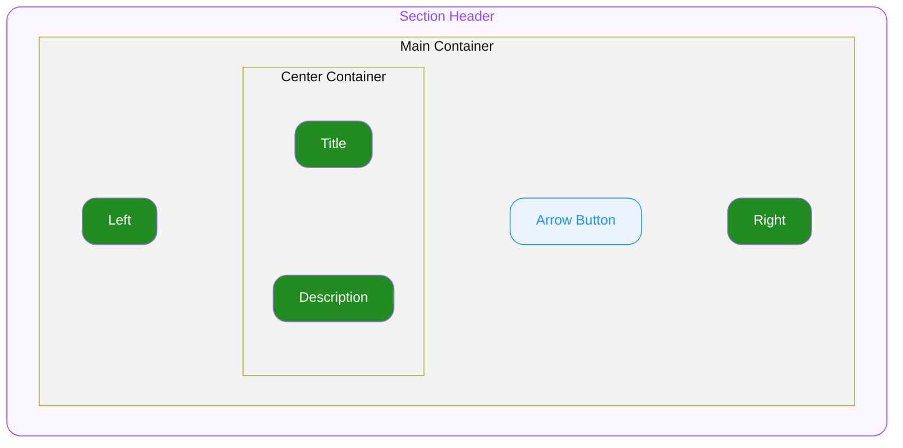

# 1. Section Header

Section 아래에서 헤더 영역을 담당하는 컴포넌트 입니다.

## 1.1. Structure

- **`Main Container`**
  최상위 영역으로 하위 요소들의 관계, 정렬, 크기(너비와 높이)를 기준으로 전체 UI의 레이아웃을 결정합니다.

  - **`Left`**
    Main Container 좌측에 위치하며 헤더의 부가 요소(썸네일 등)가 지정되는 영역입니다.

  - **`Center Container`**
    Main Container 중간에 위치하며 제목 및 설명 요소가 지정되는 컨테이너 입니다.

    - **`Title`**
      Center Container 내에 위치하며 Custom 요소를 배치할 수 있는 영역입니다.
      주로 **Section Title** 컴포넌트를 배치하도록 의도되었습니다.
    - **`Description`**
      Center Container 내에 위치하며 Section Title의 설명용 문자열을 지정하는 영역입니다.

  - **`Arrow Button`**
    Main Container 내 Center Container와 Right 사이에 위치하며 trailing 어포던스 역할을 담당하는 버튼입니다. 세부 스펙은 **Section Arrow Button**을 참조합니다.

  - **`Right`**
    Main Container terminal에 위치하며 자체 interactive 요소(주로 **Section Action**)를 배치하는 영역입니다.

## 1.2. States

#### User Interaction States

사용자의 상호작용(클릭, 터치, 포커스 등)에 따라 Arrow Button이 변화하는 상태를 의미합니다. Main Container는 Header의 `onPress`를 발동시키는 터치 타겟으로만 동작하며 hover / pressed / focus 시각 상태를 갖지 않습니다.

- **`idle`**
  Arrow Button이 인터렉션 하지 않는 기본 상태입니다.
- **`hovered`**
  `🌐 Web Only` ◌ 사용자가 마우스를 Arrow Button 위에 올렸을 때 진입하는 상태입니다.
- **`focused`**
  `🌐 Web Only` ◌ 키보드 Tab으로 Arrow Button에 포커스했을 때 진입하는 상태입니다. Focus는 Arrow Button만 소유합니다.
- **`pressed`**
  Arrow Button을 클릭하거나 터치하고 있는 상태입니다. Arrow Button 자체에 대한 직접 pointer-down에서만 발동하며, Main Container의 다른 영역 press는 반영하지 않습니다.

## 1.3. Props

### 1.3.1. Layout Props

#### Padding X

**`number`** ◌ `Optional` ◌ `Default Value`: `0`

Main Container 의 좌우 패딩을 지정합니다.

### 1.3.2. Variant Props

#### Stack Order

**`"top-first" | "bottom-first"`** ◌ `Optional` ◌ `Default Value`: **`"top-first"`**

Center Container 의 정렬 순서를 지정합니다.

- **`"top-first"`**
  위 부터 순서대로 Title - Description 순서로 정렬됩니다.
- **`"bottom-first"`**
  위 부터 순서대로 Description - Title 순서로 정렬됩니다.

### 1.3.3. Event Props

#### On Press

**`func`** ◌ `Optional`

Main Container(`Right` 제외)와 Arrow Button이 공유하는 콜백으로, 한 user gesture에 대해 **콜백은 한 번만 호출**됩니다. 지정 시 Arrow Button이 자동 노출됩니다.

### 1.3.4. Slot Props

#### Left

**`Custom`** ◌ `Optional`

Left 위치에 렌더할 임의의 요소를 지정합니다.

#### Title

**`Custom`** ◌ `Optional`

Center Container의 직접 child 위치에 렌더할 임의의 요소를 지정합니다. 주로 **Section Title** 컴포넌트를 배치하도록 의도되었습니다.

#### Description

**`string`** ◌ `Optional`

Center Container의 직접 child 위치에 설명용 문자열을 지정합니다. 지정된 문자열은 정해진 스타일로 렌더됩니다.

#### Right

**`Custom`** ◌ `Optional`

Main Container terminal 위치에 렌더할 요소를 지정합니다. Header의 `onPress` 영역에서 제외되므로 자체 `onPress`를 갖는 interactive 요소(주로 **Section Action**)를 배치합니다.

## 1.4. Constants

#### General

| | | |
|---|---|---|
| Main Container | Width | 상단 컨테이너의 가용너비 전체를 차지합니다. |
| | Height | 컨텐츠의 높이만큼 차지합니다. |
| | Alignment | 가로 방향 중앙 좌측으로 정렬됩니다. |
| | Gap | `6` |
| Left | Width | 컨텐츠의 너비만큼 차지합니다. |
| | Height | 컨텐츠의 높이만큼 차지합니다. |
| | Alignment | 가로 중앙 좌측 방향으로 정렬됩니다. |
| Center Container | Width | Main Container 내 Left / Arrow Button / Right를 제외한 가용너비를 차지합니다. |
| | Height | 컨텐츠의 높이만큼 차지합니다. |
| | Alignment | 세로 중앙 좌측 방향으로 정렬됩니다. |
| | Gap | `4` |
| Title | Width | Center Container 내 가용너비 전체를 차지합니다. |
| | Height | 컨텐츠의 높이만큼 차지합니다. |
| | Alignment | 가로 중앙 좌측 방향으로 정렬됩니다. |
| Description | Width | Center Container 내 가용너비 전체를 차지합니다. |
| | Height | 컨텐츠의 높이만큼 차지합니다. |
| | Text Color | `ODS Section Header Description Color Default` |
| Right | Width | 컨텐츠의 너비만큼 차지합니다. |
| | Height | 컨텐츠의 높이만큼 차지합니다. |
| | Alignment | 가로 중앙 좌측 방향으로 정렬됩니다. |

#### Section Size Variation

| | | Section Size = **`"medium"`** | Section Size = **`"large"`** |
|---|---|---|---|
| Description | Typography Style | Body14L18 Regular | Body16L20 Regular |

#### Tokens

토큰 값 정의(alias · hex per theme)는 `tokens.md` 참조.
