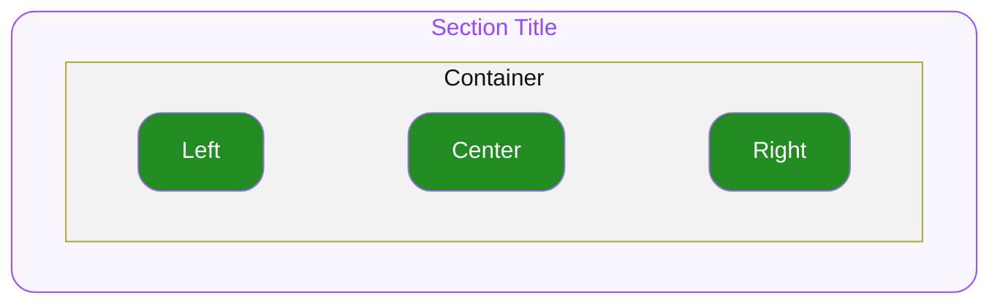

# 1. Section Title

Section Header 아래에서 타이틀 영역을 담당하는 컴포넌트 입니다.

## 1.1. Structure

- **`Container`**
  최상위 영역으로 하위 요소들의 관계, 정렬, 크기(너비와 높이)를 기준으로 전체 UI의 레이아웃을 결정합니다.

  - **`Left`**
    Container의 좌측에 위치하며 Custom 요소를 배치할수 있는 영역입니다.
  - **`Center`**
    Container의 중앙에 위치하여 문자열, 혹은 Custom 요소를 배치할 수 있는 영역입니다.
  - **`Right`**
    Container의 우측에 위치하며 Custom 요소를 배치할수 있는 영역입니다.

## 1.2. Props

### 1.2.1. Slot Props

#### Left

**`Custom`** ◌ `Optional`

Left 위치에 렌더할 요소를 지정합니다.

#### Center

**`string | Custom`**

Center 위치에 렌더할 요소를 지정합니다.

- **`string`**
  Label용 문자열을 지정하여 지정된 스타일로 렌더합니다.
- **`Custom`**
  임의의 요소를 자유롭게 조합하여 지정할 수 있습니다.

#### Right

**`Custom`** ◌ `Optional`

Right 위치에 렌더할 요소를 지정합니다.

## 1.3. Constants

#### General

| | | |
|---|---|---|
| Container | Width | 상단 컨테이너의 가용너비 전체를 차지합니다. |
| | Height | 컨텐츠의 높이만큼 차지합니다. |
| | Alignment | 좌측 가로 가운데 방향으로 정렬됩니다. |
| | Gap | `4` |
| Left | Width | 컨텐츠의 너비만큼 차지합니다. |
| | Height | 컨텐츠의 높이만큼 차지합니다. |
| Center | Width | 컨텐츠의 너비만큼 차지하되, Container 가용너비(Left / Right / gaps 제외)를 상한으로 갖습니다. 초과 시 1-line으로 truncate 됩니다. |
| | Height | 컨텐츠의 높이만큼 차지합니다. |
| | Alignment | 세로 중앙 좌측 방향으로 정렬됩니다. |
| Right | Width | 컨텐츠의 너비만큼 차지합니다. |
| | Height | 컨텐츠의 높이만큼 차지합니다. |
| Center | Text Color | `ODS Section Title Label Color Default` |

#### Section Size Variation

| | | Section Size = **`"medium"`** | Section Size = **`"large"`** |
|---|---|---|---|
| Center | Typography Style | Body17L22 Semibold | Body20L28 Semibold |

#### Tokens

토큰 값 정의(alias · hex per theme)는 `tokens.md` 참조.
