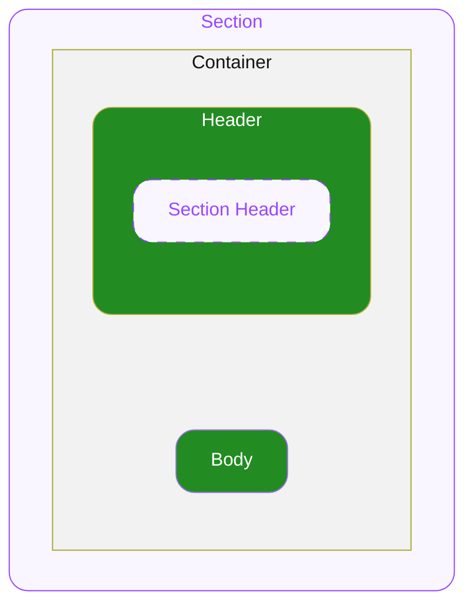

# Section — Spec

# 0. Overview

본 문서는 ODS Section이 제공하는 스펙을 명세합니다.

# 1. Section

Section의 전체 레이아웃을 담당하는 컴포넌트 입니다.

## 1.1. Structure

- **`Container`**
  최상위 영역으로 하위 요소들의 관계, 정렬, 크기(너비와 높이)를 기준으로 전체 UI의 레이아웃을 결정합니다.

  - **`Header`**
    Container의 상단에 위치하며 헤더용 Custom 요소를 배치할 수 있는 영역입니다.
    주로 **Section Header** 컴포넌트를 배치하는 것이 의도되었습니다.
  - **`Body`**
    Container 하위에 위치하며 가로 스크롤, 그리드 등 Custom 요소를 배치할 수 있는 영역입니다.

## 1.2. Props

### 1.2.1. Layout Props

#### Gap

**`number`** ◌ `Optional` ◌ `Default Value`: `14`

Container 의 간격을 지정합니다.

### 1.2.2. Variant Props

#### Size

**`"medium" | "large"`** ◌ `Optional` ◌ `Default Value`: **`"medium"`**

Section 및 하위 Compound Component에게 스타일을 전사합니다.

### 1.2.3. Slot props

#### Header

**`Custom`**

Header 위치에 렌더할 임의의 요소를 자유롭게 조합하여 지정합니다. 주로 **Section Header** 컴포넌트를 배치하는 것이 의도되었습니다.

#### Body

**`Custom`** ◌ `Optional`

Body 위치에 렌더할 임의의 요소를 자유롭게 조합하여 지정합니다.

## 1.3. Constants

#### General

| | | |
|---|---|---|
| Container | Width | 상단 컨테이너의 가용너비 전체를 차지합니다. |
| | Height | 컨텐츠의 높이만큼 차지합니다. |
| | Alignment | 좌측 세로 상단 방향으로 정렬됩니다. |
| | Gap | 14 |
| Header | Width | 상단 컨테이너의 가용너비 전체를 차지합니다. |
| | Height | 컨텐츠의 높이만큼 차지합니다. |
| Body | Width | 상단 컨테이너의 가용너비 전체를 차지합니다. |
| | Height | 컨텐츠의 높이만큼 차지합니다. |

#### Section Size Variation

Section의 Size 에 따라 하위 컴포넌트에 다음과 같이 스타일을 전사합니다.

| | | Section Size = **`"medium"`** | Section Size = **`"large"`** |
|---|---|---|---|
| Section Header | Description — Typography Style | Body14L18 Regular | Body16L20 Regular |
| Section Title | Center — Typography Style | Body17L22 Semibold | Body20L28 Semibold |
| Section Action | Center — Typography Style | Body14L18 Medium | Body16L20 Medium |
