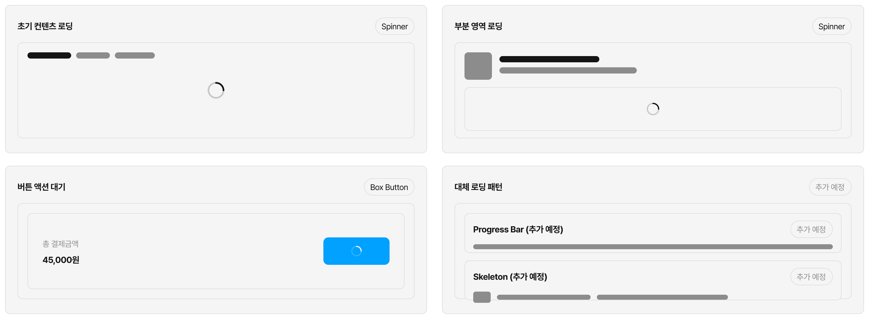

# Spinner

데이터 로딩·비동기 처리가 진행 중임을 시각적으로 알리는 indeterminate 인디케이터입니다.

> **어떤 컴포넌트를 써야 할까?**
> - 버튼을 누른 뒤 응답을 기다리는 동안 → [Box Button](../box-button/guide.md)의 Loading 상태
> - 화면·영역 단위 로딩 → **Spinner** 단독 사용
> - 수치 진행률이 필요한 상황 → Progress Bar (준비 중)

## Usage Guidelines

### 언제 Spinner를 쓰는가

Spinner는 작업이 진행 중임을 알려야 하지만 완료까지의 진행률을 알 수 없을 때 사용합니다.

<!-- figma-example: spinner-usage-contexts
source: Figma Documentation / Usage Guidelines / 언제 Spinner를 쓰는가
figma: https://www.figma.com/design/aTdWM1sgdScr68GZdQ2sWO/branch/4imN8J72mkgEfxMGSRszlC/%F0%9F%8C%80-ODS--Ohouse-Design-System-?node-id=67385-34&p=f&t=D4lSoMo5zt4PDKWY-11
status: exported
intent:
- 초기 컨텐츠 로딩은 화면이나 모달 본문 중앙에 Spinner를 배치해 표현한다.
- 부분 영역 로딩은 해당 영역 내부 중앙에 Spinner를 배치해 표현한다.
- 버튼 액션 대기는 Spinner 단독이 아니라 Box Button의 Loading 상태로 표현한다.
- Progress Bar와 Skeleton은 각각 `Progress Bar (추가 예정)`, `Skeleton (추가 예정)`으로 표시해 아직 추가 예정인 대체 패턴임을 분명히 한다.
-->

Spinner는 컨텐츠를 아직 보여줄 수 없는 초기 로딩이나 특정 영역만 일시적으로 비어 있는 로딩에 적합합니다. 버튼을 누른 뒤 응답을 기다리는 동안에는 [Box Button](../box-button/guide.md)의 Loading 상태를 사용합니다.

수치 진행률을 보여줘야 하는 작업은 Progress Bar, 반복 리스트처럼 레이아웃을 먼저 보여주는 편이 나은 로딩은 Skeleton을 우선 검토합니다. Progress Bar와 Skeleton은 추가 예정입니다.

### 단독 사용 vs 내장 사용

Spinner는 두 가지 방식으로 사용됩니다.

| | 단독(stand-alone) | 내장(embedded) |
|---|---|---|
| 배치 | 컨텐츠 영역 로드 전 placeholder로 중앙 배치 | 상위 컴포넌트의 Loading slot에 인스턴스로 삽입 |
| 예시 | 탭 전환 직후 피드 로드, 모달 초기 로딩 | Box Button Loading, Dialog 본문 로딩 |
| 제어 주체 | 화면 컨테이너 | 상위 컴포넌트(Button, Dialog 등) |

내장 사용 시 Spinner의 표시 여부, 크기, 색상은 상위 컴포넌트의 Loading 규칙을 따릅니다.

### Size 선택

Spinner의 `size`는 Container 지름(px) 숫자입니다. 단독 사용 시 기본값은 `32`입니다.

상위 컴포넌트 안에 내장되는 경우, Spinner의 크기는 상위 컴포넌트의 Size 규칙을 따릅니다.

### Color 선택

Spinner의 `color`는 ODS 컬러 토큰 중 하나를 지정합니다. 기본값은 `foreground`이며, 상위 맥락에 따라 다른 ODS 컬러 토큰으로 지정할 수 있습니다.

Spinner의 색만으로 에러/성공 등 의미를 전달하지 않습니다. 의미 전달은 상위 컴포넌트나 보조 텍스트의 책임입니다.

### 레이아웃 원칙

- Spinner 옆에 "로딩 중..." 같은 레이블 텍스트를 붙이지 않습니다. 로딩 상태는 Spinner의 존재와 애니메이션으로 전달됩니다.
- 내장 사용 시 Spinner는 상위 컴포넌트의 중앙에 오버레이됩니다. 상위 Slot이 배치를 담당합니다.

---

> 치수, 토큰, 애니메이션 등 상세 스펙은 [스펙 문서](spec.md)를 참고하세요.
