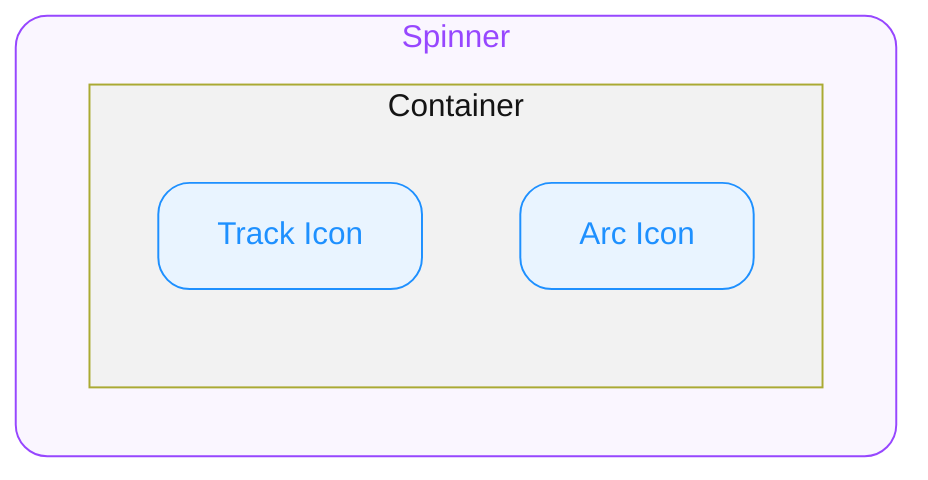

# Spinner — Spec

---

# 0. Overview

ODS Spinner는 데이터 로딩·비동기 처리가 진행 중임을 시각적으로 알리는 인디케이터입니다.

---

# 1. Structure

- **`Spinner`**
  외부로 노출되는 컴포넌트의 루트(엔트리)입니다. props/상태의 진입점이며 내부 요소에 전달됩니다.
  - **`Container`**
    Track Icon과 Arc Icon을 감싸는 정사각 영역입니다.
    - **`Track Icon`**
      Container의 지름을 따라 그려지는 전체 원형 가이드 아이콘입니다.
    - **`Arc Icon`**
      Track Icon과 동심원으로 겹쳐지는 호(arc) 아이콘입니다.

# 2. Type Definition

#### ColorToken

Spinner `color` prop에 사용되는 ODS 컬러 토큰 식별자 타입입니다.

- **`string`**
  ODS 토큰 카탈로그에 등록된 컬러 토큰 이름 (e.g. `"foreground"`).

---

# 3. Props

## 3.1. Variation Props

#### Size

**`number`** ◌ `Optional` ◌ Default Value: **`32`** ◌ Spinner Container의 지름(px)을 지정합니다. Track Icon과 Arc Icon의 Icon Size도 이 값을 따릅니다.

## 3.2. Style Props

#### Color

**`ColorToken`** ◌ `Optional` ◌ Default Value: **`"foreground"`** ◌ Track Icon과 Arc Icon에 공통으로 적용될 ODS 컬러 토큰을 지정합니다.

Track Icon은 동일한 `color` 토큰에 레이어 opacity `20%`를 적용해 표시합니다.

---

# 4. Behaviors

#### Continuous Rotation

Spinner는 렌더되는 동안 `Arc Icon`이 지속적으로 회전합니다.

---

# 5. Constants

### 5.1. General

| Element | Property | Value |
|---|---|---|
| Container | Width | `size` |
| | Height | `size` |
| Container | Ratio | `1:1` |
| Track Icon | Icon Name | `IconSpinnerTrack` |
| | Icon Weight | `regular` |
| | Icon Render Mode | `monochrome` |
| | Size | Container와 동일 |
| | Layer Opacity | `20%` |
| Arc Icon | Icon Name | `IconSpinnerArc` |
| | Icon Weight | `regular` |
| | Icon Render Mode | `monochrome` |
| | Size | Container와 동일 |
| | Layer Opacity | `100%` |

### 5.2. Animation

회전 애니메이션은 `Arc Icon`에 적용됩니다.

| Property | Value | Note |
|---|---|---|
| Animation Type | Rotation | `Arc Icon`만 회전 |
| Degree | `360°` | 무한 반복 |
| Duration | `1100ms` | 1회 360° 회전 기준 |
| Easing | `cubic-bezier(0.65, 0, 0.35, 1)` | — |
| Origin | Container 중심 | 1:1 정사각 전제 |

---

> Usage Guidelines, 선택 기준 등 사용 측면 가이드는 [가이드 문서](guide.md)를 참고하세요.
