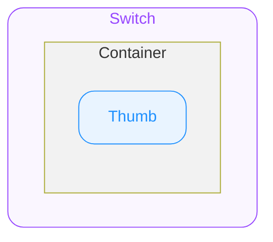

# Switch — Spec

# 0. Overview

Switch는 On/Off 두 가지 상태를 즉시 전환할 수 있는 토글 컨트롤입니다.
설정 변경 등 사용자의 선택이 **즉시** 반영되는 경우에 사용됩니다.

> **Checkbox vs Radio vs Switch 사용 기준**
> - 복수 선택이 가능한 경우 → Checkbox
> - 단일 선택만 가능한 경우 → Radio
> - 즉시 반영되는 On/Off 토글 → Switch

# 1. Structure

- **`Switch`**
  외부로 노출되는 컴포넌트의 루트(엔트리)입니다. props/상태/이벤트의 진입점이며 내부 요소에 전달됩니다.
  - **`Container`**
    최상위 영역으로 하위 요소들의 관계, 정렬, 크기(너비와 높이)를 기준으로 전체 UI의 레이아웃을 결정합니다.
    - **`Thumb`**
      Container 내부에서 좌우로 이동하며 현재 선택 상태를 시각적으로 나타내는 원형 요소입니다.

# 2. States

| State Composition | idle | hovered **`🌐 Web Only`** | pressed | keyboard tab focused **`🌐 Web Only`** |
|---|---|---|---|---|
| unchecked | ✔️ | ✔️ | ✔️ | ✔️ |
| unchecked + disabled | ✔️ | ➖ | ➖ | ➖ |
| checked | ✔️ | ✔️ | ✔️ | ✔️ |
| checked + disabled | ✔️ | ➖ | ➖ | ➖ |

#### User Interaction States

사용자의 상호작용(클릭, 터치, 포커스 등)에 따라 컴포넌트가 변화하는 상태를 의미합니다.

- **`idle`**
  유저가 인터렉션 하지 않는 기본 상태를 의미합니다.
- **`hovered`**
  **`🌐 Web Only`** 사용자가 마우스를 버튼 위에 올렸을 때 진입하는 상태입니다.
- **`pressed`**
  유저가 컴포넌트를 클릭하거나 터치하고 있는 상태입니다.
- **`keyboard tab focused`**
  **`🌐 Web Only`** 유저가 키보드로 Tab을 눌러 버튼에 포커스했을 때 진입하는 상태입니다.

#### Control States

시스템 또는 개발자의 제어에 따라 추가로 컴포넌트가 가질 수 있는 상태를 의미합니다.

- **`disabled`**
  컴포넌트가 사용 불가능한 상태입니다. 유저는 컴포넌트와 어떠한 상호작용도 할 수 없습니다.
- **`unchecked`**
  컴포넌트가 선택되지 않은 상태입니다.
- **`checked`**
  컴포넌트가 선택된 상태입니다.

# 3. Behaviors

#### Toggle Interaction

> unchecked ↔ checked 전환 시, Thumb의 Position X 이동에 Spring Animation이 적용됩니다. (5.3. Animation 참고)

- **unchecked → checked**
  사용자가 Container를 클릭/터치하면 checked 상태로 전환됩니다.
- **checked → unchecked**
  checked 상태의 Switch를 다시 클릭/터치하면 unchecked 상태로 전환됩니다.

#### Keyboard Interaction

**`🌐 Web Only`**

- `Space` / `Enter`
  checked 상태를 토글합니다.

# 4. Props

### 4.1. Variant Props

#### Size

**`"medium" | "small"`** ◌ *Optional* ◌ **Default**: **`"medium"`** ◌ Switch의 크기를 지정합니다.

### 4.2. State Props

#### Checked

**`boolean`** ◌ *Optional* ◌ **Default**: `false` ◌ 컴포넌트의 선택 상태를 지정합니다.

- `true`
  컴포넌트를 checked 상태로 전환합니다.
- `false`
  컴포넌트의 checked 상태를 해제합니다.

#### Disabled

**`boolean`** ◌ *Optional* ◌ **Default**: `false` ◌ 컴포넌트의 비활성화 상태를 지정합니다.

- `true`
  컴포넌트를 disabled 상태로 전환합니다.
- `false`
  컴포넌트의 disabled 상태를 해제합니다.

### 4.3. Field Props

#### Value

**`string`** ◌ *Optional* ◌ 컴포넌트에 연결되는 값을 지정합니다. 폼 제출 시 전송되는 데이터 값으로 사용됩니다.

#### Required

**`boolean`** ◌ *Optional* ◌ **Default**: `false` ◌ 컴포넌트가 필수 값인지 여부를 지정합니다.

- `true`
  컴포넌트가 필수 값입니다.
- `false`
  컴포넌트가 필수 값이 아닙니다.

---

# 5. Constants

### 5.1. General

| Element | Property | Value |
|---|---|---|
| Container | Border Radius | `9999` |
| Thumb | Border Radius | `9999` |
| | Position Y | center |
| | Shadow | Depth 10 |

### 5.2. Variation

#### State

| Checked | Disabled | Container Background Color | Thumb Color | Thumb Position X |
|---|---|---|---|---|
| unchecked | — | 토큰 테이블은 Notion 원본 참고 | 토큰 테이블은 Notion 원본 참고 | left: `2` |
| unchecked | disabled | 토큰 테이블은 Notion 원본 참고 | 토큰 테이블은 Notion 원본 참고 | left: `2` |
| checked | — | 토큰 테이블은 Notion 원본 참고 | 토큰 테이블은 Notion 원본 참고 | right: `2` |
| checked | disabled | 토큰 테이블은 Notion 원본 참고 | 토큰 테이블은 Notion 원본 참고 | right: `2` |

#### Size

| Size | Container Width | Container Height | Thumb Size |
|---|---|---|---|
| **`"medium"`** | `52` | `30` | `26` |
| **`"small"`** | `38` | `20` | `16` |

#### User Interaction - Keyboard Tab Focused

| Element | Property | Keyboard Tab Focused **`🌐 Web Only`** |
|---|---|---|
| Container | Focus Ring Style **`🌐 Web Only`** | `2px` `Solid` |
| | Focus Ring Color **`🌐 Web Only`** | 토큰 테이블은 Notion 원본 참고 |
| | Focus Ring Offset **`🌐 Web Only`** | `2` |

### 5.3. Animation

Thumb의 Position X가 전환될 때 아래 애니메이션이 적용됩니다.

| Property | Value |
|---|---|
| Animation Type | `spring` |
| Mass | `1` |
| Stiffness | `1754.59` |
| Damping | `72.05` |

### 5.4. Tokens

토큰 테이블은 Notion 원본 참고
