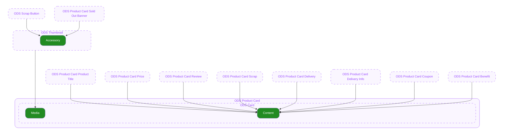

# Product Card — Pattern
**Pattern?**
실제 컴포넌트가 아니라, 특정한 UI를 구현하는 방법에 대한 가이드를 명세합니다.

## 0. Overview

본 문서는 [ODS Card](../../components/card/spec.md) 컴포넌트를 이용하여 Product Card 패턴을 구현하는 방법을 설명합니다.

---

## 1. Used Component

Product Card는 [ODS Card](../../components/card/spec.md)에 아래 컴포넌트를 이용하여 구성합니다.

| Used Component | Description |
|---|---|
| ODS Thumbnail | 썸네일용 컴포넌트입니다. |
| [ODS Scrap Button](../../components/scrap-button/spec.md) | 오늘의집에서 공통으로 사용하는 스크랩 버튼 컴포넌트입니다. |
| [ODS Product Card Sold Out Banner](../../components/product-card/product-card-sold-out-banner/spec.md) | 상품이 품절 상태일 경우에 ODS Thumbnail에 렌더되는 UI 컴포넌트입니다. |
| [ODS Product Card Product Title](../../components/product-card/product-card-product-title/spec.md) | 상품의 브랜드명, 상품명, 광고 표시 유무 등을 구현하는 UI 컴포넌트입니다. |
| [ODS Product Card Price](../../components/product-card/product-card-price/spec.md) | 상품의 할인 후 가격, 할인율, 특별인증가 유무 등을 구현하는 UI 컴포넌트입니다. |
| [ODS Product Card Review](../../components/product-card/product-card-review/spec.md) | 상품의 리뷰 평균 점수, 리뷰 수를 구현하는 UI 컴포넌트입니다. |
| [ODS Product Card Scrap](../../components/product-card/product-card-scrap/spec.md) | 상품의 스크랩 수를 구현하는 UI 컴포넌트입니다. |
| [ODS Product Card Delivery Info](../../components/product-card/product-card-delivery-info/spec.md) | 오늘출발, 오늘의집 출발, 빠른가구배송, 빠른가전배송 등 배송 관련 뱃지를 구현하는 UI 컴포넌트입니다. |
| [ODS Product Card Delivery Option](../../components/product-card/product-card-delivery-option/spec.md) | 상품의 배송비 유무, 설치비 및 해외 배송 여부 등 기타 배송 관련 정보를 구현하는 UI 컴포넌트입니다. |
| [ODS Product Card Benefit](../../components/product-card/product-card-benefit/spec.md) | 상품의 쿠폰할인율 혹은 쿠폰할인가 정보를 제공하는 UI 컴포넌트입니다. |

---

## 2. Pattern of Product Card

- **`Vertical Medium`**

  A.K.A. 2grid 카드입니다.

- **`Vertical Small`**

  A.K.A 캐러셀 카드입니다.
  Vertical Medium과 [ODS Product Card Price](../../components/product-card/product-card-price/spec.md)의 size가 다릅니다.

- **`Horizontal Medium`**

  A.K.A 리스트형 카드입니다.

---

## 3. Scrap

유저가 상품을 스크랩할 수 있고, 기존 스크랩 여부를 표시하는 기능을 제공하는 UI를 [ODS Scrap Button](../../components/scrap-button/spec.md)을 이용하여 구현합니다.
유저가 [ODS Scrap Button](../../components/scrap-button/spec.md)에 직접 인터렉션(클릭/터치)하여 스크랩 상태를 전환할 수 있습니다.
상품의 스크랩 상태 여부에 따라 다음과 같이 값이 변경됩니다.

| Case | Value |
|---|---|
| 스크랩되지 않은 상태일 경우 (기본) | `Selected` = `false` |
| 스크랩 상태일 경우 | `Selected` = `true` |

---

## 4. Sold Out

재고가 없음을 나타내는 상태입니다.
[ODS Product Card Sold Out Banner](../../components/product-card/product-card-sold-out-banner/spec.md)를 ODS Thumbnail에 지정합니다.
동시에 아래 하위 컴포넌트에 품절 상태를 전달하여 구현합니다.

| Property | Value |
|---|---|
| **ODS Product Card Price — `Soldout`** | `true` |
| **ODS Product Card Review — `Soldout`** | `true` |
| **ODS Product Card Scrap — `Soldout`** | `true` |
| **ODS Product Card Delivery Info — `Soldout`** | `true` |
| **ODS Product Card Delivery Option — `Soldout`** | `true` |
| **ODS Product Card Benefit — `Soldout`** | `true` |

---

## 5. Information

정보들이 아래 순서대로 Content에 정렬됩니다.

1. [Brand, Product Name, AD](#brand-product-name-ad)
2. [Price](#price)
3. [Review](#review) or [Scrap](#scrap)
4. [Delivery Info](#delivery-info)
5. [Delivery Option](#delivery-option)
6. [Benefit](#benefit)

### Brand, Product Name, AD

상품의 브랜드명, 제품명 정보 및 광고 여부 정보입니다.
[ODS Product Card Product Title](../../components/product-card/product-card-product-title/spec.md) 컴포넌트에 아래 정보를 전달하여 Content에 구현합니다.

| Data | Type | Props |
|---|---|---|
| 브랜드명 | `string` | `Brand Name` |
| 상품명 | `string` | `Product Name` |
| 광고여부 | `boolean` | `Is Ad` |

### Price

상품의 가격, 할인율, 특별인증가 정보입니다.
[ODS Product Card Price](../../components/product-card/product-card-price/spec.md) 컴포넌트에 아래 정보를 전달하여 Content에 구현합니다.

| Data | Type | Props |
|---|---|---|
| 특별인증가 여부 | `boolean` | `Is Special Price` |
| 할인율 | `number` | `Discount Rate` |
| 가격 | `number` | `Selling Price` |
| 통화 | `"KRW" \| "USD" \| "JPY"` | `Currency` |
| 통화 표기 방식 | `"none" \| "symbol" \| "narrowSymbol" \| "code" \| "name" \| "narrowName"` | `Currency Display` |
| 자릿수 구분 | `boolean` | `Use Grouping` |
| 최소 소수점 자릿수 | `number` | `Minimum Fraction Digits` |
| 최대 소수점 자릿수 | `number` | `Maximum Fraction Digits` |
| 묶음전 여부 | `boolean` | `Is Deal` |

### Review

상품의 리뷰 정보입니다.
[ODS Product Card Review](../../components/product-card/product-card-review/spec.md) 컴포넌트에 아래 정보를 전달하여 Content에 구현합니다.

| Data | Type | Props |
|---|---|---|
| 리뷰 평균 점수 | `number` | `Average Rating` |
| 리뷰 수 | `number` | `Review Count` |

### Scrap

상품의 스크랩 수 정보입니다.
[Review](#review) 정보가 없을 경우에만 노출합니다.
[ODS Product Card Scrap](../../components/product-card/product-card-scrap/spec.md) 컴포넌트에 아래 정보를 전달하여 Content에 구현합니다.

| Data | Type | Props |
|---|---|---|
| 스크랩 수 | `number` | `Scrap Count` |

### Delivery Info

상품의 배송 타입 관련 정보입니다.
[ODS Product Card Delivery Info](../../components/product-card/product-card-delivery-info/spec.md) 컴포넌트에 아래 정보를 전달하여 Content에 구현합니다.

| Data | Type | Props |
|---|---|---|
| 배송 타입 | `"DEPARTURE_TODAY" \| "OHOUSE" \| "THIRD_PARTY_APPLIANCE" \| "THIRD_PARTY_FURNITURE"` | `Delivery Type` |
| 오늘출발 배송 조건 | `string` | `Info Text` |

### Delivery Option

상품의 배송비, 설치비, 해외 배송 옵션 관련 정보입니다.
[ODS Product Card Delivery Option](../../components/product-card/product-card-delivery-option/spec.md) 컴포넌트에 아래 정책에 따라 배송비 정보를 전달하여 Content에 구현합니다.

> **배송비, 설치비, 해외배송 표기 정책**
> https://docs.google.com/document/d/1IlKMNv-ODrW8zIV3j_4WDjwkT_cRNFfHCyvQ-B2A5lM/edit?tab=t.0#bookmark=id.6rfcn2wdp0ih

| Data | Type | Props |
|---|---|---|
| 배송비, 설치비, 해외배송 등 배송 옵션 목록 | `string[]` | `Options` |

### Benefit

상품의 쿠폰, 결제 혜택 관련 정보입니다.
[ODS Product Card Benefit](../../components/product-card/product-card-benefit/spec.md) 컴포넌트에 아래 정보를 전달하여 Content에 구현합니다.

| Data | Type | Props | Note |
|---|---|---|---|
| 혜택 목록 | `{ icon: BenefitIconName, iconColor: BenefitIconColor, text: string }[]` | `Benefits` | 쿠폰, 결제 할인 정보를 각각 포맷팅된 아이콘과 문자열로 구성하여 전달합니다. |

---

## UI Spec

### General

| ODS Card Props | Used Element | Used Element Style/Props | Used Element Value |
|---|---|---|---|
| `Media` | ODS Thumbnail | `Ratio` | `1` |
| | | `Accessory` | [ODS Scrap Button](../../components/scrap-button/spec.md)   ↳ **Position** = bottom: 10, right: 10  [ODS Product Card Sold Out Banner](../../components/product-card/product-card-sold-out-banner/spec.md)   ↳ **Position** = bottom: 0   ↳ **Width** = 상위 컨테이너 전체 (e.g. 100%) |
| `Content` | [ODS Product Card Product Title](../../components/product-card/product-card-product-title/spec.md) | **Width** | 상위 컨테이너의 가용 너비 전체를 차지합니다. (e.g. `100%`) |
| | | `Top Space` | `0` |
| | | `Brand Name Max Lines` | `1` |
| | | `Product Name Max Line` | `2` |
| | | `Ad Text` | `"AD"` |
| | [ODS Product Card Price](../../components/product-card/product-card-price/spec.md) | **Width** | 상위 컨테이너의 가용 너비 전체를 차지합니다. (e.g. `100%`) |
| | | `Top Space` | `4` |
| | [ODS Product Card Review](../../components/product-card/product-card-review/spec.md) | **Width** | 상위 컨테이너의 가용 너비 전체를 차지합니다. (e.g. `100%`) |
| | | `Top Space` | `2` |
| | [ODS Product Card Scrap](../../components/product-card/product-card-scrap/spec.md) | **Width** | 상위 컨테이너의 가용 너비 전체를 차지합니다. (e.g. `100%`) |
| | | `Top Space` | `2` |
| | [ODS Product Card Delivery Info](../../components/product-card/product-card-delivery-info/spec.md) | **Width** | 상위 컨테이너의 가용 너비 전체를 차지합니다. (e.g. `100%`) |
| | | `Top Space` | `8` |
| | [ODS Product Card Delivery Option](../../components/product-card/product-card-delivery-option/spec.md) | **Width** | 상위 컨테이너의 가용 너비 전체를 차지합니다. (e.g. `100%`) |
| | | `Top Space` | [ODS Product Card Delivery Info](../../components/product-card/product-card-delivery-info/spec.md)   ↳ 있을 경우 → `4`   ↳ 없을 경우 → `8` |
| | [ODS Product Card Benefit](../../components/product-card/product-card-benefit/spec.md) | **Width** | 컨텐츠의 너비만큼 지정됩니다. |
| | | `Top Space` | [ODS Product Card Delivery Info](../../components/product-card/product-card-delivery-info/spec.md)   ↳ 있을 경우 → `4`   ↳ 없을 경우 → `8` |

### Type Variation

| | Vertical Medium | Vertical Small | Horizontal Medium |
|---|---|---|---|
| **Props** | **Value** | | |
| `Type` | `"vertical"` | `"vertical"` | `"horizontal"` |
| `Gap` | `10` | `10` | `12` |
| `Size` (ODS Product Card Price) | `"large"` | `"medium"` | `"medium"` |

---

## 커스텀 조합

제공된 패턴으로 맞는 조합이 없을 때는, [Card](../../components/card/guide.md) 컴포넌트에 sub-component를 직접 조합하여 만들 수 있습니다.

### 사용 가능한 Sub-components

[Section 1. Used Component](#1-used-component)의 sub-component를 Card의 content slot에 자유롭게 배치할 수 있습니다.

| Sub-component | 역할 | Notion 스펙 |
|---|---|---|
| Product Card Product Title | 브랜드명, 상품명, 광고 표시 | [스펙](../../components/product-card/product-card-product-title/spec.md) |
| Product Card Price | 가격, 할인율, 특별인증가, 묶음딜 | [스펙](../../components/product-card/product-card-price/spec.md) |
| Product Card Review | 리뷰 평점, 리뷰 수 | [스펙](../../components/product-card/product-card-review/spec.md) |
| Product Card Scrap | 스크랩 수 | [스펙](../../components/product-card/product-card-scrap/spec.md) |
| Product Card Delivery Info | 배송 타입 뱃지 | [스펙](../../components/product-card/product-card-delivery-info/spec.md) |
| Product Card Delivery Option | 배송비, 설치비, 해외배송 | [스펙](../../components/product-card/product-card-delivery-option/spec.md) |
| Product Card Benefit | 쿠폰, 결제 혜택 | [스펙](../../components/product-card/product-card-benefit/spec.md) |

### 조합 방법

1. [Card](../../components/card/guide.md) 인스턴스를 배치합니다.
2. **media** slot에 Thumbnail을 넣습니다.
3. **content** slot에 필요한 sub-component를 원하는 순서로 넣습니다.
4. 각 sub-component의 속성을 설정합니다.

> 표준 Product Card 패턴에서의 sub-component 순서와 속성값은 [Section 5. Information](#5-information)과 [UI Spec](#ui-spec)을 참고하세요.

### 조합 예시

#### 가격 전용 카드

썸네일과 가격 정보만 표시하는 최소 구성의 카드입니다. 기획전, 타임세일 등 가격이 핵심인 화면에 사용합니다.

- Card (vertical, gap 8)
  - media: Thumbnail
  - content: Product Title + Price

#### 리뷰 강조 카드

리뷰 정보를 가격보다 먼저 배치하여 사회적 증거를 강조하는 카드입니다. 리뷰 큐레이션, 베스트 리뷰 등의 화면에 사용합니다.

- Card (vertical, gap 8)
  - media: Thumbnail
  - content: Product Title + Review + Price

